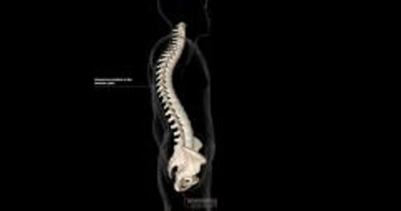

# 脊柱后凸

> **来源**: msd_家庭版  
> **分类**: Children S Health Issues

---

# 脊柱后凸

脊柱后凸是指脊柱异常弯曲引起驼背。

通常，上背部向前弯曲。有些儿童弯曲程度较大。过度弯曲可能呈

- 柔性
- 固定性（器质性）

**柔性脊柱后凸** 儿童可通过收紧肌肉来伸直脊柱，其脊骨（椎骨）正常。病因不明。可进行肌肉强化锻炼，但无需其他特殊治疗。

**固定性脊柱后凸** 儿童，背部上方椎骨呈楔形而非矩形，其脊柱无法伸直。通常涉及 3 个或更多椎骨。婴儿天生患固定性脊柱后凸的情况很少，此病通常在后天形成，常出现于青春期。有许多罕见原因，包括骨折、感染和癌症，但最常见的原因是 脊柱骨软骨病 。

通常，脊柱后凸无症状。有时会出现轻度持久性背痛。脊柱后凸改变体型时才可能引起注意。肩部呈圆形。脊柱上部异常弯曲，或出现隆起。有些人的外表类似于 马凡综合征 ，四肢比躯干长得多。

轻度脊柱后凸不出现症状，有时只能通过常规体检检测到。医生通过对脊柱进行 X 线检查 来确诊脊柱后凸。

脊柱后凸的治疗方法 与脊柱骨软骨病相同。

脊柱后凸：驼背

|  |
| --- |

脊柱后凸

3D 模型

## 脊柱骨软骨病

## （Scheuermann 病）

脊柱骨软骨病是最常见形式的固定性脊柱后凸。通常始于青春期，受影响的男孩略多于女孩。脊柱骨软骨病的病因尚不清楚，但有时会在家族中遗传。 脊柱侧凸 是脊柱侧向弯曲，也经常在患有脊柱后凸的儿童中发病（称为脊柱后侧凸）。

Scheuermann 病是一种骨软骨病。骨软骨病是儿童快速生长期间 骨骼生长板 发生的一种病变。

大多数患有 Scheuermann 病的儿童上背部呈圆弧状或驼背姿势，可能伴有轻微而持续的背痛。儿童的四肢可能与躯干相比显得不成比例地修长，类似于患有 马凡综合征 的儿童。上背部的正常曲线也可能比通常更为明显，这种情况可能出现在整个上脊柱区域，也可能仅限于特定部位。严重脊柱后凸更易引起不适，有时可限制胸部运动，引起 限制性肺部疾病 。

脊柱骨软骨病可能是在学校中常规筛查脊柱问题时发现。医生通过对脊柱进行 X 线检查来确诊脊柱骨软骨病。有时会进行 磁共振成像 (MRI) 或 计算机断层扫描 (CT)。

### 脊柱骨软骨病的治疗

- 减少负重和剧烈运动
- 有时需要佩戴脊柱矫形器
- 很少进行手术

轻度脊柱后凸可通过减轻负重压力（例如限制高强度运动或重物搬运）及避免剧烈活动来治疗，此举有助于缓解疼痛并防止脊柱弯曲进一步加重。脊柱在治疗后可能略微变直，但症状未必减轻。

对于较为严重的脊柱后凸，治疗最常包括装脊柱矫正架或睡硬床。治疗可减轻症状，防止弯曲加重。

少数情况下，虽然经过治疗，但脊柱后凸仍加重，并需要通过手术拉直脊柱。
