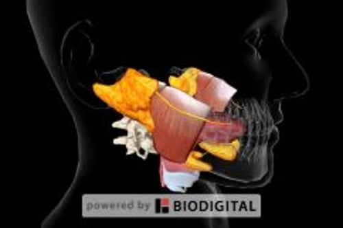

# 口腔生物学

> **来源**: msd_家庭版  
> **分类**: 口腔牙齿疾病

---

# 口腔生物学

$!
/$
$!
/$
作者：
[Rosalyn Sulyanto](https://www.msdmanuals.cn/home/authors/sulyanto-rosalyn)
,
DMD, MS
,
Boston Children's Hospital
Reviewed By
[David F. Murchison](https://www.msdmanuals.cn/home/authors/murchison-david)
,
DDS, MMS
,
The University of Texas at Dallas
已审核/已修订
修改的
4月 2024
v750031_zh
**
浏览专业版
- 多媒体 |

口腔是消化系统和呼吸系统的共同入口。在口腔内部内衬以黏膜。健康时，口腔内壁（口腔黏膜）的颜色为红粉色至不同程度的棕色或黑色。深色皮肤个体的口腔黏膜往往颜色更暗，因为黑素细胞（产生黑色素的细胞，黑色素是一种给头发、皮肤和眼睛赋予色素以使其呈现相应的颜色）更活跃。相比之下，牙龈（齿龈）通常色淡，并紧贴牙周。

**颚** 是口腔的顶部，分为两个部分。前部呈脊状，较为坚硬（硬腭）。后部相对光滑，较为柔软（软腭）。

湿润的 **口腔黏膜** 向外延续，形成唇部富有光泽的粉红色部分，并在唇红缘处与面部皮肤汇合。唇部黏膜尽管有涎腺湿润，仍易于干燥。

口腔后部上方有一悬垂的狭窄肌肉结构，发“啊”音时可见，这就是 **悬雍垂** 。鼻腔后部和口腔后部有软腭分隔，悬雍垂悬挂于软腭的后部。正常情况下，悬雍垂竖直悬垂。

口腔底部有 **舌** ，用于感受味觉并混合食物。正常的舌体并不光滑。其表面有许多微小的突起（舌乳头），内含味蕾，可以感知味觉。

**味觉** 相对简单，区分甜、酸、咸、苦和鲜（也称为鲜味，即调味剂谷氨酸钠 [味精] 的味道）。整个舌头都可检测这些味道，但是某些区域对某种味道更加敏感。甜味探测组织位于舌尖。咸味探测组织位于舌头前端。酸味探测组织位于舌头两侧。苦味探测组织位于舌头后三分之一处。

位于鼻子较高的位置的 **嗅觉** 受体可感知气味。嗅觉比味觉更加复杂，可分辨许多细微变化。味觉和嗅觉的共同作用使人们能够识别和领略各种味道（见图 人如何感知味道 ）。

口腔的结构

|  |
| --- |

**涎腺** 产生唾液。人类共有腮腺、颌下腺和舌下腺 3 对大涎腺。除了大涎腺外还有为数众多的小涎腺遍布口腔。唾液经由细小的管道（导管）从腺体流入口腔。

**唾液** 有很多作用。比如，唾液可使食物粘成食团，便于吞咽；唾液可以溶解食物以使味蕾更容易感受到食物的味道。唾液中含有消化酶，可以对食物颗粒进行初步消化。进食后，唾液的流动可以冲刷掉能够导致牙齿龋坏（ 龋洞 ）和其他牙齿疾病的口腔病菌。唾液还有助于保持口腔黏膜的健康，并且并且防止矿物质从牙齿中丢失。此外，唾液不仅可以中和细菌产生的酸性物质，还含有许多重要的抗体和酶，有助于杀死细菌、酵母和病毒。

主要唾液腺

3D 模型

Test your Knowledge
[Take a Quiz!](https://www.msdmanuals.cn/home/pages-with-widgets/quizzes)

版权所有 © 2026 Merck & Co., Inc., Rahway, NJ, USA 及其附属公司。保留所有权利。

- 关于
- 免责声明

版权所有 © 2026 Merck & Co., Inc., Rahway, NJ, USA 及其附属公司。保留所有权利。
