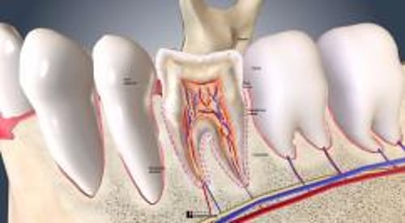

# 牙齿生物学

> **来源**: msd_家庭版  
> **分类**: 口腔牙齿疾病

---

# 牙齿生物学

$!
/$
$!
/$
作者：
[Rosalyn Sulyanto](https://www.msdmanuals.cn/home/authors/sulyanto-rosalyn)
,
DMD, MS
,
Boston Children's Hospital
Reviewed By
[David F. Murchison](https://www.msdmanuals.cn/home/authors/murchison-david)
,
DDS, MMS
,
The University of Texas at Dallas
已审核/已修订
4月 2024
|
修改的
7月 2025
v1521125_zh
**
浏览专业版
- 多媒体 |

牙齿分为 **牙冠** （牙龈线上方部分）和 **牙根** （牙龈线下方部分）。

牙冠覆盖着白色的 **牙釉质** ，对牙齿起保护作用。牙釉质是人体内最坚硬的的物质，但一旦损坏，很难自行修复。

**牙本质** 位于牙釉质的下方，与骨骼相似但质地更坚硬。牙本质包绕着位于牙齿中心位置的髓室，髓室内含有神经、血管以及结缔组织。牙本质对触碰和温度变化敏感。

牙根部的牙本质包绕形成牙根管，血管和神经通过牙根管进入髓室。牙根部牙本质的外层是一薄层类骨样的物质，即 **牙骨质** 。牙骨质被膜（牙周韧带）所包围，该膜为牙齿提供缓冲，并将牙骨质层（与整个牙齿）牢固地附着在颌骨上。

牙内视图

|  |
| --- |

人类有两套天然牙齿：

- 乳牙（婴儿的牙）：最先出现的牙齿，随后被恒牙取代
- 恒牙（成人的牙）：替代乳牙的牙齿

乳牙有 20 颗：左右成对，包括上下颌中（前）切牙、侧切牙、尖牙（犬齿）、第一磨牙和第二磨牙。

恒牙有 32 颗：左右成对，包括上下颌中切牙、侧切牙、尖牙、第一前磨牙、第二前磨牙和第一、第二、第三磨牙（智齿）。但是，智齿变数很大，并非所有人都能够长出全部 4 颗智齿，有的人甚至没有智齿。

口腔的结构

|  |
| --- |

牙齿内

3D 模型

## 牙齿萌出

牙齿通过牙龈组织（萌出）进入口腔中的时间范围十分广泛。对于乳牙，中切牙是在约 6 个月大时萌出的第一对牙齿。随后是侧切牙、第一乳磨牙、尖牙，最后是第二乳磨牙。到大约两岁半时，通常可以在儿童口腔中看到所有乳牙。

从大约 6 岁开始，恒牙将向外推压每颗乳牙。第一恒磨牙（6 岁时）在最后一对乳磨牙后长出，因此，不替代任何牙齿。同样，第二和第三恒磨牙也不替代任何牙齿。第三恒磨牙（智齿）是最晚长出的恒牙，通常在 17 至 21 岁之间。

**阻生齿** 是由于缺乏空间或牙齿的位置而不能萌出的牙齿。最常见的 阻生 齿是智齿。

在罕见情况下，婴儿 *出生时* 带有牙齿（胎生牙），或乳牙在出生后第一个月内萌出（新生牙）。这些牙齿通常是下乳切牙，但也可能是多生（多余的）牙。仅当这些牙齿干扰哺乳或变得非常松动时，才会拔除。

在许多儿童中，下恒切牙彼此紧靠在一起。空间不足（由于拥挤、恒牙旋转或骨骼发育异常）可能造成问题，因此可能需要早期 正畸治疗 （牙套）。有时，不良的吮指（拇指或其他的指头）习惯也会影响到牙齿的排列，也需要进行早期的正畸治疗来矫正。

Test your Knowledge
[Take a Quiz!](https://www.msdmanuals.cn/home/pages-with-widgets/quizzes)

版权所有 © 2026 Merck & Co., Inc., Rahway, NJ, USA 及其附属公司。保留所有权利。

- 关于
- 免责声明

版权所有 © 2026 Merck & Co., Inc., Rahway, NJ, USA 及其附属公司。保留所有权利。
