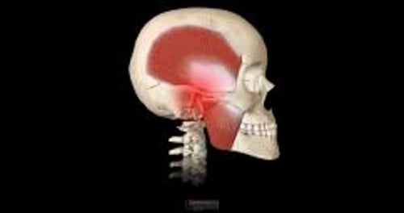

# 磨牙

> **来源**: msd_家庭版  
> **分类**: 口腔牙齿疾病

---

# 磨牙

$!
/$
$!
/$

## （磨牙症）

作者：
[Bernard J. Hennessy](https://www.msdmanuals.cn/home/authors/hennessy-bernard)
,
DDS
,
Texas A&M University, College of Dentistry
Reviewed By
[David F. Murchison](https://www.msdmanuals.cn/home/authors/murchison-david)
,
DDS, MMS
,
The University of Texas at Dallas
已审核/已修订
1月 2024
|
修改的
4月 2025
v6529017_zh
**
浏览专业版

磨牙（磨牙症）是指咬紧或碾磨牙齿。

- 治疗 |
- 了解更多信息 |
- 多媒体 |

磨牙可在睡眠时（称为睡眠磨牙症）和清醒时（清醒磨牙症）发生。磨牙最终会磨损并损伤牙齿。 胃食管反流病 (GERD) 和/或阻塞性睡眠呼吸暂停 患者中损伤通常更严重。人造牙冠（由金，瓷，或两者而制成）可破裂、穿孔并损坏，但如果瓷是在咀嚼面，与其相对的牙齿可被磨损。有些人还会出现头痛，颈部和/或下颌疼痛，这是由于反复的肌肉紧缩而导致的。

人们通常并不是有意地磨牙和咬牙。咬牙是无意识的，通常在睡眠时最为严重。尽管已经睡着了，由于没有主动的保护性反馈机制，人们可能会以高达 250 磅（1,700 千帕斯卡）的力咬紧牙。人们可能并未意识到自己在咬牙，但家人往往会注意到。

磨牙

3D 模型

## 磨牙的治疗

- 清醒时，避免磨牙，有时需要使用护板
- 睡觉时，佩戴夜用护板

在清醒时，人们必须有意识地尽量不要咬牙。睡觉时，他们可以戴适合牙齿之间的塑料口腔矫治器（夜用护板）。这种夜用护板可防止牙齿磨在一起。严重磨牙和咬牙的患者在白天也需要佩戴护板，既可以保护牙齿，也可提醒患者不要咬牙。通常，这些设备是由牙医制作并可进行调整来符合个人的需求。对于一些人来说，比如那些唯一的问题是牙齿磨损的人，牙医可能会建议使用一种非处方的护板，这种护板可以在家进行热成型（像运动员用的牙护板）。人们在使用这些设备前应经过牙医的评估。

## 了解更多信息

以下是可能对您有帮助的英文资料。请注意，本手册对该资源的内容不承担责任。

- MouthHealthy.org ：该资料提供有关口腔健康的信息，包括营养和选择美国牙科协会批准印章产品的指南。它还提供寻找牙医、如何以及何时去看牙医的建议。

Test your Knowledge
[Take a Quiz!](https://www.msdmanuals.cn/home/pages-with-widgets/quizzes)

版权所有 © 2026 Merck & Co., Inc., Rahway, NJ, USA 及其附属公司。保留所有权利。

- 关于
- 免责声明

版权所有 © 2026 Merck & Co., Inc., Rahway, NJ, USA 及其附属公司。保留所有权利。
