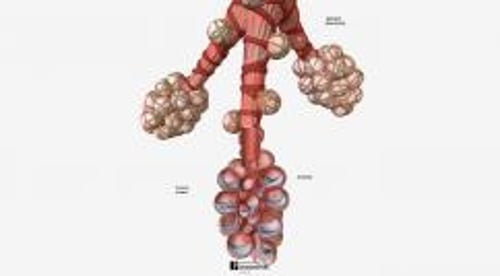

# 心力衰竭 (HF)

> **来源**: msd_家庭版  
> **分类**: 心脏血管疾病

---

# 心力衰竭 (HF)

$!
/$
$!
/$

## （充血性心力衰竭）

作者：
[Nowell M. Fine](https://www.msdmanuals.cn/home/authors/fine-nowell)
,
MD, SM
,
Libin Cardiovascular Institute, Cumming School of Medicine, University of
Calgary
Reviewed By
[Jonathan G. Howlett](https://www.msdmanuals.cn/home/authors/howlett-jonathan)
,
MD
,
Cumming School of Medicine, University of Calgary
已审核/已修订
修改的
10月 2025
v718838_zh
**
浏览专业版
[小知识](https://www.msdmanuals.cn/home/quick-facts-heart-and-blood-vessel-disorders/heart-failure/heart-failure)

心力衰竭是指心脏的泵血能力无法满足身体需求，导致血流减慢，血液积聚在静脉和肺内（充血），并且/或者出现其他可能进一步削弱心功能或使心脏僵硬的改变。

- 病因 |
- 症状 |
- 诊断 |
- 治疗 |
- 预防 |
- 了解更多信息 |
- 多媒体 |
- 当心脏肌肉的收缩动作或松弛动作不充分时会出现心力衰竭，这通常是因为心肌无力、僵硬，或两者均存在所致。
- 多种心脏疾病都可导致心力衰竭。
- 起初，许多人都不会表现明显症状，随着病情进展，几天到几个月之后，就会表现呼吸困难以及虚弱。
- 肺脏、腹腔或腿部可能积液。
- 医生一般根据症状疑诊心力衰竭，但也常会做一些检查（如超声心动图 [心脏超声检查]）来评估心功能。
- 治疗重点为治疗引起心力衰竭的疾病，改变生活方式，并通过药物、手术或其他干预措施治疗心力衰竭。

## 心力衰竭的病因

心力衰竭的病因包括：

- 直接影响心脏的疾病（心源性病因）
- 间接影响心脏的身体其他系统疾病（非心源性病因）

任何直接和间接影响心脏的疾病均可导致心力衰竭。一些疾病迅速地引起心力衰竭。而另一些则需要很多年。一些疾病可引起收缩性心力衰竭，另一些疾病可引起舒张性心力衰竭，还有一些疾病（如 高血压 和 心脏瓣膜病 ）则可同时引起这两类功能不全。

### 心力衰竭的心源性病因

引起心力衰竭的心源性病因可能损伤整个心脏或心脏的某一区域。多数情况下，多种病因的结合才会导致心力衰竭。

心力衰竭的 **常见心源性病因** 是：

- 冠状动脉疾病

冠状动脉疾病可导致流向心肌的富氧血减少，而心肌的正常收缩需要氧气，所以这种疾病会大面积损伤心肌。冠状动脉某个分支阻塞可引起 心脏病发作 ，导致相应区域的心肌受到破坏。这个区域的心肌便不能正常收缩。

心力衰竭的 **其他心源性病因** 包括：

- 心肌炎（心脏肌肉发炎）
- 有些药物（例如一些化疗药）
- 有些毒素（例如酒精）
- 心脏瓣膜病
- 心腔之间存在异常连接（例如 室间隔缺损 ）
- 影响心脏电传导系统并引起 异常心律 的疾病
- 有些遗传性疾病
- 使心脏僵硬的疾病

细菌、病毒或其他感染引起的 心肌炎 （心脏肌肉发炎）可损伤全部或部分心肌，从而削弱心脏泵血能力。

一些用于治疗癌症的药物和一些毒素（例如酒精）也可能损害心肌。

心脏瓣膜病 ，也就是瓣膜狭窄，从而阻碍血液流过心脏，或使血液从瓣膜漏回（反流或闭锁不全），可引起心力衰竭。瓣膜狭窄和反流能明显加重心脏负荷，长此以往，心脏会增生肥大，泵血功能下降。

心腔之间的异常连接（如 室间隔缺损 ）可使血液在心脏内部再循环，增加了心脏的工作负荷，从而可引起心力衰竭。

影响心脏电传导系统（见图 跟踪心电传导通路 ）并引起 心律长时间改变 （特别是心跳加快或不规则）的疾病亦能引起心力衰竭。当心脏跳动不正常时，泵血便不充分了。

有些遗传性疾病可影响心脏并导致心力衰竭。例如， 杜兴氏肌营养不良 可引起心肌（以及许多其他肌肉）无力。 唐氏综合征 可引起心脏出生缺陷。

心力衰竭可能归因于引起心壁僵硬的其他疾病，例如浸润和感染。例如，在 淀粉样变性 中，一种异常蛋白质——淀粉样蛋白会进入（浸润）机体的许多组织。如果淀粉样蛋白浸润心室壁，会使心室壁变硬，并导致心力衰竭。在热带国家，某些寄生虫浸润心肌后（如发生 南美锥虫病 时）会导致心力衰竭，甚至年轻人也会发病。

在 缩窄性心包炎 中，心包（包裹心脏的囊）会变得僵硬，导致即使健康的心脏也无法正常泵血和充盈。

您知道吗……

| 心力衰竭并不意味着心脏停止跳动了。它是指心脏不能胜任它的工作。 |
| --- |

### 心力衰竭的非心源性病因

心力衰竭的 **最常见非心源性病因** 是：

- 高血压 未充分受控

高血压加重心脏负荷是因为必须较正常情况下更加有力的收缩才能将血泵入主动脉以对抗升高了的血压。最终，心壁增厚（肥厚）和/或僵硬。僵直的心脏不能快速充盈或充盈不全，每次收缩时较正常情况下只能泵出更少的血液。 糖尿病 和 肥胖症 也可使心室壁发生僵硬性改变。

随着年龄的增大，心室壁也会逐渐变得僵硬。老年人中常见的高血压、肥胖症和 糖尿病 与年龄相关性僵硬共同作用导致心力衰竭的情况在老年人中尤其常见。

心力衰竭的 **不常见非心源性病因** 包括：

- 肺动脉血压高（肺动脉高压，有时由肺栓塞引起）
- 贫血
- 甲状腺疾病
- 肾衰竭
- 一些药物

肺动脉高压 等有些肺部疾病可能会改变或损伤肺内血管（肺动脉）。因此，负责将血液泵入肺部的心脏右侧必须更加努力地工作。然后，患者可能出现 肺源性心脏病 ，导致右心室（心脏下腔）扩大和右心衰竭。

肺栓塞 （一个或多个血栓突然严重阻塞了肺动脉）也会使得泵血进入肺动脉变得困难并由此引起右心衰竭。

贫血 是指红细胞重度缺乏（血细胞计数低）。红细胞可将氧气从肺部运送到机体组织。贫血时，降低了血液运载氧的能力，因此为了向组织提供相同量的氧，心脏必须做更多的工作。贫血有很多原因，包括心力衰竭本身。

甲状腺过度活跃（ 甲状腺功能亢进症 ）时会过度刺激心脏，导致心脏泵血太快，以致每次心搏时不能正常排空。当甲状腺不够活跃（ 甲状腺功能减退症 ）时，包括心肌在内的所有肌肉会变得无力，这是因为没有甲状腺激素，肌肉无法正常工作。

肾衰竭 可使心脏劳损是因为肾衰竭时，肾脏不能清除血流中的过多液体，导致心脏需要泵出的血量增加。最终，心脏不能胜任它的工作，从而出现心力衰竭。

一些药品，如非甾体抗炎药，可能会引起血流滞留，从而增加心脏的负荷量，并且导致心力衰竭。

老年化专题：老年人心力衰竭的病因

| 老龄化本身并不导致心力衰竭。但是，老年人更有可能存在引起心力衰竭的最常见病因——长期 高血压 和冠状动脉疾病导致的 心脏病发作 。 这些疾病可以从两个途径导致心力衰竭。它们会使心脏的以下能力出现问题： 充盈血液 泵出血液 老年人中，充盈问题（称为舒张功能障碍）和泵血问题（称为收缩功能障碍）都很常见。 充盈问题 充盈问题通常发生在心室壁变得僵硬。导致心室血液不能正常充盈，射血减少。随着人们年龄的增长，心脏肌肉会变得越来越僵硬，使心脏充盈受损更易发生。高血压会导致心肌肥厚僵硬从而影响心脏的充盈。 充盈减少原因不只是心脏肌肉僵硬。例如，在 心房颤动 （一种随着年龄增长而越来越常见的异常心律）中，心房搏动快速且不规则。因为心房不能把足够的血液射进入心室。老年人如果突发房颤可能会导致心力衰竭。 泵血问题 泵衰竭通常是发生在心脏肌肉受损时。受损的心脏泵血减少，造成心脏内部压力增加，心脏的心室扩大。 老年人发生心脏损伤的最常见原因是 心脏病发作 （由于给心脏供血的动脉阻塞所致）。 心脏瓣膜疾病也能引起泵衰竭。 在 主动脉瓣狭窄 （一种心脏瓣膜病）中，左心室和主动脉之间的开口（主动脉瓣）狭窄。导致心脏的泵血困难。主动脉瓣狭窄是老年人心力衰竭的常见原因。 如果长期存在某种肺病（如 COPD [慢性阻塞性肺病] 或瘢痕形成 [肺纤维化]），肺部血压会升高。导致血液很难从右心室泵入肺脏。 |
| --- |

## 心力衰竭的症状

心力衰竭的症状开始可以很突然（急性心力衰竭），特别是当病因是心脏病发作时。对大多数人而言，第一次出现心衰时，没有什么症状体现。症状会在数天至数月或数年内逐渐进展（慢性心力衰竭）。心力衰竭可以稳定一段时期，但常常会缓慢而凶险地进展。然而，患者可能会突然注意到症状，比如第一次出现使活动受限的症状，或在休息时出现症状。

一些常见症状是：

- 气短
- 疲劳
- 腿部积液（ 水肿 ）
- 不能运动锻炼，也不能进行需要用力的其他活动

在老年人中，心力衰竭有时可引起一些模糊的症状，例如困倦、意识模糊和定向障碍。

医生通常根据患者进行日常生活活动的能力对 **心力衰竭的严重程度** 分级。纽约心脏病协会 (NYHA) 分级仍然是患者和其医护人员了解疾病严重程度及疾病对生活影响程度的一个重要工具（见表 美国纽约心脏病协会心力衰竭分级 ）。

右心衰竭和左心衰竭引起的症状不同。虽然可能存在两种类型的心力衰竭，但通常以一侧心力衰竭的症状为主。最终，左心衰竭会引发右心衰竭。

### 右心衰竭的症状

右心衰竭的主要症状是积液，导致足部、脚踝、腿部、下背部、肝脏和腹部肿胀（ 水肿 ）。什么地方出现液体潴留取决于额外液体的量和重力的影响。如果一个人处于站立位，液体会在腿和脚潴留。当处于卧位，液体通常会在腰部潴留。如果液体的量较大，液体也会在腹部潴留。肝脏或胃部的液体潴留可引起恶心、腹胀和食欲不振。重度右心衰竭可导致体重减轻和肌肉减少。这种情况称之为心源性恶病质。

### 左心衰竭的症状

左心衰竭可导致肺内积液，引起 气短 。起初，气短只发生在活动时，心力衰竭加重后，轻微活动甚至休息时均出现气短。重度左心衰竭的患者躺下时可能会气短（一种称为端坐呼吸的疾病），这是因为躺下时重力作用会使更多液体流入肺部。这种病人经常睡梦中惊醒，发生喘息（称之为夜间阵发性呼吸困难）。坐起来会使一些液体引流至肺底部，从而使呼吸更顺畅。当进行体力活动时，左心衰竭的人会感到疲乏和虚弱，因为他们的肌肉得不到足够的血液供应。

左心衰竭：肺水肿

3D 模型

### 重度心力衰竭的症状

心力衰竭严重时，可能会出现一种称为陈-施氏呼吸的周期性呼吸。在这种异常的呼吸模式中，患者会有几秒钟无呼吸，然后呼吸开始逐渐加快、加深，接着呼吸减慢、变浅，直至再次短暂停止呼吸，之后不断重复上述周期。出现陈-施氏呼吸，是因为流经大脑的血流减少，导致控制呼吸中枢的相应大脑区域没有获得足够的氧所致。目前认为陈-施呼吸属于 中枢性睡眠呼吸暂停 。

阻塞性睡眠呼吸暂停 （气道阻塞使睡眠中断，导致白天困倦）是另一种常见于有或无心力衰竭人群中的呼吸疾病。重度阻塞性睡眠呼吸暂停可使心力衰竭恶化。一种称为 中枢性睡眠呼吸暂停 的相关疾病在心力衰竭患者中也更常见，并可能使心力衰竭恶化。

**急性肺水肿** 是指肺内突然大量积液。它会引起极度呼吸困难、呼吸急促、皮肤发青，并有烦躁不安、焦虑和窒息的感觉。一些人出现严重的呼吸道痉挛（支气管痉挛）和喘息，称之为心源性哮喘。急性肺水肿是一种危及生命的急症，当心力衰竭患者血压很高或心脏病发作时，或有时只是停用抗心力衰竭药或吃咸食时，可能会发生这种急症。

心脏严重损伤时，心腔内会形成 **血栓** 。形成血栓是因为心腔内的血流缓慢。血栓可能发生脱落（变成栓子），随血流游移，部分或完全阻塞某处动脉。如果血栓阻塞了脑部某动脉，可能导致 中风 。

抑郁 和心理机能下降在重度心力衰竭患者中比较常见（特别是老年患者），需要仔细评估和治疗。

## 心力衰竭的诊断

- 胸部 X 线检查
- 心电图(ECG)
- 超声心动图、心脏磁共振成像 (MRI) 和其他影像学检查
- 血液化验

医师通常在症状的基础上怀疑有否心力衰竭。诊断来自体格检查的结果，包括细弱而快速的脉搏、降低的血压、异常的心音、肺水肿（包括听诊）、扩大的心脏、怒张的颈静脉、肿大的肝脏、膨隆的腹部及肿胀的下肢。

通常进行评估心脏功能的检查。也需要做检查明确心力衰竭的病因。

### 胸部 X 线检查

胸部 X 线检查能显示心脏扩大、血管充血和肺内积液。

### 心电图

心电图 (ECG) 检查对判断心律是否正常以及患者有无心脏病发作史而言几乎是必做的。

### 超声心动图

超声心动图 利用声波生成心脏图像，是评估心功能（包括心脏泵血能力和心脏瓣膜功能）的最佳检查之一。超声心动图能显示：

- 心壁是否增厚和舒张是否正常
- 瓣膜功能是否正常
- 心脏收缩是否正常
- 是否有局域性室壁收缩异常

超声心动图通过让医师测量室壁厚度和僵硬程度及射血分数从而用于判断心力衰竭是否由于收缩或舒张功能不全所引起。射血分数，是心功能的重要检测指标，是指每搏输出量占心室舒张末期容积量的百分比。正常的左心室会射出其血量的 55% 至 60% 左右。如果射血分数低于 40%，则可确诊收缩性心力衰竭。如果患者有心力衰竭症状、但射血分数正常或升高，则很可能是舒张性心力衰竭。

与超声心动图相比，心脏 MRI 可以显示心脏某些方面的更多细节，包括炎症程度、瘢痕的存在以及右心室的大小和功能等信息。

### 血液化验

几乎总会进行血液检查。医生会经常测量利钠肽。利钠肽是心力衰竭时在血液中积聚的一种物质，但在引起气短的其他疾病中则较少出现这种物质的积聚。可以进行其他血液检查，以查找可能导致心力衰竭的疾病，或可能使心力衰竭恶化或使治疗复杂化的疾病。

### 其他测试

为了确定有无心力衰竭或明确其病因，可能会做其他一些检查，例如 放射性核素显像 、 计算机断层扫描 (CT)、 心导管检查术及血管造影 、 运动负荷试验 。

罕见情况下，通常是医生怀疑心脏受到浸润（如发生 淀粉样变性 时）或者细菌、病毒或其他感染导致心肌炎时，需进行心肌活检。

## 心力衰竭的治疗

- 急性心力衰竭的稳定
- 饮食和生活方式改变
- 针对心力衰竭的病因治疗
- 药物
- 有时采用植入式心脏复律除颤器、心脏再同步化治疗或机械循环支持
- 有时进行心脏移植

治疗心力衰竭需要采取多种一般措施，包括治疗引起心力衰竭的病因、改变生活方式、药物治疗等。本节中的大部分讨论适用于左心衰竭。有关该主题的更多信息，请参阅 “右心衰竭 ”。

### 急性心力衰竭的稳定和治疗

心力衰竭迅速进展或恶化时要求到医院进行急诊治疗。急性心力衰竭（无论是新确诊的还是原有疾病恶化）的治疗，都着重于：

- 支持呼吸并提供其他生命支持
- 确定可治疗的病因
- 用药物和其他治疗缓解充血和支持心脏功能
- 向长期（慢性疾病）管理过渡

医生将为危重患者提供氧气和呼吸支持以及其他生命支持措施。呼吸支持的范围从简单的氧气管到呼吸管和呼吸机。如果心脏停止跳动或无法有效泵血，可能需要进行心肺复苏和除颤。

医生还将尝试确定急性心力衰竭的病因，例如心脏病发作或心律问题，以便快速治疗，从而改善心力衰竭或防止病情恶化。在心脏病发作中，这可能意味着需要进行心导管插入、血管成形术和支架植入术。在心律问题中，这可能意味着需要进行药物治疗或电击治疗。

在大多数情况下，会给予利尿剂以缓解充血（肺水肿）。在许多情况下，会给予其他药物以支持心脏功能并快速控制高血压或低血压。对于有重度症状且治疗效果不佳的患者，类似于 肾上腺素 和 去甲肾上腺素 的药物（如多巴胺和多巴酚丁胺）或其他可促进心肌更有力收缩的药物（如米力农）有时可短期用于增强心脏泵血功能。但这些药物不能用于长期治疗。有时需要借助机械装置来帮助心脏正常运作。

早期治疗可快速实施，甚至可以同时进行。一旦患者病情稳定（通常在医院环境中），医生会开始慢性心力衰竭治疗，这部分将在本节的其余部分描述。

### 急性肺水肿

**急性肺水肿** 是指肺内突然大量积液。它会引起极度呼吸困难、呼吸急促、皮肤（或嘴唇、舌头和甲床）发青，并有烦躁不安、焦虑和窒息的感觉。一些人出现严重的呼吸道痉挛（支气管痉挛）和喘息，称之为心源性哮喘。急性肺水肿是一种危及生命的急症，当心力衰竭患者血压很高或心脏病发作时，或有时只是停用抗心力衰竭药或吃咸食时，可能会发生这种急症。

如果发生急性肺水肿（肺内迅速积液），应通过面罩给氧。静脉给予利尿剂和其他药物如硝酸甘油或舌下含化硝酸甘油也能很快起效，迅速改善心功能。吗啡可缓解通常伴随急性肺水肿出现的焦虑，但也会降低呼吸频率，因此不常使用。如果这些措施仍然不能改善呼吸，可给予特殊面罩在控制压力下吸氧或病员呼吸道会安置一根通气管，以便进行人工呼吸机辅助呼吸。

### 慢性心力衰竭的一般措施

尽管对大多数人而言，心力衰竭是一种慢性疾病，但是仍然可采取许多措施来提高运动耐量，改善生活质量，最大限度降低疾病突然恶化（急性心力衰竭）的风险，并延长寿命。通过影响患者以及他的家庭成员，让他们学习关于心力衰竭的知识，因为更多的照顾都来源于家庭。尤其是，他们应该知道怎样去辨别心力衰竭发生的前驱症状，并且意识到面对这一情况应该采取的行动（譬如，减少盐的摄入、加大利尿剂的剂量或者联系医生）。

定期随诊及接受医务人员或接受经过心力衰竭培训的医生的检查是治疗的关键。例如，护士会定期通过电话询问心力衰竭患者的体重及症状的变化。她们能决定这名病员是否需要就诊。

人们也可以去专业的心力衰竭治疗诊所。这些诊所拥有心力衰竭专业治疗医生，他们可以与经过专业培训的护士和其他医护人员如药剂师、营养师、社会工作者密切合作通过向患者及其看护者传授自我护理技巧护理心衰病人。这些诊所可以通过确保患者接受最有效的治疗来减少病症，减少住院开支并提高生活质量。这些治疗只是补充而不是替代早期医生提供的治疗。

对于患有心力衰竭的患者，在服用新药即使是非处方药之前，都需咨询医生。有些药物（包括许多用于治疗关节炎的药物）可引起水钠潴留。其他药物可能会降低心脏功能的效率。忘记服用必要的药品是症状加重的一个常见原因，患者应该采取一些方法提醒他们按时服药。

流感会导致心力衰竭突然恶化，因此医生建议心衰患者进行每年接种一次 流感疫苗 。还建议接种 新冠病毒 疫苗。

您知道吗……

| 心力衰竭通常是一种慢性疾病，生活方式的改变可以使症状得到改善，心功能得到好转。 |
| --- |

### 病因治疗

例如，如果心力衰竭的病因是瓣膜狭窄或反流性瓣膜病或心室之间的异常连通，通过外科手术可以纠正。 冠状动脉阻塞 可能需要通过药物、手术或血管成形术（植入冠状动脉支架）治疗。抗高血压药物可降低血压并控制高血压。抗生素能治疗一些感染。

### 改变生活方式

通过改变生活方式，数种心力衰竭的危险因素能被减小或消除。

心力衰竭患者应保持适宜的体力活动，尽管他们运动不能进行得太剧烈。轻度心力衰竭患者应在医师指导下进行体育锻炼。而严重心力衰竭患者则需要受到专门训练的助手监视下在心血管康复器械上进行锻炼。

有心力衰竭和肥胖的患者，活动时心脏负荷更大，会加重心力衰竭。这类人必须通过健康的饮食减肥，以实现并维持理想体重。

吸烟会损害血管健康。大量的酒精如同毒素能直接作用于心脏。因此， 吸烟 和饮酒会使心力衰竭恶化，应该戒掉或尽量减少吸烟和饮酒。

饮食中过多的盐（钠）能引起体液潴留，可以抵消增加液体排出的药物（如利尿剂）和减轻体液潴留药物的作用。因此，食用过多的盐会加重症状。几乎所有的心力衰竭患者均应限制食盐和较咸食物的摄入及烹饪时盐的使用。食物中盐的含量可以从标签中得知。严重心力衰竭的患者通常也被详细的告诉如何控制盐分的摄入。营养师的指导对患者有帮助。控制盐类摄入时病员通常不被限制水分的摄入，除非他们水潴留也很严重。但过量饮水也不提倡。

一个简单可靠的检查身体是否有水滞留的方法就是每天测体重。医师经常要求心力衰竭患者每天尽可能准确地测量体重，一般选在清晨病员起床及小便后，进早餐前。在每天同一时刻，用同一个秤，穿同样的衣服，每天记录测量的体重易于发现体重的变化趋势。每天体重增加超过 l kg 是液体潴留的早期警示征象。持续迅速的体重增加（如每天 l kg），说明心力衰竭在恶化。

许多限制食盐摄入的病人仍存在水肿。坐在凳子上时应抬高水肿的大腿。这个位置有助于机体重吸收和消除过多的液体。有些病人还需要穿全长度的支持性长袜，以帮助防止液体潴留。如果出现肺部淤血，高枕卧位有助于睡眠。

### 治疗慢性心力衰竭的药物

治疗慢性心力衰竭的药物包括：

- 有助于延长生存期的药物： β 受体阻滞剂 、 血管紧张素受体/脑啡肽酶抑制剂 (ARNI)、 盐皮质激素受体拮抗剂 和 钠-葡萄糖共转运蛋白-2 (SGLT2) 抑制剂
- 有时用于缓解症状的药物： 利尿剂 、 地高辛 或 血管扩张剂

使用哪类药物取决于心力衰竭的类型。对于收缩性心力衰竭 (HFrEF)，通常会使用所有 4 类已被证明有助于提高生存率的药物。对于 HFmrEF，可以使用部分或全部类型的药物，尽管研究表明这些药物对患者没有太大帮助。对于舒张性心力衰竭 (HFpEF)，建议所有患者使用 SGLT2 抑制剂，对持续充血的患者使用利尿剂，对某些患者使用其他类别的药物，如 ARNI 和盐皮质激素受体拮抗剂。

患者应按时服药并确保随时备有医生在处方中开出的药物，这一点很重要。

### β-受体阻滞剂

β 受体阻滞剂（如卡维地洛、美托洛尔和比索洛尔）常与血管紧张素转换酶 (ACE) 抑制剂一起用于治疗心力衰竭，是心力衰竭治疗的另一主要手段。这些药物可阻断 去甲肾上腺素 （增加心脏的负荷）的效应，并能长期改善心功能和生存期。它们是是收缩性心力衰竭患者的一种基本疗法。β 受体阻滞剂可以初步减小心脏收缩力，因此通常在心力衰竭被药物稳定下来后开始使用。

### 血管紧张素受体/脑啡肽酶抑制剂及相关药物

血管紧张素受体/脑啡肽酶抑制剂（ARNI，如沙库巴曲/缬沙坦）是一种用于治疗心力衰竭的新型组合药物。它们包括血管紧张素受体阻滞剂 (ARB) 和硝化素抑制剂。 血管紧张素 II 是一种激素，可触发醛固酮和 血管加压素 的释放，而醛固酮和血管加压素均可使肾脏保留盐和水。ARB 和 ACE 抑制剂可阻断 血管紧张素 II 的产生或作用，从而有助于限制体液潴留，是收缩性心力衰竭治疗的主要手段之一。ARB 和 ACE 抑制剂还可以通过扩宽（扩张）血管来减轻心脏的负担。这些药物不仅能够减少症状和住院天数，而且可以延长寿命。脑啡肽酶是一种参与对机体排钠起信号作用的某些物质（肽）分解的酶。这类药物通过抑制这些肽的分解，降低血压并增加钠排泄，从而减轻心脏的工作负荷。在收缩性心力衰竭患者中，联合用药在延长生存期方面的效果优于 ACE 抑制剂或 ARB 单独用药。

### 盐皮质激素受体拮抗剂

醛固酮是一种称为盐皮质激素的激素，可使肾脏保留盐和水。盐皮质激素受体拮抗剂（如螺内酯和依普利酮），也称为醛固酮拮抗剂（阻滞剂），可直接阻断醛固酮的作用，并有助于限制体液潴留。这类药物可延长心力衰竭患者的生存期并缩短住院时间。

### 钠-葡萄糖共转运蛋白 2 抑制剂 (SGLT2)

钠-葡萄糖共转运蛋白 2 抑制剂（如恩格列净、达格列净和 sotagliflozin）用于治疗 糖尿病 。除了降低血糖（葡萄糖）水平之外，这类药物也对心肌和血管具有有益作用。达格列净是这类药物中的一种，已被证明可减少心力衰竭症状并改善某些收缩性心力衰竭患者的生活质量。这类药物中的另一种药物恩格列净已被证明可减少因舒张性心力衰竭而住院的情况。

### 利尿剂

如果仅限盐不能减轻体液潴留，医生通常会开一些利尿剂（“水丸”）。这些药物通过增加尿液生成来帮助肾脏排出盐分和水分，从而减少全身的体液量。

**袢利尿剂** （如呋塞米、托拉塞米或布美他尼）是最常用于治疗心力衰竭的利尿剂。这些利尿剂通常长期口服，但在紧急情况下，静脉注射也非常有效。袢利尿剂通常适用于中重度心力衰竭。

**噻嗪类利尿剂** （如氢氯噻嗪）的作用温和，可降低血压，特别适用于同时患有高血压的心力衰竭病人。

袢利尿剂和噻嗪类利尿剂可使钾在尿液中流失，导致 低钾血症 。因此，也可能给予能使血钾水平升高的利尿剂（保钾利尿剂）或钾补充剂。对于所有心力衰竭患者，螺内酯都是首选的保钾利尿剂，除非患者的肾功能严重减退，否则应使用螺内酯。它能延长心衰患者的生存期。

利尿剂可能加重尿失禁。因此，利尿剂应定时服用，以免发生尿失禁时找不到卫生间。

### 用于治疗慢性心力衰竭的其他药物

其他药物有时是有用的。

**地高辛** ，最古老的治疗心力衰竭的药物之一，可以增加心肌收缩力，减慢心率。 地高辛 有助于缓解有些收缩性心力衰竭患者的症状，但与此处讨论的其他抗心力衰竭药不同，它不能延长患者的生存期。医生也尝试使用除 地高辛 外可增强心脏泵血能力的药物，但迄今为止，尚无疗效得到证实的其他药物，并且有些药物会增加死亡危险。

窦房结是心脏的一部分，可触发心跳并设置心率。 **窦房结抑制剂** ，如伊伐布雷定，可以减缓窦房结的活动频率。减慢心率可降低心脏的工作负荷，并有助于减少某些心衰患者需要住院的次数。

**血管扩张剂** （扩宽血管的药物）可使心脏能更轻松地泵血。这些药物包括肼屈嗪、硝酸异山梨酯和硝酸甘油贴剂或喷雾剂。对 ARNI、ACE 抑制剂或 ARB 无反应或不能服用这些药物的患者可以从血管扩张剂中获益。在一些有晚期症状的患者中，这些药物在与 ARNI 联用时可能会改善生活质量和延长寿命。

如果心律异常，可给予 **抗心律失常药** （见表 治疗心律失常使用的一些药物 ）。

### 治疗急性和慢性心力衰竭的其他措施

有时，医生会在重度心力衰竭患者的胸部植入一个小型监测装置。该监测装置会持续测量患者肺部的压力，这有助于医生调整药物治疗方案。这种监测仪对心力衰竭反复发作且并存 肾衰竭 的患者尤其有用。

对于心力衰竭非常严重并正在恶化、且药物治疗无效的患者， 心脏移植 可能是一个治疗选择。

帮助泵血的 **机械装置** 适用于某些心力衰竭非常严重且药物治疗无效的患者。装置的类型包括：

- 主动脉内球囊反搏（IABP，有时也称为球囊反搏）：将导管末端的香肠状球囊置入主动脉。一台机器会监测心搏，在心脏舒张时给球囊充气，在心脏收缩时给球囊放气，这会使心脏更容易泵血。
- 心室辅助装置：为了帮助心脏泵血，可在左心室或右心室内或附近植入不同的机械泵。
- 血管内辅助装置：可将小泵植入主动脉等大血管内，以帮助泵血。
- 体外膜肺氧合 (ECMO)：一种类似于心肺体外循环机的装置从大动脉抽取血液，并将其泵过允许氧气进入血液的膜，然后再将其泵回大静脉。

药物治疗有时对纠正心律问题有帮助，但有些患者需要植入 心脏起搏器 。一种带有两条或三条引线的起搏器可以使某些心衰患者恢复心室正常收缩顺序（心脏再同步疗法）并改善一些心力衰竭患者的转归。心功能很差的患者发生猝死的风险增加，因此医生可能会考虑使用 植入式心脏复律除颤器 。

如果心力衰竭是由心脏瓣膜问题引起的，医生可能会修补或置换瓣膜。

### 临终事宜

预期寿命长短取决于许多因素，包括心力衰竭的严重程度、心力衰竭的病因能否纠正以及使用哪种治疗。然而，一旦患者因心力衰竭而需要住院，只有约三分之一的患者可以再生存 5 年。治疗可延长生存期。

最终，如果患者发生心力衰竭有一段时间，生活质量会恶化，接受进一步治疗的可能性有限（特别是心脏移植不可行的老年患者）。相对于延长生命而言，保持舒适感或许更加重要。病员及家属都应参与这些决策。事实上，许多研究表明，严重心力衰竭病人和他们的家属都愿意讨论这些问题，并且这样做不会造成不必要的痛苦。为了向患者提供人文关怀、缓解症状并保持患者尊严，还有很多事需要做（参见 死亡和濒死 ）。

心力衰竭会在无症状恶化的情况下突然而意外地导致死亡。所以在条件允许时，心力衰竭患者应作出 预先指示 ，以提前决定在他们不能作出决定的情况下希望接受的治疗措施。因此对于这些患者，制定并更新愿望极为重要。

## 心力衰竭的预防

预防心衰包括在心衰前治疗可引起心力衰竭的疾病。可以治疗的疾病包括：

- 高血压
- 肥胖
- 阻塞性睡眠呼吸暂停
- 冠状动脉阻塞
- 心脏瓣膜病
- 某些异常心律
- 酒精使用障碍（或大量饮酒）
- 贫血
- 甲状腺疾病

## 了解更多信息

以下是可能对您有帮助的英文资料。请注意，本手册对该资料中的内容不承担任何责任。

- 美国心脏协会: 心力衰竭

Test your Knowledge
[Take a Quiz!](https://www.msdmanuals.cn/home/pages-with-widgets/quizzes)

版权所有 © 2026 Merck & Co., Inc., Rahway, NJ, USA 及其附属公司。保留所有权利。

- 关于
- 免责声明

版权所有 © 2026 Merck & Co., Inc., Rahway, NJ, USA 及其附属公司。保留所有权利。
