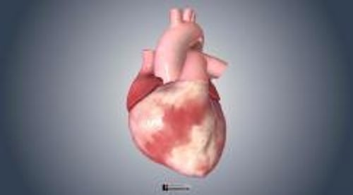

# 心室颤动

> **来源**: msd_家庭版  
> **分类**: 心脏血管疾病

---

# 心室颤动

$!
/$
$!
/$
作者：
[L. Brent Mitchell](https://www.msdmanuals.cn/home/authors/mitchell-brent)
,
MD
,
Libin Cardiovascular Institute, University of Calgary
Reviewed By
[Jonathan G. Howlett](https://www.msdmanuals.cn/home/authors/howlett-jonathan)
,
MD
,
Cumming School of Medicine, University of Calgary
已审核/已修订
9月 2024
|
修改的
10月 2024
v720022_zh
**
浏览专业版

心室颤动是由许多混乱电冲动引起的可能致命且不协调的一系列急速而无效的心室（下部心腔）收缩。

- 症状 |
- 诊断 |
- 治疗 |
- 了解更多信息 |
- 多媒体 |
- 心室颤动几秒内就可使病人失去意识，并且如果不及时治疗的话，随后可死亡。
- 心电图可帮助确定心脏骤停是否由于心室颤动所致。
- 必须在几分钟内开始心肺复苏，并且必须随后进行心脏除颤（对胸部电击）来恢复正常心律。

（也可参见 异常心律概述 。）

在心室颤动时，心室仅仅发生颤动但并不能协调地收缩。血液不能被泵出心脏，因此心室颤动是一种 心脏停搏 。不立即治疗会导致死亡。

心室颤动的最常见病因是存在某种心脏疾病、特别是由于 冠状动脉疾病 导致心肌血液灌注不足时（例如 心脏病发作 时）。其他原因包括：

- 心力衰竭
- 心肌病
- 休克 （血压很低），可由冠状动脉疾病和其他疾病引起
- 电击
- 淹溺
- 长 QT 综合征 （可能引起 尖端扭转型室性心动过速 ），包括由于血钾水平极低（ 低钾血症 ）导致的长 QT 综合征
- 影响心内电流的药物（如钠通道阻滞剂或钾通道阻滞剂——见表 治疗心律失常使用的一些药物 ）
- 心脏离子通道病
心室颤动

3D 模型

## 特发性心室颤动

对于由心室颤动引起的心脏骤停而复苏的患者，通常进行心脏病评估，尤其是 冠状动脉疾病 、 心肌病 和 通道病 。如果检查未发现任何致病性疾病，则认为此人患有特发性心室颤动。特发性即表示病因不明。

其中一些人可能患有未识别或未知的遗传性疾病。由于该疾病可能是遗传性的，因此医生建议检查家庭成员是否出现可能的心脏事件（例如 昏厥或 心悸 ），并建议他们接受某些检查，包括心电图、运动负荷测试和超声心动图。尚不清楚基因检测是否有帮助。

特发性心室颤动患者可使用 植入式心脏复律除颤器 治疗。

## 心室颤动的症状

心室颤动发生数秒钟即可引起意识丧失。如果未治疗，病人通常会出现短暂的发作，然后会出现瘫软并失去知觉。如果不治疗，持续 5 分钟以上即可因缺氧而使脑组织发生不可逆的损伤。随即很快死亡。

## 心室颤动的诊断

- 心电图
心室颤动

图片

这些记录纸的右侧显示超快、不规则且无模式的搏动，这是心室颤动的典型特征。

© Springer Science+Business Media

当患者出现突然跌倒、皮肤苍白、停止呼吸、不能扪及脉搏、心脏跳动或不能测出血压等症状提示心脏停搏的诊断。根据 心电图 (ECG) 将心室颤动诊断为导致心脏骤停的原因。

ECG：读取波形

| 心电图 (ECG) 表示心跳期间心脏的电流活动。电流活动可分为若干部分，每一部分心电图存在一个字母名称。 每次心搏以一来源于心脏起搏点（窦房结）的脉冲开始。脉冲首先激动心脏的上部腔室（心房）。心房的电活动用 P 波表示。 随后脉冲向下激动心脏下部腔室（心室）。QRS 波群表示心室的电活动。 然后电流沿相反的方向在心室内扩布。这种电活动称为恢复波，以 T 波表示。 通常可在心电图上显示许多类型的异常。如既往的心肌梗死、心律失常、心脏供血供氧不足（缺血性心脏病）、心肌肥厚。 心电图显示的某种异常可提示心脏壁的薄弱区域的膨出（动脉瘤）。动脉瘤可因心脏病发作引起。如果节律异常（过快、过慢，或不规则），心电图也可显示心脏异常节律开始的部位。这些信息有助于医生确定病因。 |
| --- |

## 心室颤动的治疗

- 心肺复苏
- 预防再次发作

心室颤动需要紧急治疗。 心肺复苏 (CPR) 必须尽快实施。随之在除颤仪可用时立即进行 除颤 （通过胸壁施行电击）。因此，使用 自动体外除颤器 (AED) 是挽救心脏骤停患者生命的最有效方法之一。然后可给予药物纠正异常心律（见表 治疗心律失常使用的一些药物 ），这有助于维持正常心律。

如果心脏病发作后几小时内出现心室颤动，并且患者未休克、也未发生心力衰竭，那么立即实施除颤可使约 95% 的患者恢复正常心律，预后良好。 休克 和 心力衰竭 提示心室损伤严重。如果心室严重受损，对于大多数人来说，即使及时实施心脏电复律也无法使其复苏，许多复苏的人由于不能恢复正常的心搏功能而死亡。

发生心室颤动后成功心肺复苏并存活下来的人以后再次发生心室颤动的几率很高。如果心室颤动是由可逆性疾病引起，应治疗这种疾病。否则，大多数患者需通过手术安置 植入式心脏复律除颤器 (ICD)，以便心室颤动复发时进行电击治疗。ICD 持续监测心率和心律，自动探测心室颤动，并可发放电击以将心律失常转复至正常节律。通常也可给予这种患者预防复发的药物。

## 了解更多信息

以下是可能对您有帮助的英文资料。请注意，本手册对该资料中的内容不承担任何责任。

- 美国心脏协会：心律失常 ：提供有助于人们了解心律失常的风险及其诊断和治疗的信息

Test your Knowledge
[Take a Quiz!](https://www.msdmanuals.cn/home/pages-with-widgets/quizzes)

版权所有 © 2026 Merck & Co., Inc., Rahway, NJ, USA 及其附属公司。保留所有权利。

- 关于
- 免责声明

版权所有 © 2026 Merck & Co., Inc., Rahway, NJ, USA 及其附属公司。保留所有权利。
