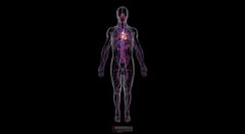
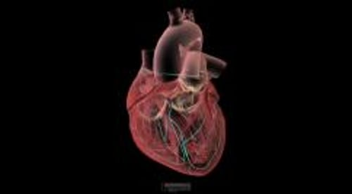

# 心脏生物学

> **来源**: msd_家庭版  
> **分类**: 心脏血管疾病

---

# 心脏生物学

$!
/$
$!
/$
作者：
[Jessica I. Gupta](https://www.msdmanuals.cn/home/authors/gupta-jessica)
,
MD
,
University of Michigan Health;
[Michael J. Shea](https://www.msdmanuals.cn/home/authors/shea-michael)
,
MD
,
Michigan Medicine at the University of Michigan
Reviewed By
[Jonathan G. Howlett](https://www.msdmanuals.cn/home/authors/howlett-jonathan)
,
MD
,
Cumming School of Medicine, University of Calgary
已审核/已修订
修改的
4月 2025
v717089_zh
**
浏览专业版
[小知识](https://www.msdmanuals.cn/home/quick-facts-heart-and-blood-vessel-disorders/biology-of-the-heart-and-blood-vessels/biology-of-the-heart)
- 心脏的功能 |
- 心脏的供血 |
- 心脏的自我调节 |
- 多媒体 |

心脏和 血管 构成心血管系统（循环系统）。心脏将 血液 泵入肺部以使血液吸收氧气，然后再将富氧血泵入全身。在全身循环的血液可将氧气和营养素运送到机体组织，并把组织产生的废物（如二氧化碳）运走。

心脏是一个中空的肌性器官，它位于胸腔中央偏左侧。心脏有两个侧面——右侧和左侧。左心和右心都有：

- 心房： 上部心腔，可收集血液并将其泵入下部心腔
- 心室： 下部心腔，可将血液从心脏泵出

为保证血液单向流动，每个心室都有一个“入口”瓣膜及一个“出口”瓣膜。

心血管系统

3D 模型

在左心室，入口瓣膜是二尖瓣，出口瓣膜是主动脉瓣。在右心室，入口瓣膜是三尖瓣，出口瓣膜是肺动脉瓣。

每个瓣膜包括瓣尖和瓣叶，它们类似于单向阀门开关。二尖瓣有两个瓣叶。其他的瓣膜（三尖瓣、主动脉瓣和肺动脉瓣）有三个瓣叶。二尖瓣和三尖瓣瓣膜较大，还具有连接结构——乳头肌和腱索——它们有牵拉作用，防止心室收缩时瓣膜凸向心房。如果乳头肌受损（例如由于 心脏病发作 ），瓣膜可能会向后摆动并开始 漏血 （称为反流）。如果 瓣膜开口变窄 （称为狭窄），则通过该瓣膜的血流会减少。任何瓣膜都可能狭窄或渗漏，并且同一瓣膜中可能同时发生渗漏和狭窄。

心脏和血管概述

视频

心跳表示心脏正在泵血。医生通常将心跳声音描述为扑通声。当医生用听诊器听心跳时，听到的第一心音（扑通的“扑”）是二尖瓣和三尖瓣关闭的声音。第二心音（扑通的“通”）是主动脉瓣和肺动脉瓣关闭的声音。每次心跳有两个部分：

- 收缩期： 在收缩期，心室收缩并将血液泵出心脏，心房舒张开始再次充盈血液。
- 舒张期： 在舒张期，心室舒张充盈。接着心房收缩，泵入更多的血到心室。

## 心脏的功能

心脏的唯一功能是泵血。

- 右心 ：将血液泵入肺部，血液在此吸收氧气并排出二氧化碳
- 左心 ：将血液泵入身体其他部位，氧气和营养素会被运送到组织中，二氧化碳等废物会被转移至血液以便通过肺、肾等其他器官排出体外

心脏内面观

| 显示正常血流方向的心脏剖面图。 |
| --- |

血液循环途径：首先，来自于全身的低氧而富含二氧化碳的血液通过两条最大的静脉（上、下腔静脉，统称为腔静脉）回流到右心房。右心室舒张时，右心房的血液通过三尖瓣流入右心室。右心室充盈时，右心房收缩，将多余的血液注入右心室，然后右心室收缩。然后，右心室通过肺动脉瓣将血液泵入肺动脉进入肺脏。在肺部，血液流经肺泡周围细小的毛细血管。在这里，血液吸收氧气，并放出二氧化碳，然后二氧化碳被呼出体外。

随后，这些富氧血液通过肺静脉流入左心房。左心室舒张时，左心房的血液通过二尖瓣流入左心室。左心室充盈时，左心房收缩，将多余的血液注入左心室，然后左心室收缩。（在老年人中，左心房收缩前左心室尚未充盈，这使得左心房的这次收缩显得尤其重要。） 左心室收缩时关闭二尖瓣并通过主动脉瓣将血液泵入主动脉，它是体内最大的动脉。这些血液将氧气运送到除肺以外的全身各处。

**肺循环** 是从右心开始，流经肺部，流入左心房的循环路线。

**体循环** 是从左心开始，流经身体大部分，最后流入右心房的循环路线。

## 心脏的供血

与其他器官一样，心脏也需要持续的动脉血供应。即使心腔充满血液，心肌也需要自己的专用血液供应通道，称为：

- 冠脉循环

由动静脉系统构成的冠脉循环为心脏肌肉（心肌）提供富氧血，然后将乏氧血运回右心房。

左右冠状动脉从主动脉根部发出，提供富有氧气的血液到心肌。这两条动脉发出其他分支，这些分支动脉也为心脏供血。心脏静脉血管收集心肌的血液，最后汇入心脏背面浅表的冠状静脉窦，最后回流至右房。由于心肌收缩时产生强大的挤压力，因此大部分血液仅在两次搏动之间心室舒张时（在舒张期）才流经冠脉循环。

心脏供血

| 像肌体其他组织一样，心肌必须接受富氧血供并且通过血压排出代谢废物。主动脉在离开心脏后发出左右冠脉分支向心肌提供富氧血液。右冠发出缘支和位于心脏后方的后间隔动脉。左冠状动脉分为旋支和前降支动脉。冠状静脉从心肌收集含有代谢废物的血液并将其排入位于心脏后方称为冠状窦的大静脉中，冠状静脉再将这部分血液排入右心房。 |
| --- |

## 心脏的自我调节

心肌纤维的收缩是有顺序的，受到严格调控。每条心肌纤维不在完全相同的时间收缩。相反，纤维按照能将血液泵出每个心腔的最佳顺序收缩。收缩顺序受到节律性电冲动（放电）的控制，电冲动以精确方式和受控速度沿着明确路径在心脏传导。电冲动起源于可产生微弱电流的心脏自然起搏点（窦房结，右心房壁内的一小块团状组织）。

描记心脏的电传导通路

| 窦房结 (1) 发出的电冲动通过右心房和左心房 (2)，引起两个心房收缩。当电冲动到达房室结 (3) 时被轻度延迟。随后下传到希氏束 (4)，希氏束分支出进入右室的右束支 (5) 和进入左室的左束支 (5)。电冲动随后扩散入心室，引起心室收缩。 |
| --- |

心率或脉搏是心脏在一分钟内跳动的次数。如果身体需氧量增加（例如运动时），心率会上升。如果身体需氧量减少（例如休息时），心率会下降。

窦房结发出电冲动的速率可控制心率。窦房结可以自己确定发出电冲动的速率。该速率由 自主神经系统 两个相互对立的系统调节：一个系统可加快心率（自主神经系统的交感神经系统），而另一个系统则减慢心率（自主神经系统的副交感神经系统）。

- 交感神经系统 通过被称为交感神经丛的神经网络以及肾上腺和神经末梢释放的 肾上腺素 和 去甲肾上腺素 而发挥作用。
- 副交感神经系统 仅通过迷走神经发挥作用，迷走神经可释放神经递质“乙酰胆碱”。
心脏传导系统

3D 模型

Test your Knowledge
[Take a Quiz!](https://www.msdmanuals.cn/home/pages-with-widgets/quizzes)

版权所有 © 2026 Merck & Co., Inc., Rahway, NJ, USA 及其附属公司。保留所有权利。

- 关于
- 免责声明

版权所有 © 2026 Merck & Co., Inc., Rahway, NJ, USA 及其附属公司。保留所有权利。
