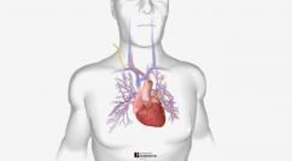

# 肺动脉导管术

> **来源**: msd_家庭版  
> **分类**: 心脏血管疾病

---

# 肺动脉导管术

$!
/$
$!
/$
作者：
[Thomas Cascino](https://www.msdmanuals.cn/home/authors/cascino-thomas)
,
MD, MSc
,
Michigan Medicine, University of Michigan;
[Michael J. Shea](https://www.msdmanuals.cn/home/authors/shea-michael)
,
MD
,
Michigan Medicine at the University of Michigan
Reviewed By
[Jonathan G. Howlett](https://www.msdmanuals.cn/home/authors/howlett-jonathan)
,
MD
,
Cumming School of Medicine, University of Calgary
已审核/已修订
修改的
12月 2023
v27307974_zh
**
浏览专业版

肺动脉导管术可用来检测右心腔内压，估测左心腔内压及每分钟心脏泵出的血量（心输出量），还可用来测量输送心脏血液的动脉中的血流阻力（外周阻力）和血量。

- 多媒体 |

肺动脉是指从右心运送血液进入肺部的动脉。在肺动脉导管术中，导管经过右心房和心室进入肺动脉。这项检查偶尔是对危重患者（尤其是需要静脉补液时）进行心脏功能整体评估的一种有用方法。这项检查的适用人群包括：有重度心肺疾病（如 心力衰竭 、 心脏病发作 、 异常心律 或 肺栓塞 出现并发症时）；刚接受过心脏手术；处在 休克 状态；或者有重度烧伤。

肺动脉导管也可以用来检测右心腔内压，估测左心腔内压及心输出量，还可用来测量心脏发出血管的血流阻力及血液流量。这项检查可以提供信息解释患者血压为什么偏低（如发生 心脏压塞 ），或帮助医生确定患者为什么会呼吸困难（如发生心力衰竭或 肺动脉高压 ）。

这项检查可能引起并发症，但通常较为罕见。并发症包括 气胸 （包被肺的两层膜之间形成气袋）、异常心律（心律失常）、感染、肺动脉内损伤或形成血栓以及某条动脉或静脉损伤。

肺动脉导管术

3D 模型

## 如何进行肺动脉导管术

与右 心导管检查术 一样，在肺动脉导管术中，医生会将尖端有球囊的导管插入某条静脉（通常位于颈部、锁骨下、腹股沟内或手臂内），然后使导管穿行进入心脏。导管尖端经过上腔静脉或下腔静脉（分别使血液从身体上部和下部流回心脏的大血管）以及右心房和右心室后，到达肺动脉。导管顶端的球囊固定在肺动脉中。可以通过 X 线胸片或透视来检查导管尖端是否到位。

充气导管尖端球囊可暂时阻断肺动脉血流，因此可测量肺内毛细血管压（肺毛细血管楔压）。通过肺毛细血管楔压可以间接地估测左房压。也可通过导管取肺内血样测量氧及二氧化碳的水平。

Test your Knowledge
[Take a Quiz!](https://www.msdmanuals.cn/home/pages-with-widgets/quizzes)

版权所有 © 2026 Merck & Co., Inc., Rahway, NJ, USA 及其附属公司。保留所有权利。

- 关于
- 免责声明

版权所有 © 2026 Merck & Co., Inc., Rahway, NJ, USA 及其附属公司。保留所有权利。
