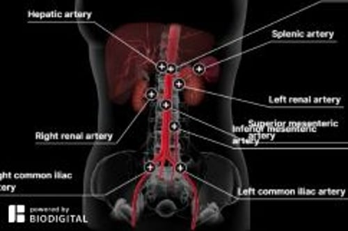

# 腹主动脉分支闭塞

> **来源**: msd_家庭版  
> **分类**: 心脏血管疾病

---

# 腹主动脉分支闭塞

$!
/$
$!
/$
作者：
[Mark A. Farber](https://www.msdmanuals.cn/home/authors/farber-mark)
,
MD, FACS
,
University of North Carolina;
[Federico E. Parodi](https://www.msdmanuals.cn/home/authors/parodi-federico)
,
MD
,
University of North Carolina School of Medicine
Reviewed By
[Jonathan G. Howlett](https://www.msdmanuals.cn/home/authors/howlett-jonathan)
,
MD
,
Cumming School of Medicine, University of Calgary
已审核/已修订
修改的
12月 2024
v26285359_zh
**
浏览专业版

腹主动脉分支闭塞是指从源自主动脉的腹部较大动脉之一出现阻塞或狭窄。

- 症状 |
- 诊断 |
- 治疗 |
- 多媒体 |
- 主动脉的分支会因动脉粥样硬化、动脉壁内肌肉异常生长（纤维肌性发育不良）、血栓或其他疾病而阻塞（闭塞）。
- 阻塞可引起由该动脉负责供血的区域出现与缺血相关的症状，包括疼痛。
- 影像学检查用于做出诊断。
- 治疗方法是清除血栓、实施血管成形术，有时需进行搭桥手术。

主动脉是人体内最大的动脉。主动脉接纳左心室射出的富氧血，并通过从主动脉分出的较小动脉将血液分配到全身。腹主动脉是指流经腹腔的那一部分主动脉。腹主动脉的重要分支包括给以下部位供血的动脉

- 肠（腹腔动脉、肠系膜上动脉和肠系膜下动脉）
- 肾（肾动脉）
- 腿部（髂动脉）

从主动脉分支出来的动脉可能突然阻塞，也可能逐渐阻塞。

腹主动脉分支 **突然阻塞（急性闭塞）** 可能归因于该动脉内形成的血栓或从身体其他部位随血流运动而至的血栓（栓塞），或者由于动脉各层突然分离（ 夹层 ）而引起。

腹主动脉分支 **缓慢形成的阻塞** 可能归因于动脉硬化（ 动脉粥样硬化 ，胆固醇和其他脂肪物质 [粥样斑或粥样硬化斑块] 在动脉壁中沉积）、动脉壁内肌肉异常生长（ 纤维肌性发育不良 ）或者正在生长的腹部肿瘤压迫动脉。

类似的阻塞可见于腿部动脉，有时也发生在手臂动脉内（参见 闭塞性外周动脉疾病 ）。

Branches of the Abdominal Aorta

3D 模型

## 腹主动脉分支闭塞的症状

突然阻塞会切断血流，立即引起剧烈疼痛。疼痛可能发生在腹部、背部或腿部，这取决于哪条动脉阻塞。如果血流得不到恢复，器官衰竭和组织死亡（坏死）会在数小时内发生。

缓慢发展的阻塞所引起的症状各异，取决于哪条动脉受累以及阻塞的严重程度。

### 主动脉下段和髂总动脉

主动脉末端分支的髂总动脉处如发生突然闭塞，双侧大腿会感突然疼痛、苍白、变冷。双腿可有麻木感，脉搏消失。一条髂动脉突然阻塞仅在患腿引起症状。 **这些症状是临床急症。**

主动脉下段或髂总动脉的逐渐狭窄可引起行走时抽筋和疼痛（ 间歇性跛行 ），累及臀部及双侧大腿。下肢往往看上去正常，但也可有冷感或变得苍白。慢性闭塞也可导致 勃起功能障碍 。有时，跛行和勃起功能障碍同时出现时被称为 Leriche 综合征。

### 肾动脉

单侧肾动脉（给肾脏供血的动脉）突然完全闭塞 可能会引起患侧突然疼痛，可能伴有血尿。 **这些症状是临床急症。**

单侧或双侧肾动脉逐渐、中度狭窄可不引起症状或影响肾功能。一侧或双侧肾动脉完全闭塞较少见，会发展为 肾衰竭 和 高血压 （肾血管性高血压）。高血压患者中不到 5% 有肾血管高血压。但是，肾血管性高血压很难控制。

### 肠系膜上动脉

肠系膜上动脉的突然、完全阻塞可引起剧烈腹痛、恶心和呕吐。 **这些症状是临床急症。**

起初，大多数发生这种肠系膜上动脉突然闭塞的患者会出现呕吐，并急需排便。由于大部分肠道由肠系膜上动脉供血，所以如病情加重可有严重的腹痛。医师触诊腹部时会出现触痛，但严重腹痛通常更突出，表现为广泛、不确切的压痛。腹部可轻微膨隆。通过听诊器，医生最初可听到肠鸣音减少。之后，肠鸣音消失。粪便最初含有少量血液，但很快呈血样便。血压下降和 休克 可能导致肠道某些区域死亡（称为坏死或坏疽）。

肠系膜上动脉逐渐狭窄的典型症状为餐后 30-60 分钟出现腹痛，这是由于消化过程中肠道需要更多的血供。腹痛发作通常较稳定，程度重，多位于脐周围。疼痛使患者害怕进食、体重下降。由于肠道血供减少，营养成分吸收很差，也是体重下降的原因之一。进食后疼痛的患者也可能出现恶心、呕吐、便秘或腹泻。

### 肝动脉和脾动脉

肝动脉和脾动脉分别向肝、脾供血，如发生闭塞，后果通常也没有肠道主要动脉发生闭塞那么严重。不过，仍可能会损伤部分肝脏或脾脏。肝动脉闭塞患者可能无症状，也可能出现腹痛、发热和寒战、恶心、呕吐，以及皮肤和眼白发黄（ 黄疸 ）。

脾动脉闭塞患者可能无症状，也可能出现腹痛、发热和寒战。

## 腹主动脉分支闭塞的诊断

- 影像学检查

医生通常根据患者的症状和体检结果疑诊该病。影像学检查（例如超声、计算机断层 [CT] 扫描血管造影、磁共振血管造影或传统血管造影）可用于确诊。

通常，需要做 **血管造影** ，这是一项通过将一根塑料软管插入大腿上部某条大动脉而进行的有创检查，仅在做外科手术或血管成形术（通过给动脉内的小球囊充气来疏通闭塞部位）时进行。目的在于术前给医师呈现受累血管的清晰影像。用血管造影来决定是否做外科手术或血管成形术较少见。在血管造影中，医生会通过塑料软导管将一种在放射线影像上可见的造影剂注射到动脉内。当进行 X 线检查时，造影剂可显示动脉内部的轮廓。因此，血管造影可准确显示动脉直径，在检测某些血管闭塞时比超声更准确。

大多数医疗中心采用微创方法做血管造影，例如计算机断层扫描（ CT 血管造影 ）或磁共振成像（称为 磁共振血管造影 或 MRA）。这些检查不需要将柔性导管插入大动脉，只需使用插入手臂的标准静脉导管将少量 放射性造影剂 通过静脉注入血流。

## 腹主动脉分支闭塞的治疗

- 通过血管成形术或血栓清除术恢复血流

急性闭塞是一种需要清除血栓（栓子切除术）或者实施血管成形术或其他一些医疗操作（如注射药物溶解血栓或进行紧急搭桥手术）来恢复受影响区域血供的手术急症。

### 主动脉下段和髂总动脉

如发生主动脉末端和髂总动脉的突然、完全闭塞，应立即清除血栓。清除血栓的方法是将一根导管插入动脉，然后使用该导管将血栓去除或抽空，或者可在开放性手术中切开动脉并用手清除血栓。

### 肾动脉

如果某条肾动脉突然完全阻塞，需做 **血管成形术** 并清除血栓、植入支架，或进行外科手术治疗。如果及时治疗，肾脏血流和肾功能可得以恢复。

血管成形术是指在动脉狭窄部分插入尖端带有气囊的导管，然后给球囊充气以消除阻塞。有时，在阻塞部位放置可扩张的金属网状管（支架），以保持血管开放。有些支架含有缓释药物（药物洗脱支架），可防止阻塞复发。如果慢性阻塞引起症状，可能需要做外科手术或血管成形术。术后给予 抗血小板治疗 。

对于逐渐发生的中度肾动脉阻塞，只要血压受控并且血液检查提示肾功能正常，则可进行 **医学治疗** 。如果出现肾血管性高血压，可使用 降压药 。通常至少需要 3 种降压药控制。血管紧张素转化酶 (ACE) 抑制剂尤其有用。使用 ACE 抑制剂时必须监测肾功能。如果高血压持续且严重，或肾功能恶化，则医生可能做血管成形术或搭桥手术以恢复肾脏血供。

### 肠系膜上动脉

如果肠系膜上动脉突然完全阻塞，那么只有立即干预才能快速恢复血液供应，挽救患者的生命。医生可能会使用血管成形术与支架置入术、搭桥手术、栓塞切除术或药物治疗。为节约时间，患者往往没做诊断性检查就直接被推去手术。在手术过程中，医生可能会切除或绕过阻塞部分。如果肠道受损且在血液供应恢复后没有改善，则可能需要切除受累肠段。

如果在血管造影术中作出动脉阻塞的诊断，则可给予溶解血栓（溶栓）或扩宽（扩张）动脉的 **药物** 。这些药物会直接注入动脉，可能会疏通阻塞部位。如果阻塞清除，则无需手术。患者存活与否，能否保住肠道，取决于血供恢复的速度。

如果肠系膜上动脉逐渐变窄，那么 **硝酸甘油** 可用来缓解腹痛，但仍需做血管成形术或外科手术以扩张动脉。

### 肝动脉和脾动脉

需手术开通肝、脾动脉闭塞处。

Test your Knowledge
[Take a Quiz!](https://www.msdmanuals.cn/home/pages-with-widgets/quizzes)

版权所有 © 2026 Merck & Co., Inc., Rahway, NJ, USA 及其附属公司。保留所有权利。

- 关于
- 免责声明

版权所有 © 2026 Merck & Co., Inc., Rahway, NJ, USA 及其附属公司。保留所有权利。
