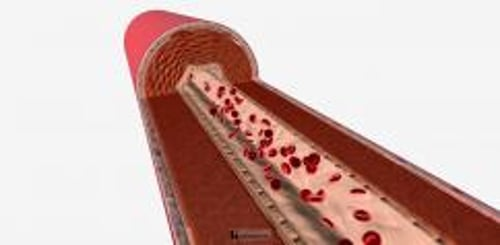

# 针对心脏和血管疾病询问病史和进行体格检查

> **来源**: msd_家庭版  
> **分类**: 心脏血管疾病

---

# 针对心脏和血管疾病询问病史和进行体格检查

$!
/$
$!
/$
作者：
[Thomas Cascino](https://www.msdmanuals.cn/home/authors/cascino-thomas)
,
MD, MSc
,
Michigan Medicine, University of Michigan;
[Michael J. Shea](https://www.msdmanuals.cn/home/authors/shea-michael)
,
MD
,
Michigan Medicine at the University of Michigan
Reviewed By
[Jonathan G. Howlett](https://www.msdmanuals.cn/home/authors/howlett-jonathan)
,
MD
,
Cumming School of Medicine, University of Calgary
已审核/已修订
12月 2023
|
修改的
10月 2025
v1158180_zh
**
浏览专业版
- 病史 |
- 体格检查 |
- 多媒体 |

病史和体格检查结果可以提示某人有心脏或血管疾病，但需再做检查才能准确诊断。

## 针对心脏和血管疾病的病史

“询问病史”时，医生会请求就诊者详细说明在哪方面感觉不舒服。医生首先询问症状。 胸痛 、 气短 、感觉心跳加快或不规则（ 心悸 ）、 晕厥 、 头晕或头重脚轻感 、平躺时不舒服以及腿部、脚踝和足部或腹部 肿胀 （水肿）这些症状提示存在心脏病。

其他更为一般化的症状（如发热、虚弱、疲劳、食欲不振以及全身感觉不舒服或不适（身体不适）可能归因于心脏病，但也存在其他许多病因。

腿部疼痛、麻木或肌肉痉挛可能提示 外周动脉疾病 ，该病可累及手臂、腿部和躯干的动脉（为心脏供血的动脉除外）。

接下来，医生会询问

- 心血管疾病 、 高血压 、 糖尿病 或 高胆固醇 的任何既往病史
- 是久坐还是经常活动
- 症状是否在劳累或运动时出现并在休息后缓解
- 使用药物（包括处方药、非处方药和/或自然疗法）、膳食补充剂、非法药物、酒精和烟草
- 累及心脏或血管的疾病家族史

## 针对心脏和血管疾病的体格检查

在体格检查中，医生会从以下方面检查患者

- 体重和整体外貌
- 生命体征（如体温、呼吸频率和血压）
- 眼睛
- 颈部静脉
- 心音和肺音
- 脉搏
- 腿部和脚踝有无任何肿胀迹象
- 皮肤

医生会查找某些征象如面色苍白（灰白）、出汗，或嗜睡，这些可能是心脏疾病的细微指征。患者的情绪表情和一般状态，这些也可以受到心脏疾病的影响，也应给予注意。

血压 (BP) 测量

图片

患者手臂应处于舒适的休息状态，袖套应与心脏平齐。

JIM VARNEY/科学图片库

评估 **肤色** 是因为苍白或发绀（青紫色）可能提示 贫血 （红细胞计数低）或血流灌注不足。这些发现也可能提示肺部疾病、 心力衰竭 或各种循环疾病导致皮肤无法从血液获得充足氧气。

触摸颈部动脉、腋下动脉、肘部和手腕处的动脉、腹内动脉、腹股沟内动脉、膝盖处动脉以及脚踝和足部动脉的 **脉搏** ，评估血流是否充足、身体两侧的血流量是否相等。异常可能提示存在心脏或血管疾病。

医生会让就诊者躺下并使上半身抬高与地面呈 45 度角，然后检查 **颈部静脉** 。颈静脉直接与心脏右心房相连，是进入右心的血流压力和容积的观察指标。颈部静脉高度扩张提示右心异常高压。

医生会用手指按压脚踝和腿部的皮肤、有时也按压下背部的皮肤， **检查有无皮下组织积液引起的肿胀（水肿）** 。水肿可能由于 心力衰竭 或其他疾病（如肾脏或肝脏疾病）所致。

进行 **眼部检查** 是因为视网膜（眼睛内表面上的对光敏感的薄膜）是医生可直接观察动静脉的唯一部位。医生使用 眼底镜 观察视网膜的血管。视网膜内有可见异常的情况常见于有 高血压 、 糖尿病 、 动脉硬化 或 心内膜炎 （心脏瓣膜发生细菌感染）的患者。

医生会 **观察胸部** ，明确呼吸频率和呼吸运动是否正常。通过用手指 **轻敲（叩诊）胸部** ，医生可以判断肺部是否充满空气（这是正常的），或者肺部是否有液体（ 胸腔积液 ），肺内有液体是不正常的，可能由于 心力衰竭 和某些肺部疾病所致。叩诊也有助于确定心包（包裹心脏的囊）内有无液体。

医生会用听诊器 **听呼吸音** 。有细碎的噼啪声可能提示肺内存在液体，这是由 心力衰竭 引起的。

医生会 **将手放在受检者胸部** ，触摸（触诊）心搏最强劲之处，从而判断心脏是否扩大。也可判断每次心跳的收缩质量和收缩力度。当存在血管或心腔间的血流异常、紊乱引起震颤时，也可通过手指尖或手掌感觉到。

医生会 **用听诊器对心脏听诊** ，可听到由于心脏瓣膜开闭产生的特征性声音。瓣膜和心脏结构异常引起的血液湍流可产生特征性的声音称为杂音。典型的湍流发生在当血液流过狭窄或有漏隙的瓣膜时。但不是所有的心脏病都会产生杂音，也不是所有杂音都提示心脏病的存在。如，妊娠妇女通常因为正常增多的血流量而产生心脏杂音。在婴儿和小孩，由于血流速度较快且心脏结构较小，常常出现无害的杂音。老年人由于血管壁、瓣膜和其他组织的逐渐硬化，可产生血液湍流，但并不存在严重的心脏疾病。另外，瓣膜开放异常时，也可闻及喀喇音及开瓣音。由于一个或两个额外心音而产生的奔马律（类似于一匹飞奔的马发出的声音）多见于 心力衰竭 患者。

医生将听诊器置于身体其他部位的动脉和静脉表面，可 **闻及血液湍流的声音** （杂音）。产生这些杂音可能是因为血管狭窄、血流增多或动静脉之间有异常通道（ 动静脉瘘 ）。

医生会 **触摸腹部** ，判断肝脏是否肿大。肝脏肿大可提示回心的主要静脉的淤血。腹腔积液导致的腹部膨隆提示可能合并心力衰竭。轻压腹部可以检查动脉搏动情况并判断腹主动脉的宽度。

动脉搏动

3D 模型

### 动态（在家）血压监测

如果尚不能确诊高血压（如在诊室测得的血压值变化很大），医生可能会建议患者使用 24 小时连续血压 (BP) 监测仪。这是一种便携式的电池供电装置，附于臀部，与绑在上臂处的血压计袖带相连。这个监测仪可以 24 小时或 48 小时连续地自动记录受试者血压数据。通过它不仅可以明确是否存在高血压，而且还可了解其严重程度。

医生一般也会建议高血压患者在家自测血压。自测血压有助于激励患者遵循医生的治疗建议。实现在家监测血压的一个途径是购买一台价格不贵的家用血压计。这类血压计是一种便携式的电池供电装置，将袖带缠绕在腕部或上臂即可在家轻松测量血压。尽管家用血压计通常不像医生在诊室使用的血压监测仪器那样准确，但能使患者更频繁地监测血压，便于医生调整用药。

Test your Knowledge
[Take a Quiz!](https://www.msdmanuals.cn/home/pages-with-widgets/quizzes)

版权所有 © 2026 Merck & Co., Inc., Rahway, NJ, USA 及其附属公司。保留所有权利。

- 关于
- 免责声明

版权所有 © 2026 Merck & Co., Inc., Rahway, NJ, USA 及其附属公司。保留所有权利。
