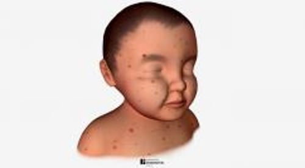

# 水痘

> **来源**: msd_家庭版  
> **分类**: 感染

---

# 水痘

$!
/$
$!
/$

## （水痘）

作者：
[Kenneth M. Kaye](https://www.msdmanuals.cn/home/authors/kaye-kenneth)
,
MD
,
Harvard Medical School
Reviewed By
[Christina A. Muzny](https://www.msdmanuals.cn/home/authors/muzny-christina)
,
MD, MSPH
,
Division of Infectious Diseases, University of Alabama at Birmingham
已审核/已修订
修改的
1月 2026
v818883_zh
**
浏览专业版
[小知识](https://www.msdmanuals.cn/home/quick-facts-infections/herpesvirus-infections/chickenpox)

水痘是一种由水痘-带状疱疹病毒引起的有高度传染性的 病毒性感染 ，有特征性发痒的皮疹，由小的、高出皮面的水疱疹或结痂的斑疹构成。

- 症状 |
- 诊断 |
- 治疗 |
- 预后 |
- 预防 |
- 多媒体 |
- 水痘最常发生于儿童，但疫苗的使用已大大降低发病例数。
- 在皮疹出现前，患儿会出现轻微的头疼、中度发热、食欲减退和患病的一般不适感觉。
- 诊断基于症状，特别是皮疹。
- 大多数患儿完全治愈，而还有一些患儿发病严重甚至死亡。
- 通常，只需要对症治疗。
- 常规的疫苗可以预防水痘。

水痘是儿童期的一种有高度传染性的疾病。它由水痘-带状疱疹病毒引起，这种病毒是 疱疹病毒 的一种类型（疱疹病毒 3型）。

在 水痘疫苗 引入之前，水痘流行在冬季和早春发生，周期为 3 至 4 年。

水痘患者从皮疹出现前2天内开始具有传染性，并且持续直到最后一个水泡结痂。

您知道吗……

| 水痘患者从皮疹出现前2天内开始具有传染性，并且持续直到最后一个水泡结痂。 |
| --- |

免疫系统 正常的儿童极少发生重度水痘感染。大多数水痘患者仅出现皮肤和口腔的溃疡。不过，水痘病毒有时会感染肺、脑、心脏或肝脏。这些严重感染更多见于新生儿、成人以及 免疫系统受损 的人（比如 人类免疫缺陷病毒 [HIV] 感染者或使用 免疫系统抑制药物 或大剂量类固醇[有时称为糖皮质激素或皮质类固醇]的人）。

患水痘后由于免疫力的产生而不会再感染。不过，水痘-带状疱疹病毒在初始感染水痘后可在体内保持休眠（潜伏）状态，有时日后被重新激活后可引起 带状疱疹 。老年人可以接种 带状疱疹疫苗 。该疫苗可降低晚年患带状疱疹的风险。

## 水痘的传播

水痘通过以下方式传播：

- 由含水痘-带状疱疹病毒的飞沫通过空气传播
- 通过接触由水痘或带状疱疹引起的皮疹传播
- 从孕妇到胎儿或新生儿

## 水痘的症状

水痘症状通常在接触病原体后 14 至 16 天出现（完整病程为 10 至 21 天）。它们包括

- 轻度头痛
- 中度发热
- 食欲不振（不常见）
- 患病般的感觉（不舒服）

幼小儿童一般没有这些症状，但在成人症状往往很严重。

水痘的传染期从出现第一个水痘疹前 2 天开始，一直持续到最后一个水痘结痂为止。初始症状出现后，会出现由小的、扁平的红色斑点组成的皮疹。小红疹一开始出现于躯干和面部，后来发展至上下肢。有些人只有几个斑疹。其他人皮疹遍布全身，包括头皮和口腔黏膜。

在 6 至 8 小时内，斑疹开始隆起。在发红的皮肤上形成瘙痒的、圆的、充满液体的水疱，最后结痂。以后的数天里，皮疹继续出现并结痂。水痘的标志是皮疹一茬一茬地出现，因此在任何受累区域的斑点处于各种不同的发展状态。极少数情况下，斑点被细菌感染，这可能导致严重的皮肤感染（ 蜂窝组织炎 或 坏死性筋膜炎 ）。

通常到了第5天，新发皮疹停止出现，到第6天时多数已经结痂，大部分在20天以内消失。

有时，接种过水痘疫苗的儿童也会出水痘。这些儿童的皮疹一般更轻，发烧更少见，病程也更短。不过，他们的溃疡灶仍有传染性。

口腔黏膜的疱疹很快破裂并形成疼痛的破损（溃疡），常引起吞咽疼痛。溃疡也可以发生在眼睑、上呼吸道、直肠和阴道。水痘最严重的时期一般持续4～7天。

水痘（面部）

图片

这张照片显示了由影响面部的水痘引起的圆形、充满液体的水泡。

Image courtesy of Renelle Woodall via the Public Health Image Library of the Centers for Disease Control and Prevention.

水痘（背部）

图片

该照片显示水痘皮疹患者的背部。

Image courtesy of Ann Cain via the Public Health Image Library of the Centers for Disease Control and Prevention.

水痘

3D 模型

## 并发症

新生儿、成人和免疫系统功能低下或某些疾病的患者出现水痘并发症的风险可能会增加。

导致咳嗽和呼吸困难的肺部感染（ 肺炎 ）可能会使成人、婴儿和所有年龄段的免疫系统薄弱人群的严重水痘复杂化。肺炎很少发生于免疫系统正常的年幼儿童。

脑部感染（ 脑炎 ）比较少见，可引起走路不稳、头痛、头晕、意识错乱和癫痫发作。在成人中，脑炎可危及生命。

肝炎和出血问题也有可能出现。

急性脑病综合征 是一种罕见但非常严重的并发症，几乎仅发生在使用阿司匹林后的18岁以下的人中。因此，阿司匹林不应用于患水痘的儿童。皮疹开始后3～8天可能出现急性脑病综合征。

孕妇感染水痘后有可能会出现严重并发症，如 肺炎 ，甚至也有可能死亡。水痘也可传播给胎儿，尤其是在孕早期或孕中期初期发生水痘的情况下，或在分娩时或分娩后传播给新生儿。这种感染可导致皮肤瘢痕、出生缺陷、出生低体重或新生儿生病。

## 水痘的诊断

- 医师的评估
- 很少需要进行血液检查或从水痘疮口采集样本进行检测（例如 PCR 检测）

该病皮疹和其他的症状典型，故不难诊断。

极少情况下才需要做血液化验检测抗体水平，或做实验室检查鉴定病毒（通常使用从溃疡灶上刮取的样本）。（ 抗体 是免疫系统产生的，有助于保护身体免受特定攻击物，如水痘-带状疱疹病毒的攻击。）

## 水痘的治疗

- 轻度病例可对症治疗
- 易发生中度至重度症状的病例可使用抗病毒药物

儿童水痘轻症病人只需要对症处理。湿敷可以减轻强烈的瘙痒，防止抓伤而引起感染扩散和留下瘢痕。因为细菌感染的危险，要经常用肥皂和水冲洗皮肤，保持手的清洁，剪掉指甲以防止抓伤，保持衣物干燥清洁。如果瘙痒严重，可口服止痒药物，如抗组胺药。用胶状燕麦洗澡可能有帮助。

如果细菌感染扩散，就需要应用抗生素。

医生通常开具 抗病毒药物 （如阿昔洛韦、伐昔洛韦和泛昔洛韦）（参见表 一些用于疱疹病毒感染的抗病毒药物 ）给某些有中度至重度疾病风险的健康人口服，包括

- 12 岁或以上未接种疫苗者（泛昔洛韦为 18 岁或以上）
- 皮肤病变，例如 湿疹
- 慢性肺病
- 长期服用水杨酸盐（一种药物，例如阿司匹林）
- 使用类固醇或其他抑制免疫系统的疗法
- 感染与其一起居住者的水痘的人，因为这些病例通常比原发性病例更严重

对于免疫系统功能低下的患者，医生可能会开具阿昔洛韦通过静脉 (IV) 给药。

抗病毒药物可以减轻症状的严重程度和持续时间，如果可能，应在疾病开始后 24 小时内给予抗病毒药物。

由于孕妇有水痘严重并发症的高风险，因此有些专家建议对患有水痘的孕妇使用阿昔洛韦或伐昔洛韦进行治疗。

## 水痘的预后

健康的儿童几乎总是从水痘中康复，没有任何问题。在进行常规免疫接种之前，美国每年约有 400 万人感染水痘，每年由于水痘的并发症而死亡的人数约为 100 至 150。

成人患者的水痘更严重，死亡风险更高。

水痘在 免疫系统受损 的患者中尤其严重。

接种过 疫苗的人如果发生水痘，病情会较轻，死亡率也更低。

## 水痘的预防

- 疫苗接种
- 有时使用免疫球蛋白

### 疫苗接种

所有健康儿童都应接种 2 剂 水痘疫苗 ，该疫苗含有减毒活水痘病毒（参见 水痘疫苗 )。

未患过水痘且未接种过疫苗的年龄较大的儿童和成年人（尤其是育龄妇女和患有慢性疾病的成年人）也应接种疫苗，因为他们患重症的风险较高。间隔 4 至 8 周给予两剂。

疫苗接种对于育龄女性、高危人群以及接触高危人群的人员尤为重要。这些包括医疗保健专业人员、教师、儿童护理工作者、护理院或其他机构（如惩教机构）的居住者和工作人员，尤其是无法提供免疫证明的人员。任何暴露于水痘病毒的人群应尽快接种疫苗，并停工 21 天。

免疫系统受损者以及孕妇或计划在 3 个月内怀孕者不应接种疫苗。

### 预防水痘传播

对感染者应予隔离，以阻止感染向未患过水痘的人传播。在水痘结痂前，儿童不应返回学校，成人不用重返工作岗位。

### 刚接触过水痘的人

对并发症风险高且接触了水痘患者的易感人群，可给予抗水痘病毒抗体（水痘-带状疱疹免疫球蛋白）来预防水痘。这些人包括

- 白血病患者或免疫系统功能低下者（无免疫力证据）
- 未患过水痘或未接种过水痘疫苗的孕妇
- 母亲在分娩前5天或分娩后2天出现水痘的新生儿

水痘-带状疱疹免疫球蛋白治疗可预防感染，或降低感染的严重程度。

如果健康人曾暴露于水痘且尚未接种疫苗，则在暴露后的3至5天内接种疫苗有助于预防水痘或减轻其严重程度。

Test your Knowledge
[Take a Quiz!](https://www.msdmanuals.cn/home/pages-with-widgets/quizzes)

版权所有 © 2026 Merck & Co., Inc., Rahway, NJ, USA 及其附属公司。保留所有权利。

- 关于
- 免责声明

版权所有 © 2026 Merck & Co., Inc., Rahway, NJ, USA 及其附属公司。保留所有权利。
