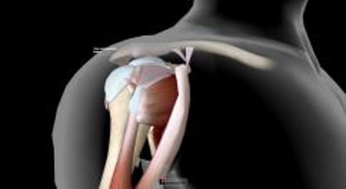

# 肩袖损伤/肩峰下滑囊炎

> **来源**: msd_家庭版  
> **分类**: 损伤与中毒

---

# 肩袖损伤/肩峰下滑囊炎

$!
/$
$!
/$

## （投手肩；游泳者肩；网球肩；肩袖肌腱炎；肩袖撕裂）

作者：
[Paul L. Liebert](https://www.msdmanuals.cn/home/authors/liebert-paul)
,
MD
,
Tomah Health Hospital, Tomah, WI
Reviewed By
[Brian F. Mandell](https://www.msdmanuals.cn/home/authors/mandell-brian)
,
MD, PhD
,
Cleveland Clinic Lerner College of Medicine at Case Western Reserve University
已审核/已修订
修改的
11月 2025
v13976144_zh
**
浏览专业版

将上臂保持在肩关节部位的肌肉（肩袖肌群）受到挤压（肩部撞击综合征），发炎（肌腱炎），或出现部分或完全撕裂。

- 症状 |
- 诊断 |
- 治疗 |
- 多媒体 |

（另见 运动损伤概述 。）

- 当手臂向上向后移动，甚至不移动时，出现肩关节疼痛
- 锻炼可能有帮助。

肩袖包含了连接肩胛骨和肱骨头的肌肉。肩袖加强了肩关节的力量并有助于上臂的旋转。

肩关节解剖

|  |
| --- |

肩袖挤压（撞击）及肌腱炎常发生于需要手臂在头部上方反复运动的活动，比如篮球的投篮，举重物过肩，球拍运动时发球，以及自由泳、蝶泳或仰泳。手臂反复活动过头会引起上肢骨的顶端将肩袖肌肉挤向肩胛骨上端，从而引起肌肉炎症和肿胀。如果不顾炎症仍继续运动，肌腱会力量减弱和撕裂。

即便没有过度使用和慢性炎症，肩袖可能在突然的强力位移（如极度伸展或拉伸）或跌倒时被撕裂。

肩袖撕裂

3D 模型

## 肩袖损伤的症状

肩痛是肩袖损伤的主要症状。起初，将手臂举到头部上方时才会疼痛（撞击综合征）。当手臂抬离身体侧面 60 至 120 度时，疼痛会加剧。除非得到有效治疗，肩部出现休息时疼痛（肌腱炎），特别是经常夜间疼痛，影响睡眠。如果肌腱撕裂，在肩部外展手臂将会感到无力，甚至无法完成。

## 肩袖损伤的诊断

- 医师的评估
- 有时需要进行磁共振成像检查

医生在患者症状及检查结果的基础上作出诊断。有时需要进行 磁共振成像 (MRI) 检查以排除肩袖肌群的撕裂伤。

## 肩袖损伤的治疗

- 休息
- 有时需要使用抗炎药物或类固醇注射剂。
- 有时需要进行手术
- 康复

如疼痛为中度或重度，可将手臂悬吊保护数日以使肩部休息。应避免将手臂抬到肩部以上水平，尤其是在有阻力的情况下。一旦肩部能够像以前那样无痛活动，即可开始加强肩袖肌群的力量训练。针对特定肌肉群的强化训练可恢复所有肩袖肌群的力量，并在进行上举动作时减轻撞击症状。如果疼痛严重，医生可能会开抗炎药物或有时在肩袖上方的空间（滑囊）注射类固醇（有时也称为糖皮质激素或皮质类固醇）。

当肩袖撕裂或治疗肌腱炎其他方法无效时，需要手术治疗。手术去除肩关节内的多余骨头，为肩袖创造个更大的空间，因此可防止手臂在头部上方运动时挤压肩袖。如果肩袖撕裂，通常推荐手术修复。

肩袖肌肉强化训练
$!
/$

俯卧肩伸展

1. 俯卧，手臂悬垂在床边，拇指指向远离身体的方向。

2. 保持肘部伸直，将手臂伸至与躯干水平，同时向下和向后挤压肩胛骨。

3. 回到起始位置。

4. 重复做 3 组，每组 10 遍。

5. 根据耐受情况，逐渐增加力度。

由 Tomah 纪念医院理疗科的 Tomah, WI；Elizabeth C.K. Bender, MSPT, ATC, CSCS 以及 Whitney Gnewikow, DPT, ATC 提供。

侧肩外旋

1. 向未受累侧躺下，在受累侧手臂和身体之间垫枕头。

2. 将受累肘部弯曲至 90 度。

3. 朝向脊柱并向下挤压肩胛骨。

4. 通过旋转肩膀向上移动前臂，使手背向上朝向天花板。

5. 缓慢回到起始位置，重复上述动作。

6. 重复做 3

... 阅读更多

由 Tomah 纪念医院理疗科的 Tomah, WI；Elizabeth C.K. Bender, MSPT, ATC, CSCS 以及 Whitney Gnewikow, DPT, ATC 提供。

俯卧肩水平外展

1. 俯卧，受累手臂向下离开台面边缘，拇指指向远离身体的方向。

2. 朝向脊柱并向下挤压肩胛骨。

3. 将手臂向上抬至与肩部水平。

4. 下压手臂，重复上述动作。

5. 重复做 3 组，每组 10 遍，每天 1 次。

6. 特殊说明

a

... 阅读更多

由 Tomah 纪念医院理疗科的 Tomah, WI；Elizabeth C.K. Bender, MSPT, ATC, CSCS 以及 Whitney Gnewikow, DPT, ATC 提供。

俯卧肩水平外展及外旋

1. 俯卧于床上，受累侧手臂离开一侧床沿，肘部弯曲 90 度，拇指朝向身体。

2. 朝向脊柱并向下挤压肩胛骨。

3. 向上旋转前臂。

4. 回到起始位置，重复上述动作。

5. 重复做 3 组，每组 10 遍，每天 1 次。

6. 特殊说明

... 阅读更多

由 Tomah 纪念医院理疗科的 Tomah, WI；Elizabeth C.K. Bender, MSPT, ATC, CSCS 以及 Whitney Gnewikow, DPT, ATC 提供。

站立位肩胛面外展

1. 开始时将手臂置于身侧，保持肘部伸直，拇指向上。

2. 向前移动手臂大约 30 度。

3. 手臂抬高，在无痛范围内保持这个姿势。

4. 回到起始位置。

5. 重复做 3 组，每组 10 遍，每天 1 次。

6. 根据耐受情况，逐渐增加

... 阅读更多

由 Tomah 纪念医院理疗科的 Tomah, WI；Elizabeth C.K. Bender, MSPT, ATC, CSCS 以及 Whitney Gnewikow, DPT, ATC 提供。

站立位抗肩外旋

1. 将弹力带的一端置于与腰部水平的固定物上。

2. 将枕头或毛巾卷起来放在受累侧肘部和身体之间。

3. 受累手抓住弹力带，肘部弯曲 90 度，拇指向上。

4. 外旋手臂，然后缓慢返回起始位置。

5. 重复做 3 组，每组 10 遍，每天

... 阅读更多

由 Tomah 纪念医院理疗科的 Tomah, WI；Elizabeth C.K. Bender, MSPT, ATC, CSCS 以及 Whitney Gnewikow, DPT, ATC 提供。

站立位抗肩内旋

1. 将弹力带的一端置于与腰部水平的固定物上。

2. 将枕头或毛巾卷起来放在受累侧肘部和身体之间。

3. 受累手抓住弹力带，肘部弯曲 90 度，拇指向上。

4. 手臂向内旋转（手向靠近身体的方向拉动），然后慢慢回到起始位置。

5. 重复做

... 阅读更多

由 Tomah 纪念医院理疗科的 Tomah, WI；Elizabeth C.K. Bender, MSPT, ATC, CSCS 以及 Whitney Gnewikow, DPT, ATC 提供。

俯身肩膀力量对抗

1. 受累手中负重。

2. 髋关节和膝关节轻微弯曲，将另一只手放在桌子或床上支撑上半身。

3. 肘部弯曲 90 度，回缩（挤压）肩胛骨使肘部抬至肩部高度。

4. 回到起始位置。

5. 重复做 3 组，每组 10 遍，每天 1 次。

6.

... 阅读更多

由 Tomah 纪念医院理疗科的 Tomah, WI；Elizabeth C.K. Bender, MSPT, ATC, CSCS 以及 Whitney Gnewikow, DPT, ATC 提供。

$!
/$

俯卧肩伸展

1. 俯卧，手臂悬垂在床边，拇指指向远离身体的方向。

2. 保持肘部伸直，将手臂伸至与躯干水平，同时向下和向后挤压肩胛骨。

3. 回到起始位置。

4. 重复做 3 组，每组 10 遍。

5. 根据耐受情况，逐渐增加力度。

由 Tomah 纪念医院理疗科的 Tomah, WI；Elizabeth C.K. Bender, MSPT, ATC, CSCS 以及 Whitney Gnewikow, DPT, ATC 提供。

侧肩外旋

1. 向未受累侧躺下，在受累侧手臂和身体之间垫枕头。

2. 将受累肘部弯曲至 90 度。

3. 朝向脊柱并向下挤压肩胛骨。

4. 通过旋转肩膀向上移动前臂，使手背向上朝向天花板。

5. 缓慢回到起始位置，重复上述动作。

6. 重复做 3 组，每组 10 遍，每天 1 次。

7. 根据耐受情况，逐渐增加力度。

... 阅读更多

由 Tomah 纪念医院理疗科的 Tomah, WI；Elizabeth C.K. Bender, MSPT, ATC, CSCS 以及 Whitney Gnewikow, DPT, ATC 提供。

俯卧肩水平外展

1. 俯卧，受累手臂向下离开台面边缘，拇指指向远离身体的方向。

2. 朝向脊柱并向下挤压肩胛骨。

3. 将手臂向上抬至与肩部水平。

4. 下压手臂，重复上述动作。

5. 重复做 3 组，每组 10 遍，每天 1 次。

6. 特殊说明

a. 抬起手臂时，保持肩胛骨不动。

b. 拇指朝上指向天花板。

... 阅读更多

由 Tomah 纪念医院理疗科的 Tomah, WI；Elizabeth C.K. Bender, MSPT, ATC, CSCS 以及 Whitney Gnewikow, DPT, ATC 提供。

俯卧肩水平外展及外旋

1. 俯卧于床上，受累侧手臂离开一侧床沿，肘部弯曲 90 度，拇指朝向身体。

2. 朝向脊柱并向下挤压肩胛骨。

3. 向上旋转前臂。

4. 回到起始位置，重复上述动作。

5. 重复做 3 组，每组 10 遍，每天 1 次。

6. 特殊说明

a. 抬起前臂时，保持肩胛骨不动。

... 阅读更多

由 Tomah 纪念医院理疗科的 Tomah, WI；Elizabeth C.K. Bender, MSPT, ATC, CSCS 以及 Whitney Gnewikow, DPT, ATC 提供。

站立位肩胛面外展

1. 开始时将手臂置于身侧，保持肘部伸直，拇指向上。

2. 向前移动手臂大约 30 度。

3. 手臂抬高，在无痛范围内保持这个姿势。

4. 回到起始位置。

5. 重复做 3 组，每组 10 遍，每天 1 次。

6. 根据耐受情况，逐渐增加力度。

... 阅读更多

由 Tomah 纪念医院理疗科的 Tomah, WI；Elizabeth C.K. Bender, MSPT, ATC, CSCS 以及 Whitney Gnewikow, DPT, ATC 提供。

站立位抗肩外旋

1. 将弹力带的一端置于与腰部水平的固定物上。

2. 将枕头或毛巾卷起来放在受累侧肘部和身体之间。

3. 受累手抓住弹力带，肘部弯曲 90 度，拇指向上。

4. 外旋手臂，然后缓慢返回起始位置。

5. 重复做 3 组，每组 10 遍，每天 1 次。

6. 特殊说明

a. 从阻力最小的阻力带开始。

b. 保持手臂在身侧，肘部弯曲 90 度。

... 阅读更多

由 Tomah 纪念医院理疗科的 Tomah, WI；Elizabeth C.K. Bender, MSPT, ATC, CSCS 以及 Whitney Gnewikow, DPT, ATC 提供。

站立位抗肩内旋

1. 将弹力带的一端置于与腰部水平的固定物上。

2. 将枕头或毛巾卷起来放在受累侧肘部和身体之间。

3. 受累手抓住弹力带，肘部弯曲 90 度，拇指向上。

4. 手臂向内旋转（手向靠近身体的方向拉动），然后慢慢回到起始位置。

5. 重复做 3 组，每组 10 遍，每天 1 次。

6. 特殊说明

a. 从阻力最小的阻力带开始。

b. 保持手臂在身侧，肘部弯曲 90 度。

... 阅读更多

由 Tomah 纪念医院理疗科的 Tomah, WI；Elizabeth C.K. Bender, MSPT, ATC, CSCS 以及 Whitney Gnewikow, DPT, ATC 提供。

俯身肩膀力量对抗

1. 受累手中负重。

2. 髋关节和膝关节轻微弯曲，将另一只手放在桌子或床上支撑上半身。

3. 肘部弯曲 90 度，回缩（挤压）肩胛骨使肘部抬至肩部高度。

4. 回到起始位置。

5. 重复做 3 组，每组 10 遍，每天 1 次。

6. 特殊说明

a. 从 1 至 2 磅（0.5 至 1 kg）的重量开始（即一个汤罐头）。

... 阅读更多

由 Tomah 纪念医院理疗科的 Tomah, WI；Elizabeth C.K. Bender, MSPT, ATC, CSCS 以及 Whitney Gnewikow, DPT, ATC 提供。

Test your Knowledge
[Take a Quiz!](https://www.msdmanuals.cn/home/pages-with-widgets/quizzes)

版权所有 © 2026 Merck & Co., Inc., Rahway, NJ, USA 及其附属公司。保留所有权利。

- 关于
- 免责声明

版权所有 © 2026 Merck & Co., Inc., Rahway, NJ, USA 及其附属公司。保留所有权利。
