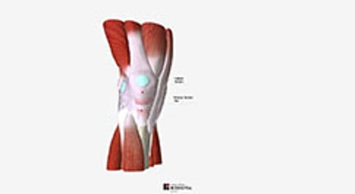

# 膝关节伸肌损伤

> **来源**: msd_家庭版  
> **分类**: 损伤与中毒

---

# 膝关节伸肌损伤

$!
/$
$!
/$

## （股四头肌肌腱撕裂；髌腱撕裂）

作者：
[James Y. McCue](https://www.msdmanuals.cn/home/authors/mccue-james)
,
MD
,
University of Washington
Reviewed By
[Diane M. Birnbaumer](https://www.msdmanuals.cn/home/authors/birnbaumer-diane)
,
MD
,
David Geffen School of Medicine at UCLA
已审核/已修订
修改的
10月 2025
v13968091_zh
**
浏览专业版

膝关节伸肌损伤发生于患者试图伸直膝关节但被物体阻挡时。这类损伤可使得连接大腿主要肌肉（四头肌）和膝盖骨（髌骨）的肌腱撕裂，以及连接膝盖骨和胫骨的肌腱撕裂，或膝盖骨或胫骨顶端骨折。

- 症状 |
- 诊断 |
- 治疗 |
- 多媒体 |

对于身体健康的人，只有强大的暴力（如高处跳下或高速行驶的小汽车碰撞）可导致膝关节伸肌损伤。然而，具备某些条件的人更容易出现这类损伤。这些病症包括：

- 老年人
- 骨关节炎
- 使用某些药物（如类固醇 [有时也称为糖皮质激素或皮质类固醇] 或称为氟喹诺酮的抗生素）
- 糖尿病
- 肥胖
- 甲状旁腺功能亢进
- 多发性神经病 （许多神经功能失常）
- 合成代谢类固醇滥用

具备这些条件之一的人在楼梯跌倒或走路时绊倒可损伤膝关节。

伸直膝关节涉及到多个结构。股四头肌腱负责连接大腿主要肌肉（四头肌）和膝盖骨（髌骨）。髌腱负责连接膝盖骨和胫骨。

健康人的肌腱非常强健，所以膝盖骨通常先骨折才出现肌腱撕裂。股四头肌肌腱的损伤通常比髌腱更为常见，尤其是在老年人中。

伸直膝关节

| 伸直膝关节涉及到几个结构，均可在伸直膝关节受阻时损伤。这些损伤包括 股四头肌腱，即连接大腿主要肌肉（四头肌）和膝盖骨（髌骨）的肌腱撕裂（破裂） 髌韧带，即连接膝盖骨和胫骨的肌腱撕裂 膝盖骨或胫骨顶端骨折 |
| --- |

## 膝关节伸肌损伤的症状

若肌腱完全被撕裂，患者无法站立，仰卧时无法直膝抬腿，或坐下时无法伸直膝关节。膝关节通常疼痛和肿胀。

髌腱撕裂

3D 模型

膝盖骨可能移位，向上或向下。

## 膝关节伸肌损伤的诊断

- 医师的评估
- X 射线检查
- 磁共振成像 (MRI)

通过检查膝盖，医生可判断受伤的结构。如果患者在受伤后膝盖肿胀疼痛，医生会让患者坐下并尝试伸展受伤的腿，或仰卧抬起受伤的腿。如果患者不能伸直腿，则可能有膝关节伸肌机制损伤。

医生还会对膝盖拍摄 X 光片。通常，X 光片检查会显示膝盖骨是移位还是骨折。例如，X 光片检查会显示膝盖骨的位置高于其在膝关节上的正常位置（称为高位或抬高髌骨）。这些结果表明髌腱被撕裂。但 X 光片检查结果可能显示正常。

MRI 可确认诊断

## 膝关节伸肌损伤的治疗

- 手术

膝关节伸肌损伤应尽快手术修复。

Test your Knowledge
[Take a Quiz!](https://www.msdmanuals.cn/home/pages-with-widgets/quizzes)

版权所有 © 2026 Merck & Co., Inc., Rahway, NJ, USA 及其附属公司。保留所有权利。

- 关于
- 免责声明

版权所有 © 2026 Merck & Co., Inc., Rahway, NJ, USA 及其附属公司。保留所有权利。
