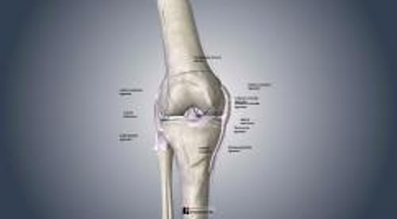

# 膝关节扭伤可相关损伤

> **来源**: msd_家庭版  
> **分类**: 损伤与中毒

---

# 膝关节扭伤可相关损伤

$!
/$
$!
/$

## （前交叉韧带撕裂；半月板损伤；内侧副韧带撕裂；后交叉韧带撕裂）

作者：
[James Y. McCue](https://www.msdmanuals.cn/home/authors/mccue-james)
,
MD
,
University of Washington
Reviewed By
[Diane M. Birnbaumer](https://www.msdmanuals.cn/home/authors/birnbaumer-diane)
,
MD
,
David Geffen School of Medicine at UCLA
已审核/已修订
修改的
10月 2025
v13968336_zh
**
浏览专业版
[小知识](https://www.msdmanuals.cn/home/quick-facts-injuries-and-poisoning/sprains-and-other-soft-tissue-injuries/knee-sprains)

膝关节扭伤即连接股骨至胫骨的韧带发生撕裂。膝关节内作为缓冲器的软骨垫（半月板）也可能损伤、

- 症状 |
- 诊断 |
- 治疗 |
- 多媒体 |
- 膝关节扭伤经常由站在地面上屈曲或扭转膝关节所致。
- 膝关节通常疼痛和肿胀。
- 通常根据体格检查结果作出诊断。
- 通常唯一需要的治疗措施就是休息和膝关节制动，但有时严重的损伤必须手术治疗。

几条韧带一起来维持膝关节在位：

- 侧副韧带： 这些韧带位于膝关节两侧，防止膝关节向两侧过度活动。内侧副韧带位于腿内侧，外侧副韧带则位于腿的外侧。
- 交叉韧带： 这些韧带防止膝关节向前或向后过度活动。前交叉韧带（ACL）在后交叉韧带（PCL）前方与之交叉形成一个“X”。

软骨垫（半月板）填充在股骨和胫骨之间的空隙内。软骨垫有助于膝关节的稳定和缓冲。

将膝关节支撑在一起

| 两条韧带位于膝关节两侧，防止膝关节向两侧过度活动： 内侧副韧带位于腿内侧 外侧副韧带位于腿外侧 关节内有两条韧带（交叉韧带）防止膝关节向前或向后过度活动： 前交叉韧带（ACL） 后交叉韧带（PCL） ACL在PCL前方与之交叉形成一个“X”。 半月板是软骨垫，在股骨和胫骨之间的空隙内起到缓冲作用，也是膝关节的一部分。 |  |
| --- | --- |

膝关节中 **最常受伤的结构** 是：

- 内侧副韧带
- 前交叉韧带

哪些结构出现撕裂取决于作用于膝关节的暴力方向：

- 内侧副韧带和前交叉韧带： 当一侧的脚牢牢地踩在地上时，此时同侧膝关节从侧面受到撞击，如发生在足球运动铲球时，则其中一条韧带或两条韧带都可能发生撕裂。若膝关节同时扭曲则更容易出现损害。
- 外侧副韧带和前交叉韧带： 当膝关节外侧受到直接暴力时这两条韧带可能损伤。这类损伤也可能发生于腿部受到从内向外的推动。
- 前交叉韧带和后交叉韧带： 当膝关节受到暴力被动伸直时可损伤这两条韧带。
- 半月板： 当患者将身体重量集中于一侧足部并且膝关节扭转受伤时可能损伤半月板。
膝关节的结缔组织

3D 模型

## 膝关节扭伤和相关损伤的症状

Meniscal Injuries: ACL and MCL

图片

Copyright © 2025 Merck & Co., Inc., Rahway, NJ, USA and its affiliates. All rights reserved.

偶尔在损伤发生时患者能听到一声弹响。弹响声通常提示某条韧带（特别是前交叉韧带）撕裂。

膝关节疼痛、肿胀、僵硬，且有时瘀伤。疼痛部位取决于哪个结构损伤。可能感觉膝关节不稳，似乎要发软弯曲。可能发生肌肉痉挛，即膝盖周围的肌肉非自主收缩。何时出现症状及其严重程度取决于损伤的程度：

- 轻度： 最初的几小时后出现肿胀，但可持续超过24小时。通常为轻度或中度疼痛。
- 中度： 中度或重度疼痛，特别是患者活动或弯曲膝关节时。
- 重度： 疼痛可能为中度或重度，某些患者不能自行走路。

有时半月板撕裂会阻碍膝关节弯曲（称为卡锁）。

有时，导致膝关节扭伤的外力也会引起骨折和/或膝盖肌腱损伤（ 膝关节伸肌损伤 ）。

## 膝关节扭伤和相关损伤的诊断

- 医师的评估
- 拍摄 X 光片检查有无骨折
- 有时需要进行磁共振成像检查

当患者出现典型症状（比如肿胀）并有外伤病史，医生会怀疑有膝关节扭伤。

## 应力测试

医生会通过某些方式活动患者的腿部来检查膝盖是否出现韧带撕裂（称为应力测试）。包括应力测试在内的全面检查通常可以让医生确认膝盖损伤。

但应力测试通常会推迟，因为在医生首次评估患者时，患者膝盖通常非常疼痛，无法测试。另外，明显肿胀和肌肉痉挛可能导致膝关节评估难以进行。可以在几天后等症状减轻时，再进行应力测试。

## 影像学检查

若膝盖非常疼痛或肿胀，医生通常会先进行 X 光片检查后才进行应力测试，以检查是否有骨折。

某些结果使得骨折的可能性更大：

- 膝关节的某些区域感到有剧烈疼痛。
- 患者无法弯曲膝盖。
- 患者因疼痛导致伤腿不能负重。
- 患者年龄大于55岁。

通常，起初不需要行 磁共振成像 (MRI) 。但如果有以下情况，可能会进行

- 怀疑有严重损伤。
- 经过数周的保护、休息、冰敷、压迫和抬高 (PRICE) 后，症状未消退。

## 膝关节扭伤和相关损伤的治疗

- 有时需要将积液抽出
- 保护、休息、冰敷、压迫和抬高
- 使用夹板或膝关节固定器，以及拐杖
- 有时需要进行手术

如果膝关节内有大量积液，医生有时会抽出积液，以帮助缓解疼痛和肌肉痉挛。

大多数轻度或中度损伤可以首先通过保护、休息、冰敷、压迫和抬高 ( PRICE ) 治疗，有时用弹性压迫绷带缠绕膝关节，以及偶尔使用夹板或一种支撑膝关节防止膝关节弯曲的装置（膝关节固定器）来固定膝关节。膝关节固定器主要用于骨折或大韧带的撕裂，不适用于单纯的拉伤。一般会尽早开始物理治疗，以进行活动范围练习。

如果严重扭伤，有些患者需要上膝关节固定器 6 周或更长时间。

有些韧带或半月板的严重损伤需由骨科医生手术修复。手术修复通常一个小切口和一根小的弹性管完成，这是一种称为 关节镜手术 的程序。

通常建议对轻度或中度损伤者进行 膝关节强化训练 。若损伤严重，关节强化锻炼应推迟到手术之后。

Test your Knowledge
[Take a Quiz!](https://www.msdmanuals.cn/home/pages-with-widgets/quizzes)

版权所有 © 2026 Merck & Co., Inc., Rahway, NJ, USA 及其附属公司。保留所有权利。

- 关于
- 免责声明

版权所有 © 2026 Merck & Co., Inc., Rahway, NJ, USA 及其附属公司。保留所有权利。
