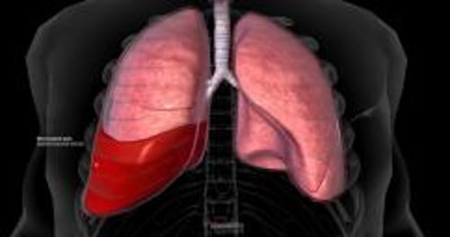

# 血胸

> **来源**: msd_家庭版  
> **分类**: 损伤与中毒

---

# 血胸

$!
/$
$!
/$
作者：
[Thomas G. Weiser](https://www.msdmanuals.cn/home/authors/weiser-thomas)
,
MD, MPH
,
Stanford University School of Medicine
Reviewed By
[David A. Spain](https://www.msdmanuals.cn/home/authors/spain-david)
,
MD
,
Department of Surgery, Stanford University
已审核/已修订
修改的
4月 2024
v12777644_zh
**
浏览专业版

血胸是指在肺和胸壁之间有血液积聚。

- 症状 |
- 诊断 |
- 治疗 |
- 多媒体 |
- 血胸患者可能出现头晕、呼吸短促以及胸痛、皮肤湿冷，或变为青紫色。
- 医生通过胸部 X 片检查作出诊断。
- 给患者静脉输液或 输血 治疗，并往胸腔插入一根管来引流血液。

（另见 胸部创伤介绍 。）

血胸的原因可能是各种损伤——钝性或穿透伤——切割或撕裂肺或胸部的动脉或静脉。然后血液在胸膜腔中积聚——胸膜腔位于覆盖在肺表面的两层组织之间。大量的血液聚集可能挤压肺使得呼吸困难。当气体也同时进入胸膜腔时，称之为血气胸。胸部手术或 肺结核 或 肺癌 等其他疾病偶尔会引起血胸。

您知道吗……

| 绝大多数胸部伤口的出血发生在胸腔内，体外可见的出血极少。 |
| --- |

血胸

3D 模型

## 血胸的症状

血胸本身不会引起疼痛，但导致血胸的损伤通常会引发疼痛。其他症状的严重程度在一定程度上取决于胸腔中的血液量。如果血液量较小，患者不会有其他症状。如果血液量较大，患者可能会感到呼吸短促，并且出现浅快呼吸。大量血液可能会导致血压低至危险程度（ 休克 ）。出现皮肤湿冷，变为青紫色。

## 血胸的诊断

- 胸部 X 线检查
- 有时进行超声检查

如果医生怀疑是血胸，他们会进行 胸部 X 线检查 ，或者特别是有必要快速诊断时，进行称为 E-FAST（扩展创伤重点超声评估法）的床旁超声检查，以检测肺和胸壁之间的胸膜腔中的血液。

## 血胸的治疗

- 静脉输液，有时输入血液制品以维持血压
- 插入胸腔引流管

医生给予静脉输入液体以增加血管内液体容量，从而增加血压。如果流失了大量血液，则有必要 输血 。

医生通常会在 胸部进行插管 （胸廓造口术）来引流血液，并使肺复张。插管可能需要维持几天。

如果存在大量血液或持续出血，则可进行手术（ 胸廓造口术 ）来止血。

Test your Knowledge
[Take a Quiz!](https://www.msdmanuals.cn/home/pages-with-widgets/quizzes)

版权所有 © 2026 Merck & Co., Inc., Rahway, NJ, USA 及其附属公司。保留所有权利。

- 关于
- 免责声明

版权所有 © 2026 Merck & Co., Inc., Rahway, NJ, USA 及其附属公司。保留所有权利。
