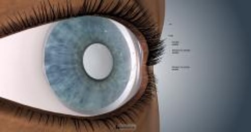

# 角膜擦伤和角膜异物

> **来源**: msd_家庭版  
> **分类**: 损伤与中毒

---

# 角膜擦伤和角膜异物

$!
/$
$!
/$

## （眼里有异物）

作者：
[Jurij R. Bilyk](https://www.msdmanuals.cn/home/authors/bilyk-jurij)
,
MD
,
Thomas Jefferson University Hospital
Reviewed By
[Diane M. Birnbaumer](https://www.msdmanuals.cn/home/authors/birnbaumer-diane)
,
MD
,
David Geffen School of Medicine at UCLA
已审核/已修订
修改的
10月 2024
v797787_zh
**
浏览专业版
[小知识](https://www.msdmanuals.cn/home/quick-facts-injuries-and-poisoning/injuries-to-the-eye/corneal-abrasions-and-corneal-foreign-bodies)

角膜异物可导致擦伤，引起疼痛和发红，并导致感染，甚至在去除后也是如此。绝大部分损伤都很轻微。

- 病因 |
- 症状 |
- 诊断 |
- 治疗 |
- 预后 |
- 多媒体 |

（另见 眼外伤概述 。）

涉及眼睛前表面的透明穹顶层（角膜）的最常见损伤有

- 刮伤（擦伤）
- 异物（物体）

约四分之一主诉眼痛的急诊患者存在角膜擦伤。

## 角膜擦伤和角膜异物的病因

微粒是导致擦伤的常见原因。微粒可以通过爆炸、风或使用工具（例如，磨床、电锯、锤子、电钻或带有金属材料相互接触的机械的旋转工具）进行扩散。隐形眼镜是角膜擦伤的常见原因。隐形眼镜与角膜表面不匹配、戴镜时眼睛干涩、未清洗干净有异物附着、戴镜时间太长、睡觉时未取下、取戴眼镜时用力过猛等都可能导致眼表划伤。其他常见的擦伤来源是

- 树枝或掉落的碎片
- 指甲
- 发刷
- 化妆刷

多数角膜擦伤能自行愈合而并不发生感染（比如 结膜炎 和 角膜溃疡 ），但对于与隐形眼镜相关或被土壤或植物污染的擦伤（例如树枝导致的损伤），则更可能发生感染。

角膜擦伤

3D 模型

## 角膜擦伤和角膜异物的症状

角膜擦伤和异物通常会导致疼痛、流泪及眼内异物感。它们还可能会导致眼睛和眼睑发红（因眼表面血管扩张）或偶尔的肿胀。视觉可能变模糊。光线可能会导致收缩瞳孔的肌肉疼痛性痉挛。

穿透眼球（ 眼内异物 ）的损伤可能会造成类似症状。如果异物穿透眼球内部，可能会流出液体。

## 角膜擦伤和角膜异物的诊断

- 医师的评估

及时诊断和适当治疗角膜擦伤和角膜异物有助于预防角膜感染（角膜溃疡）、眼内感染（ 眼内炎 ）或虹膜炎症（虹膜睫状体炎），所有这些均对视力会造成风险。根据患者症状、受伤情况和体格检查作出诊断。

## 角膜擦伤和角膜异物的治疗

- 去除异物
- 抗生素
- 疼痛缓解

### 角膜异物

在去除角膜异物前，医生通常使用麻醉滴眼液（比如丙美卡因）麻醉眼睛表面。医生还会给予含有染料（荧光素）的滴眼液，这种染料可在特定光照下发光，使得表面物体可见度增强并显示擦伤。医生之后使用 裂隙灯 或其他放大仪器去除任何剩余的异物。通常，可用消毒棉签轻轻蘸取用消毒盐水冲洗异物。若患者能很好地配合医生固视某点而不转动眼球，医生可用针头或其他特殊工具挑出异物。

当铁质或钢质异物被移除后，可能会留下锈环，这需要用无菌皮下注射针或低速旋转式无菌钻（一种小型手术器械，有微小可研磨的钻面）。

有时异物可能嵌顿在上睑后方。此时需翻转眼睑（无痛操作，称为外翻）去除异物。医生还会用无菌棉签在眼睑内轻轻擦除掉那些不可见的微粒。

### 角膜擦伤

不管是否移除异物，角膜擦伤的治疗类似。通常会使用几天抗生素软膏（例如多粘菌素B加杆菌肽）以预防感染。大面积擦伤可能需要其他治疗。如患者对光敏感，用睫状肌麻痹滴眼液（比如环喷托酯或后马托品）维持瞳孔扩张状态。这类眼药水可防止瞳孔收缩肌的疼痛性痉挛。

可通过口服药物缓解疼痛，如对乙酰氨基酚，或偶尔使用处方止痛药。有的医生会使用双氯芬酸或酮咯酸眼药水帮助缓解疼痛，但需要小心，因为这些药物在极少数情况下可能导致并发症，比如某种角膜瘢痕（称为角膜融化）。虽然将麻醉剂直接用于眼部可有效缓解疼痛，但因其对愈合有损，所以在评估并治疗后不应使用麻醉剂。

眼贴可增加感染风险，因而不能用于角膜划伤的患者，尤其不能用于因隐形眼镜或混有植物、泥土的异物划伤者。

## 角膜擦伤和角膜异物的预后

幸运的是，角膜上皮细胞能迅速再生。较大的角膜擦伤也能在 1～3 天内愈合。划伤后至少5天不能配戴隐形眼镜。在擦伤后一两天由眼科医生（专门评估和治疗眼部疾病的外科和非外科医生）进行随访检查是明智的，但时间范围可能根据伤口的大小和严重程度不同而有所不同。

Test your Knowledge
[Take a Quiz!](https://www.msdmanuals.cn/home/pages-with-widgets/quizzes)

版权所有 © 2026 Merck & Co., Inc., Rahway, NJ, USA 及其附属公司。保留所有权利。

- 关于
- 免责声明

版权所有 © 2026 Merck & Co., Inc., Rahway, NJ, USA 及其附属公司。保留所有权利。
