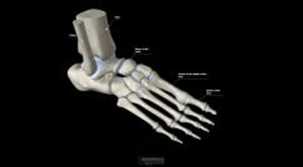

# 足部骨折

> **来源**: msd_家庭版  
> **分类**: 损伤与中毒

---

# 足部骨折

$!
/$
$!
/$
作者：
[Danielle Campagne](https://www.msdmanuals.cn/home/authors/campagne-danielle)
,
MD
,
University of California, San Francisco
Reviewed By
[Diane M. Birnbaumer](https://www.msdmanuals.cn/home/authors/birnbaumer-diane)
,
MD
,
David Geffen School of Medicine at UCLA
已审核/已修订
修改的
3月 2025
v829971_zh
**
浏览专业版

足部骨折包括 脚趾骨折 、足中部骨骨折（ 跖骨骨折 ）、大脚趾根部两块圆形小骨（ 籽骨骨折 ）或足底骨骨折，包括 足跟骨（跟骨）骨折 。

- 诊断 |
- 治疗 |
- 多媒体 |
- 足部骨折可能由跌倒、扭伤、或脚直接踢到硬物所致。
- 足部骨折会引起剧烈疼痛，当患足承重时疼痛通常会加重。
- 医生通常需要拍摄 X 线片来诊断足部骨折。
- 治疗方法取决于骨折位置和骨折类型，但通常涉及使用夹板或专门设计来保护脚的鞋或靴子。

（另见 骨折概述 。）

足部骨折较常见。足部骨折可能由跌倒、扭转、或硬物直接击打足部所致。

足部骨折可引起剧烈疼痛，如果患足继续行走或足部承重，足部骨折常会加重。

足部骨折发生部位

| 足部骨折较常见。他们可能发生于 足趾（指骨）、特别是大脚趾（大拇趾），如下所示 足中部骨（跖骨） 大脚趾底部两块圆形小骨（籽骨） 足底部骨：楔状骨、舟骨、骰骨、距骨和跟骨 |
| --- |

足部骨骼

3D 模型

## 足部骨折的诊断

- 通常行X线检查

（另见 骨折诊断 。）

除某些脚趾骨折外，足部骨折诊断通常需要 X 线片检查。极少数情况下，需要进行CT或MRI检查。

## 足部骨折的治疗

- 用夹板（有时用石膏）或专门设计的鞋或靴子
- 通常会告知患者暂时不要让足部负重
- 物理疗法

足部骨折的治疗取决于骨折位置和骨折类型，但通常包括给脚和脚踝上夹板（有时是石膏），或穿鞋头开口露趾、带 Velcro 紧固件和硬鞋底的专门设计的鞋或靴子，以防止足部进一步受伤。

通常会告知患者一段时间内不要让足部负重。等待时间取决于损伤情况，并且可能长达数周。通常情况下，医生会鼓励患者只要不是非常疼痛，可活动足和踝。

通常需要物理治疗。物理治疗包括特殊训练以改善受伤的足灵活性和活动并加强支撑的肌肉。

Test your Knowledge
[Take a Quiz!](https://www.msdmanuals.cn/home/pages-with-widgets/quizzes)

版权所有 © 2026 Merck & Co., Inc., Rahway, NJ, USA 及其附属公司。保留所有权利。

- 关于
- 免责声明

版权所有 © 2026 Merck & Co., Inc., Rahway, NJ, USA 及其附属公司。保留所有权利。
