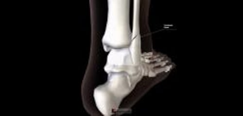

# 踝关节骨折

> **来源**: msd_家庭版  
> **分类**: 损伤与中毒

---

# 踝关节骨折

$!
/$
$!
/$

## （腓骨骨折；胫骨骨折）

作者：
[Danielle Campagne](https://www.msdmanuals.cn/home/authors/campagne-danielle)
,
MD
,
University of California, San Francisco
Reviewed By
[Diane M. Birnbaumer](https://www.msdmanuals.cn/home/authors/birnbaumer-diane)
,
MD
,
David Geffen School of Medicine at UCLA
已审核/已修订
修改的
3月 2025
v13967097_zh
**
浏览专业版
[小知识](https://www.msdmanuals.cn/home/quick-facts-injuries-and-poisoning/fractures/broken-ankle)

踝部骨折可发生在踝部外方的骨性突起（外踝），即小腿较小的骨（腓骨）末端。或发生在踝关节内方的骨性突起，即小腿较大的骨（胫骨）末端，或胫骨后下端（后踝），或更常见的二者皆有。

- 症状 |
- 诊断 |
- 治疗 |
- 多媒体 |
- 脚踝可能会有多个部位断裂，而使脚踝稳定的韧带也可能会被撕裂。
- 骨折的踝关节会出现疼痛和肿胀，通常不能承重。
- 医生根据症状和体格检查怀疑踝关节骨折，但要拍摄 X 线片来确诊。
- 稳定的腓骨骨折采用穿步行靴或上石膏治疗，大多数胫骨骨折需要手术治疗。

踝关节骨折较常见。当足被强迫上下或旋内、旋外活动时可能发生踝关节骨折。踝部骨折可能不止一处。有时腓骨顶端（膝关节附近）也有骨折。

踝关节包含三块骨：

- 小腿的两根骨（腓骨和胫骨）
- 位于小腿骨和跟骨之间足部的一块骨（距骨）

这三块骨通过几条韧带相连，形成环状结构使得踝关节稳定。骨折通常会在多处破坏此环状结构。例如，如果其中一块骨骨折，同时某条韧带通常严重撕裂。如果骨折在两处或更多处破坏环状结构，踝关节即出现不稳定。

有时暴力作用于踝关节某条韧带，韧带会在其附着处撕脱下一小块骨片。这类骨折称为撕脱性骨折，感觉上更像是严重扭伤而非骨折。

（另见 骨折概述 。）

踝部解剖学

|  |
| --- |

脚踝骨折

3D 模型

## 踝关节骨折的症状

踝关节骨折出现疼痛和肿胀。通常情况下，患肢不能负重。

## 踝关节骨折的诊断

- X 射线检查

（另见 骨折诊断 。）

医生检查并轻柔的感受（触诊）踝关节以查看骨折。若怀疑有骨折，会拍摄多张 X 线片以确认（或排除）骨折。

根据体格检查结果和X线片，医生判断踝关节是否稳定。然后可决定最佳治疗方法。

## 踝关节骨折的治疗

- 对大多数稳定骨折，选择步行靴或石膏
- 对于不稳定骨折，有时进行手术复位骨折块

对于大多数 **稳定的踝关节骨折** （包括撕脱性骨折），医生通常会提供步行靴或上石膏，这要保持大约 6 周。步行靴有 Velcro 紧固件以及硬框和外壳来保护足部不会进一步受伤。稳定的踝关节骨折通常愈合良好。

步行靴

图片

图片由 Danielle Campagne 医学博士提供。

对于 **不稳定的踝关节骨折，** 可能需要手术。通常行 切开复位内固定术 (ORIF)。进行 ORIF 时，将骨折块放回原位（复位），然后用金属线、金属针、螺钉、金属棒和金属板等装置固定。在发生不稳定的踝关节骨折后，脚踝可能不如以前坚韧。

如果踝关节稳定并且骨折块已正确放回原处，骨折通常愈合良好。如果骨折块未留在原位，可能发生关节炎，脚踝可能会再次骨折。

Test your Knowledge
[Take a Quiz!](https://www.msdmanuals.cn/home/pages-with-widgets/quizzes)

版权所有 © 2026 Merck & Co., Inc., Rahway, NJ, USA 及其附属公司。保留所有权利。

- 关于
- 免责声明

版权所有 © 2026 Merck & Co., Inc., Rahway, NJ, USA 及其附属公司。保留所有权利。
