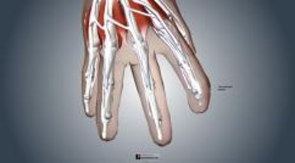

# 锤状指

> **来源**: msd_家庭版  
> **分类**: 损伤与中毒

---

# 锤状指

$!
/$
$!
/$
作者：
[James Y. McCue](https://www.msdmanuals.cn/home/authors/mccue-james)
,
MD
,
University of Washington
Reviewed By
[Diane M. Birnbaumer](https://www.msdmanuals.cn/home/authors/birnbaumer-diane)
,
MD
,
David Geffen School of Medicine at UCLA
已审核/已修订
修改的
10月 2025
v13968045_zh
**
浏览专业版
[小知识](https://www.msdmanuals.cn/home/quick-facts-injuries-and-poisoning/sprains-and-other-soft-tissue-injuries/mallet-finger)

锤状指就是指尖下垂并无法伸直。通常是由肌腱损伤引起的。

- 症状 |
- 诊断 |
- 治疗 |
- 多媒体 |

（另见 扭伤和其他软组织损伤概述 和 手指骨折 。）

锤状指通常发生于指尖内连接骨和肌肉的肌腱撕裂所致。这条肌腱（称为伸指肌腱）可使得指尖伸直。通常，当外力导致指尖弯曲超过其正常弯曲范围时，肌腱会被撕裂。常见原因是棒球击中指尖并造成挤压。因此，锤状指有时又称作棒球指。

有时还有关节脱位。

当肌腱撕裂时，可能会从指骨撕掉一小块骨片（称为撕脱性骨折）。发生撕脱性骨折时，受损的指骨末端软骨（关节面）同样骨折。

锤状指

| 锤状指不能将手指末端伸直。 |
| --- |

槌狀指

3D 模型

## 槌状指的症状

通常手指在伤后立即出现疼痛、肿胀和淤伤。指关节弯曲。患者无法伸直关节。偶尔，血液会积存在指甲下（称为甲下血肿）。

## 槌状指的诊断

- 体格检查
- X线片查看骨折

医生通常在检查手指时即可诊断锤状指。

通常从多个角度拍摄X线片以查看骨折情况。

## 槌状指的治疗

- 夹板固定

通常情况下，医生将患者的手指伸直，放置夹板并以稍微向上弯曲的姿势固定。夹板固定6到8周时间。

极少情况下骨折涉及大部分关节面或有关节脱位，则需要手术治疗。

Test your Knowledge
[Take a Quiz!](https://www.msdmanuals.cn/home/pages-with-widgets/quizzes)

版权所有 © 2026 Merck & Co., Inc., Rahway, NJ, USA 及其附属公司。保留所有权利。

- 关于
- 免责声明

版权所有 © 2026 Merck & Co., Inc., Rahway, NJ, USA 及其附属公司。保留所有权利。
