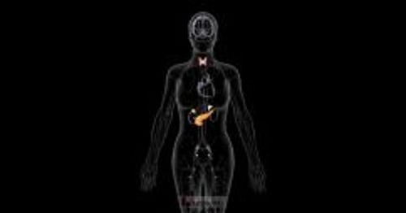
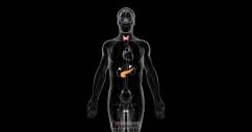

# 内分泌腺体

> **来源**: msd_家庭版  
> **分类**: 激素代谢疾病

---

# 内分泌腺体

$!
/$
$!
/$
作者：
[William F. Young, Jr](https://www.msdmanuals.cn/home/authors/young-william)
,
MD, MSc
,
Mayo Clinic College of Medicine
Reviewed By
[Glenn D. Braunstein](https://www.msdmanuals.cn/home/authors/braunstein-glenn)
,
MD
,
Cedars-Sinai Medical Center
已审核/已修订
2月 2025
|
修改的
7月 2025
v771097_zh
**
浏览专业版
- 多媒体 |

内分泌系统包括一组腺体和器官，这些腺体和器官产生和分泌激素，调控多种机体功能。激素是会影响其他身体部位活动的化学物质。实质上，激素起着类似信使的作用，控制和协调整个机体的功能活动。

- 内分泌 腺会分泌激素直接进入 血流 。
- 外分泌 腺会将激素或其他物质释放到 导管 。

构成内分泌系统的每个器官具有不同且通常不相关的功能。而专攻内分泌系统疾病的医生则被称为内分泌专家。许多内分泌专家又进一步专注于研究特定腺体的功能和疾病。

内分泌系统和激素概述

视频

内分泌系统的每个主要腺体都生成一种或多种特定激素，这些腺体为

- 下丘脑
- 垂体
- 甲状腺
- 甲状旁腺
- 胰腺的胰岛细胞
- 肾上腺
- 男性睾丸和女性卵巢

下丘脑（脑部与垂体相连的一个小区域）分泌多种控制垂体的激素。 垂体 有时被称为主腺体，因为它可分泌 控制许多其他内分泌腺功能 的激素。

在怀孕期，胎盘除了自身的 其他功能 之外，还通过分泌支持妊娠的激素，从而起到内分泌腺的作用。

主要内分泌腺

| 内分泌系统的主要腺体是下丘脑、垂体、甲状腺、甲状旁腺、胰岛细胞、肾上腺、男性睾丸和女性卵巢。 |
| --- |

并不是所有分泌激素或激素样物质的器官都是内分泌系统的一部分。例如，肾脏产生两种激素：肾素，一种帮助控制血压的酶；以及 促红细胞生成素 ，刺激骨髓生成红细胞。另外，消化系统也产生多种激素调控消化，影响胰腺分泌 胰岛素 ，改变诸如与饥饿相关的行为。脂肪组织还产生可调节代谢（身体如何利用食物来控制体内化学过程）和食欲的激素。

此外，“腺体”一词并不意味着相应器官隶属于内分泌系统。例如，汗腺、唾液腺、黏膜内腺体以及乳腺被称为外分泌腺，因为它们分泌的物质不是激素，并且它们是将物质分泌到导管中，而不是直接进入血流。

胰腺 既是内分泌腺，又是外分泌腺。胰腺内的特化部位生成 胰岛素 和其他激素，并将它们释放到血流中调节血糖（葡萄糖）水平，其他部位生成消化液，消化液通过胰管并最终进入小肠，以帮助消化食物。

您知道吗……

| 有些人把淋巴结肿大说成是“腺体肿大”，尤其是颈部淋巴结肿大时。但 淋巴结 并不是腺体。 |
| --- |

女性内分泌系统

3D 模型
男性内分泌系统

3D 模型

Test your Knowledge
[Take a Quiz!](https://www.msdmanuals.cn/home/pages-with-widgets/quizzes)

版权所有 © 2026 Merck & Co., Inc., Rahway, NJ, USA 及其附属公司。保留所有权利。

- 关于
- 免责声明

版权所有 © 2026 Merck & Co., Inc., Rahway, NJ, USA 及其附属公司。保留所有权利。
