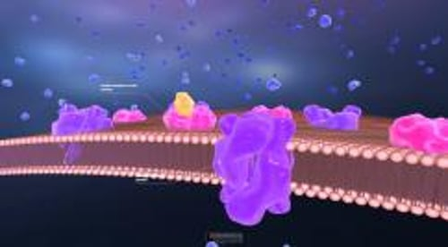

# 糖尿病概述

> **来源**: msd_家庭版  
> **分类**: 激素代谢疾病

---

# 糖尿病概述

$!
/$
$!
/$
作者：
[Erika F. Brutsaert](https://www.msdmanuals.cn/home/authors/brutsaert-erika)
,
MD
,
New York Medical College
Reviewed By
[Glenn D. Braunstein](https://www.msdmanuals.cn/home/authors/braunstein-glenn)
,
MD
,
Cedars-Sinai Medical Center
已审核/已修订
修改的
12月 2025
v104712060_zh
**
浏览专业版

糖尿病是指身体产生的 胰岛素 不足和/或不能对 胰岛素 作出正常应答，导致血糖（葡萄糖）水平异常偏高。

- 1 型糖尿病和 2 型糖尿病 |
- 诊断 |
- 糖尿病并发症 |
- 针对老年人和有医学问题人群的治疗考虑因素 |
- 多媒体 |
- 糖尿病的症状包括多尿、烦渴，未尝试减肥体重即可减轻。
- 医生通过测定血糖水平诊断糖尿病
- 糖尿病可损伤血管并增加心脏病发作、卒中、慢性肾病和失明的风险。
- 糖尿病可损伤神经并导致触觉异常。
- 糖尿病患者需坚持健康饮食，少吃精制碳水化合物（包括糖）、饱和脂肪和加工食品。他们还需坚持锻炼，保持健康的体重，平时使用降血糖的药物；如果体重高于健康水平，还应减肥。

全世界有 11% 至 14% 的成年人患有糖尿病。医生通常使用全称“diabetes mellitus”来指称糖尿病，而不是单独使用“diabetes”一词，这是为了将糖尿病与 精氨酸加压素缺乏症 （以前称为尿崩症，一种相对罕见的疾病，不影响血糖水平，但与糖尿病一样，可导致排尿增加）区分开来。

## 血糖

构成大多数食物的 3 大营养素是 碳水化合物 、 蛋白质 和 脂肪 。碳水化合物有 3 类，糖类是其中之一，除此之外还有淀粉和纤维。

糖有很多种类型。有些糖是单糖，有些是复合糖。食糖（蔗糖）由 2 种较简单的糖组成，分别称为葡萄糖和果糖。乳糖由葡萄糖和被称为半乳糖的单糖构成。淀粉中的碳水化合物（如面包、意大利面食、米饭和其他类似食物）以不同单糖分子的长链形式存在。蔗糖、乳糖、碳水化合物和其他复合糖须在消化道内被酶分解成单糖后才可以被人体吸收。

单糖一旦被人体吸收，通常会全部转化成葡萄糖，而葡萄糖则是身体能量的主要来源。葡萄糖是通过血液运输和由细胞吸收的糖。人体还可以从脂肪和蛋白中获取葡萄糖。血液中的“糖”的真正含义是血中的葡萄糖。

您知道吗……

| 糖有多种类型，“血糖”通过检查血液中的葡萄糖测量。 |
| --- |

## 胰岛素

胰岛素 是 胰腺 （胃后面的一个器官，也生成消化酶）释放的一种激素，可控制血糖水平。血液中的葡萄糖刺激胰腺产生 胰岛素 。 胰岛素 有助于葡萄糖从血液进入细胞。一旦进入细胞，葡萄糖就会转化为能量并立刻被利用，或者葡萄糖以脂肪或淀粉糖原的形式储存起来备用。

胰岛素如何工作

3D 模型

正常情况下每天的血糖水平在不断发生变化。用餐后，血糖水平升高，此时会有更多的葡萄糖存在于血液中，大约在进食后两小时内，血糖会恢复到餐前水平。一旦血糖水平恢复到餐前水平， 胰岛素 生成就会减少。在健康人中，血糖水平的变化范围通常较窄，约 70-110 毫克/分升 (mg/dL) 或 3.9-6.1 毫摩尔/升 (mmol/L)。如果一个人进食了大量的碳水化合物，其血糖水平可能会升得更高。65岁以上的老年人血糖水平可能会轻度增高，尤其是在进餐后。

如果人体不能产生足够的 胰岛素 来使葡萄糖进入细胞，或者细胞停止对 胰岛素 作出正常反应（称为 胰岛素抵抗 ），那么由此导致的血液内葡萄糖水平升高和细胞内葡萄糖含量不足的问题会引起糖尿病的症状和 并发症 。

## 1 型糖尿病和 2 型糖尿病

糖尿病有两种主要类型，在所有确诊糖尿病病例中，1 型糖尿病占 5% 至 10%，2 型糖尿病占 90% 至 95%。其余的糖尿病病例则表现为其他一些不太常见的类型。

### 1 型糖尿病

在 1 型糖尿病（曾被称为 胰岛素 依赖型糖尿病或青少年发病型糖尿病）中，人体免疫系统会攻击胰腺的产 胰岛素 细胞，大多数这类细胞会被永久破坏。因此胰腺仅产生极少量或根本不产生 胰岛素 。大多数 1 型糖尿病患者在 30 岁以前发病，但也有可能在更大年龄时发病。科学家们相信，可能是在孩童时期或刚刚成年的时期由于病毒感染或营养原因等环境因素的影响，导致了胰腺的产 胰岛素 细胞受到免疫系统的破坏。遗传易感性会使有些人对某种环境因素更加敏感。

### 2 型糖尿病

在 2 型糖尿病（曾被称为非 胰岛素 依赖型糖尿病或成年发病型糖尿病）中，胰腺通常会继续分泌 胰岛素 ，有时甚至比正常水平还高，尤其是糖尿病早期。但机体对 胰岛素 的作用产生了抵抗，从而就没有足够 胰岛素 来满足机体的需求。随着 2 型糖尿病的进展，胰腺产 胰岛素 的能力下降。以往 2 型糠尿病在儿童和青少年中很罕见，而现在则更为常见。通常 2 型糖尿病在 30 岁以后发病，并随年龄增长发病率逐渐增加。

一些疾病或药物能影响机体利用 胰岛素 并导致 2 型糖尿病。类固醇（有时称为糖皮质激素或皮质类固醇）水平高（最常见的原因是使用泼尼松等类固醇药物，或者患有 库欣综合征 ）,可导致 胰岛素 的利用率下降。

### 糖尿病前期

血糖水平高于正常但还未达到糖尿病诊断标准的状态，称为糖尿病前期。如果空腹血糖水平介于 100 mg/dL (5.6 mmol/L) 和 125 mg/dL (6.9 mmol/L) 之间，或葡萄糖耐量试验后两小时的血糖水平介于 140 mg/dL (7.8 mmol/L) 和 199 mg/dL (11.0 mmol/L) 之间，则患者被认为是有前驱糖尿病。前驱糖尿病人群将来发生糖尿病以及心脏病的风险更高。通过饮食控制和锻炼使体重下降 5%～10% 能显著降低发生糖尿病的风险。

### 糖尿病的其他类型和病因

其他类型糖尿病在病例中的占比较小。原因包括：

- 怀孕（ 孕期糖尿病 ）
- 单基因糖尿病
- 成人隐匿性自身免疫性糖尿病
- 囊性纤维化相关糖尿病
- 胰腺破坏或切除引起的糖尿病（有时称为 3c 型糖尿病)
- 影响胰腺的其他疾病，如 胰腺炎 或 血色病
- 移植后糖尿病
- 营养不良相关性糖尿病
- 内分泌疾病，如 库欣综合征 或 肢端肥大症
- 药物，最明显的是糖皮质激素、 β 受体阻滞剂、蛋白酶抑制剂、非典型抗精神病药、免疫检查点抑制剂和钙调磷酸酶抑制剂

糖尿病可能发生在生长激素分泌过多（ 肢端肥大症 ）以及患有某些激素分泌瘤的患者中。重度或反复发作的 胰腺炎 以及其他直接损伤胰腺的疾病都会导致糖尿病。

### 妊娠期糖尿病

有些孕妇会发生 妊娠期糖尿病 ，因为怀孕会导致对 胰岛素 作用的抵抗。

### 单基因糖尿病

单基因形式的糖尿病由一些遗传缺陷引起，这些遗传缺陷会影响胰腺分泌 胰岛素 的方式、 胰岛素 在体内的作用，或者细胞内的其他过程。

### 成人隐匿性自身免疫性糖尿病

隐匿性自身免疫性糖尿病是发生于成年期的一种糖尿病形式，患者体内存在一种或多种自身抗体。与典型的 1 型糖尿病相比，隐匿性自身免疫性糖尿病的进展更为缓慢，有些成人患者在首次出现血糖异常时不需使用 胰岛素 。最初，这种形式的糖尿病可能会被误诊为 2 型糖尿病。

## 糖尿病的诊断

- 测量血液中的葡萄糖水平，有时是空腹测量或在摄入标准数量的糖之后测量

如果某人血液中的葡萄糖水平异常偏高，应诊断为糖尿病（糖尿病前期）。医生可能会对有糖尿病风险但无症状、有其他通常与糖尿病相关的疾病或有糖尿病症状的人群进行 筛查检测 。

### 检测血糖

如果患者有烦渴、多尿或饥饿感增强等糖尿病症状，医生会检测血糖水平。当一个人出现逐渐加重的口渴、多尿和饥饿时、或者出现糖尿病并发症，如反复感染、足部溃疡和真菌感染时，医生也会检测血糖水平。

为了准确评估血糖水平，医生通常会在患者禁食过夜后采血。如果 **空腹血糖** 水平达到或高于 126 mg/dL (7.0 mmol/L)，则可诊断为糖尿病。但是，也允许使用在非空腹状态下采集的血液样本（称为 **随机血糖水平** ）。进食后血糖水平有一定程度的升高是正常的，但不应该太高。如果随机（不是在空腹后进行）血糖水平高于 200 mg/dL (11.1 mmol/L)，则可诊断为糖尿病。

### 血红蛋白 A1C

医生还会检测血液中一种蛋白——血红蛋白 A1C（亦称为糖基化血红蛋白或糖化血红蛋白）的水平，其反映血糖水平的长期趋势，而非短期变化。

血红蛋白是红细胞的红色携氧物质。当血液处于高血糖水平一段时间后，葡萄糖会附着于血红蛋白上，形成糖化血红蛋白。在血检报告中，血红蛋白 A1C 水平即血红蛋白 A1C 的百分比。

通过认证的实验室（不是家中或医生诊所使用的仪器）测量的HbA1C可以被用来诊断糖尿病。HbA1C水平为6.5％或以上的人患有糖尿病。如果 HbA1C 水平在 5.7 至 6.4 之间，则他们处于糖尿病前期，有患糖尿病的风险。

实验室检测
血红蛋白 A1c HbA1c 检测

### 口服葡萄糖耐量试验

在某些情况下，例如筛查孕妇有无 孕期糖尿病 或对有糖尿病症状但空腹血糖水平正常的老年人做检查，可行另一种血液检查，即口服葡萄糖耐量试验。然而，这项检查非常繁琐，因此不作常规糖尿病检测项目。

在这个试验中，患者先空腹采集血样来检测空腹血糖水平，然后再饮用含有标准剂量葡萄糖的特制溶液。在随后的2至3个小时再采集血样并进行检测，以确定血糖水平是否异常升高。

## 糖尿病并发症

血糖水平的突然变化会使血生化指标发生其他变化，导致糖尿病的一些并发症迅速发生。这些并发症包括低血糖症、糖尿病酮症酸中毒和高渗性高血糖状态。

其他并发症的发展更为缓慢，归因于血糖水平多年持续偏高而造成的损伤。糖尿病会损伤血管，导致血管狭窄，从而限制血流。由于全身的血管都会受累，因此患者可能出现许多 糖尿病并发症 。

很多器官会受累，尤其是下列器官：

- 眼睛（ 糖尿病视网膜病变 ），引起失明
- 肾脏（ 糖尿病肾病 ），引起慢性肾病
- 神经（ 糖尿病性神经病 ），主要引起足部和腿部感觉减退
- 心脏，导致 心脏病发作 或 心力衰竭
- 脑，引起 卒中
- 腿部，引起 外周动脉疾病

高血糖水平还会引起机体免疫系统紊乱，因此糖尿病患者尤其容易感染细菌和真菌。

## 针对老年人和有医学问题人群的治疗考虑因素

对于 1 型和 2 型糖尿病患者的治疗，请分别参阅 1 型糖尿病 -治疗 和 2 型糖尿病 - 治疗 。然而，不论哪种类型的糖尿病，在治疗老年人和有其他医学问题的人群时都要考虑到一些因素。

老年人及患有多种疾病（尤其是严重疾病）的人群需要遵循糖尿病管理的基本准则，即教育、饮食、运动和药物，这个准则也适用于年轻人或健康人群。然而，尝试严格控制血糖水平会引起 低血糖 （血糖水平低）风险，可能会对身体较为虚弱或有多种疾病的患者造成伤害。

### 受教育程度

在学习糖尿病知识的同时，患有多种疾病的患者还可能需要学习如何在治疗他们所患的其他疾病的同时来管理糖尿病。了解如何避免并发症（如脱水、皮肤破损和血液循环问题）以及如何管理可诱发糖尿病并发症的因素（如高血压和高胆固醇水平）尤为重要。无论有无糖尿病，这些问题在老年患者中都比较常见。

### 饮食

许多老年患者很难实行有利于控制血糖和体重的健康均衡饮食。改变长期以来养成的饮食嗜好和习惯是十分困难的。一些人可能患有其他受饮食影响的疾病，但并不了解如何将他们所患的多种疾病的饮食建议进行整合。

一些患者由于在家中、养老院或其他地方由别人为其提供餐食而无法控制他们的饮食。当患者无法自己做饭时，为其购买和烹饪食物的人必须了解患者需要控制饮食。通过与营养师会面来制定一个健康可行的饮食计划，能够使这些患者和他们的看护人从中获益。

### 锻炼

一些患者，特别是以前已经无法活动或者因患病（如关节炎）而导致活动受限的患者，日常生活中可能难以增加锻炼时间。但是他们可以在常规生活中增加锻炼。例如患者可以用步行来代替开车，或者爬楼梯而不坐电梯。

### 药物

通过药物来控制血糖，特别是 胰岛素 ，对一些患者而言可能存在困难。视力不佳可能让患者很难看清 胰岛素 注射器上的剂量刻度。患有关节炎、帕金森病或中风的患者可能无法操作注射器。一些有视力或其他问题的老年患者无法准确地为胰岛素注射器填充胰岛素。如果患者使用的 胰岛素 剂量稳定，可以购买预充式注射器。预充式 胰岛素 笔对躯体活动受限的患者来说是比较容易操作的。一些注射器上的数字很大而且转动方便。

### 监测血糖水平

视力差、由于关节炎而手脚不灵便、震颤、中风或其他体力受限可能使一些患者检测血糖水平变得更为困难。视力不佳可能让患者很难看清血糖仪上的读数。不过，有些血糖监测仪显示的数字很大，容易读出。有些提供语音播报指令和数据。一些仪器通过皮肤来监测血糖而不需要采血。患者可以咨询糖尿病教育专家来选择一种合适的仪器。

### 低血糖

治疗高血糖的最常见并发症是血糖水平低（ 低血糖 ）。在虚弱的、经常需要住院的或服用多种药物的患者中这种风险最高。在治疗糖尿病的所有可用药物中，长效磺脲类药物或 胰岛素 最有可能导致患有严重疾病或多种疾病患者（尤其是老年人）的血糖水平偏低。当这些患者服用此类药物，他们也最容易因为低血糖出现严重症状，例如晕倒和跌倒，思考和肢体活动困难。

在老年人中，低血糖可能不如年轻人明显。低血糖引起的意识模糊可能会被误认为是 痴呆 或药物的镇静作用。此外，有沟通困难的人（如 卒中 后或痴呆所致）可能无法让别人知道他们有症状。

Test your Knowledge
[Take a Quiz!](https://www.msdmanuals.cn/home/pages-with-widgets/quizzes)

版权所有 © 2026 Merck & Co., Inc., Rahway, NJ, USA 及其附属公司。保留所有权利。

- 关于
- 免责声明

版权所有 © 2026 Merck & Co., Inc., Rahway, NJ, USA 及其附属公司。保留所有权利。
