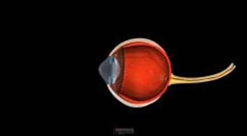

# 圆锥形角膜

> **来源**: msd_家庭版  
> **分类**: 眼科疾病

---

# 圆锥形角膜

$!
/$
$!
/$
作者：
[Vatinee Y. Bunya](https://www.msdmanuals.cn/home/authors/bunya-vatinee)
,
MD, MSCE
,
Scheie Eye Institute at the University of Pennsylvania
Reviewed By
[Sunir J. Garg](https://www.msdmanuals.cn/home/authors/garg-sunir)
,
MD, FACS
,
Thomas Jefferson University
已审核/已修订
修改的
7月 2024
v26622535_zh
**
浏览专业版

圆锥形角膜是角膜（虹膜和瞳孔前的透明层）形状逐渐变化成不规则圆锥形外观导致视力下降的眼病。

- 治疗 |
- 多媒体 |

眼球内部结构

|  |
| --- |

圆锥形角膜常起病于 10～25 岁之间。总是双眼发病，在很多人中导致视力显著变化，需频繁更换框架眼镜或隐形眼镜处方。病因不明，但有下列情况者更容易患病：

- 其他家庭成员患圆锥形角膜
- 有多种过敏的倾向（有时被称为特应性）
- 倾向于用力揉眼
- 眼睑松弛
- 某些结缔组织疾病（例如 埃勒斯－当洛斯综合征 、 马凡综合征 和 成骨不全 ）
- 唐氏综合症
- 出生时就很明显且造成视力不良的疾病（例如雷伯氏先天性黑内障、 早产儿视网膜病变 和眼睛虹膜缺失）
- 阻塞性睡眠呼吸暂停
圆锥角膜

3D 模型

## 圆锥形角膜的治疗

- 隐形眼镜
- 紫外线治疗
- 角膜环
- 角膜移植

隐形眼镜通常能比框架眼镜更好地矫正视力问题。隐形眼镜有多种不同的设计（例如，透气性硬性隐形眼镜、混合式隐形眼镜、巩膜镜），可根据角膜的异常形状尝试不同的类型。有些人可能耐受良好，视力较佳。但有时角膜形状的改变过于严重，以至于不能佩戴隐形眼镜，或即使戴了也不能校正视力。

使角膜硬化（称为胶原交联）的紫外线治疗有助于预防早期圆锥形角膜进一步进展。

角膜环（改变角膜形状以帮助校正折射）植入可改善视力，让人们更好地佩戴接触镜。角膜环使一些人避免进行角膜移植。

严重情况下，可能需要 角膜移植 来恢复视力。

Test your Knowledge
[Take a Quiz!](https://www.msdmanuals.cn/home/pages-with-widgets/quizzes)

版权所有 © 2026 Merck & Co., Inc., Rahway, NJ, USA 及其附属公司。保留所有权利。

- 关于
- 免责声明

版权所有 © 2026 Merck & Co., Inc., Rahway, NJ, USA 及其附属公司。保留所有权利。
