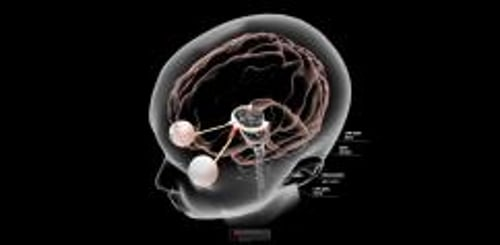

# 视神经炎

> **来源**: msd_家庭版  
> **分类**: 眼科疾病

---

# 视神经炎

$!
/$
$!
/$
作者：
[John J. Chen](https://www.msdmanuals.cn/home/authors/chen-john)
,
MD, PhD
,
Mayo Clinic
Reviewed By
[Sunir J. Garg](https://www.msdmanuals.cn/home/authors/garg-sunir)
,
MD, FACS
,
Thomas Jefferson University
已审核/已修订
修改的
6月 2024
v799783_zh
**
浏览专业版

视神经炎是沿视神经的炎症。

- 病因 |
- 症状 |
- 诊断 |
- 治疗 |
- 多媒体 |
- 多发性硬化是最为常见的原因。
- 可出现视力丧失，并且眼球活动时疼痛。
- 行磁共振成像检查。
- 可给予皮质类固醇。

（另见 视神经疾病概述 。）

## 视神经炎的病因

视神经炎是 50 岁以下成人中最常见的视神经疾病。 多发性硬化 是导致视神经炎的最常见原因。一些视神经炎患者已知被诊断为多发性硬化症，而另一些视神经炎患者后来被发现患有多发性硬化症。以下原因也可导致视神经炎的发生：

- 视神经脊髓炎 (NMO)
- 髓鞘少突胶质细胞糖蛋白抗体相关疾病 (MOGAD)
- 感染，如 病毒性脑炎 （尤其是儿童）、 脑膜炎 、 梅毒 、 鼻窦炎 、 结核 和 人免疫缺陷病毒 (HIV)
- 药物，如肿瘤坏死因子 (TNF) -α 抑制剂或检查点抑制剂
- 其他自身免疫性疾病，如 系统性红斑狼疮

不过，有很多视神经炎患者原因不明。

视神经炎

3D 模型

## 视神经炎的症状

视神经炎可导致严重的视力损失，可单眼发病，也可累及双眼。视力丧失可能会在数天内加重。受累眼的视力下降程度可从接近正常到完全失明。色觉可能尤其容易受到影响，但患者没有注意到。大部分人有轻度眼痛，在眼球运动时常感觉加重。

根据不同的病因，患者的视力多在 2~3 个月内恢复，但并不总是完全恢复。有的患者可出现视神经炎病情反复。

## 视神经炎的诊断

- 医师的评估
- 通常进行磁共振成像

诊断包括检查瞳孔反应，使用带放大镜的灯（检眼镜）观察眼睛后部。眼睛后部的视神经头（视盘）可出现水肿。视野检查通常表现为部分视野丧失。

脑部磁共振成像 (MRI) 可能显示以下疾病证据： 多发性硬化 ；髓鞘少突胶质细胞糖蛋白抗体相关性疾病（也称为 MOGAD），一种神经性免疫介导的疾病，其中视神经发炎；或视神经脊髓炎（也称为 NMO），一种罕见的可损害脊髓和视神经的免疫性疾病。脑部和眼眶 MRI 通常会显示视神经异常。在有神经系统症状的患者中可进行脊髓成像。

## 视神经炎的治疗

- 有时使用皮质类固醇

在某些情况下，皮质类固醇通过静脉给药，用于治疗视神经炎。几天后，可给予口服皮质类固醇。这些药物可加速恢复。如果视力严重下降，并且在皮质类固醇治疗后没有开始缓解，有时可以进行 血浆置换 。如果视神经炎与多发性硬化、NMO、MOGAD 或感染相关，还应治疗基础疾病。

放大镜、用大号铅字排印设备和报时手表（低视力助视器）或可帮助视力丧失的人。

Test your Knowledge
[Take a Quiz!](https://www.msdmanuals.cn/home/pages-with-widgets/quizzes)

版权所有 © 2026 Merck & Co., Inc., Rahway, NJ, USA 及其附属公司。保留所有权利。

- 关于
- 免责声明

版权所有 © 2026 Merck & Co., Inc., Rahway, NJ, USA 及其附属公司。保留所有权利。
