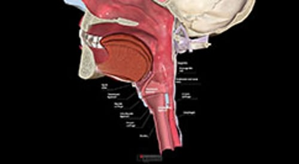

# 喉部疾病概述

> **来源**: msd_家庭版  
> **分类**: 耳鼻喉疾病

---

# 喉部疾病概述

$!
/$
$!
/$
作者：
[Hayley L. Born](https://www.msdmanuals.cn/home/authors/born-hayley)
,
MD, MS
,
Columbia University
Reviewed By
[Lawrence R. Lustig](https://www.msdmanuals.cn/home/authors/lustig-lawrence)
,
MD
,
Columbia University Medical Center and New York Presbyterian Hospital
已审核/已修订
修改的
7月 2025
v43926280_zh
**
浏览专业版
- 多媒体 |

声带（医生有时称其为声腔）位于音匣（喉部）。喉部疾病可能是由声带过度劳累或损伤或由病毒感染引起的。

这里讨论的具体疾病包括

- 喉炎
- 喉含气囊肿
- 喉气管狭窄
- 喉癌
- 喉肌张力障碍 （特征为声带痉挛）
- 声带接触性溃疡
- 声带麻痹
- 声带息肉、结节、肉芽肿和乳头状瘤

偶有良性肿瘤累及喉部。

医生要诊断喉和声带疾病需先做检查，检查包括喉和咽喉的窥镜检查或镜检。也可能需要其它检查，包括影像学检查、活检或内窥镜检查。

对影响喉部和声带的疾病的治疗因诊断而异。声休也许是唯一需要的治疗方法。可能需要手术来治疗息肉、结节、肉芽肿和良性肿瘤，或诊断和治疗癌症。

喉部解剖标志

3D 模型

Test your Knowledge
[Take a Quiz!](https://www.msdmanuals.cn/home/pages-with-widgets/quizzes)

版权所有 © 2026 Merck & Co., Inc., Rahway, NJ, USA 及其附属公司。保留所有权利。

- 关于
- 免责声明

版权所有 © 2026 Merck & Co., Inc., Rahway, NJ, USA 及其附属公司。保留所有权利。
