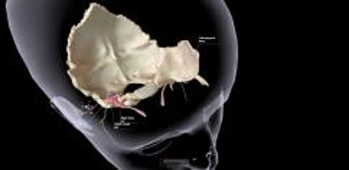

# 耳

> **来源**: msd_家庭版  
> **分类**: 耳鼻喉疾病

---

# 耳

$!
/$
$!
/$
作者：
[Eric J. Formeister](https://www.msdmanuals.cn/home/authors/formeister-eric)
,
MD, MS
,
Dept. of Head and Neck Surgery and Communication Sciences, Duke University
School of Medicine
Reviewed By
[Lawrence R. Lustig](https://www.msdmanuals.cn/home/authors/lustig-lawrence)
,
MD
,
Columbia University Medical Center and New York Presbyterian Hospital
已审核/已修订
修改的
1月 2025
v794952_zh
**
浏览专业版
[小知识](https://www.msdmanuals.cn/home/quick-facts-ear-nose-and-throat-disorders/biology-of-the-ears-nose-and-throat/ears)
- 外耳 |
- 中耳 |
- 内耳 |
- 多媒体 |

耳是司听觉和平衡的器官，由外耳、中耳和内耳三部分组成。

耳：听觉和平衡器官

3D 模型

外耳、中耳、内耳一起将声波转换成神经冲动，传入大脑，感知声音。

同时内耳有助于维持平衡。

耳部内视图

|  |
| --- |

## 外耳

外耳由耳朵的外部（即耳廓）和外耳道（外部的声音通道）组成。

耳廓由软骨构成支架，外覆皮肤，其形状利于收集声波并通过外耳道传至耳膜（也称鼓膜，是一层将外耳与中耳隔开的薄膜）。

## 中耳

中耳由鼓膜和一个小的含气的中耳腔构成，中耳腔内有一条由 3 个小骨头（听骨）组成的链，这条听骨链连接鼓膜和内耳。各听骨以其形状命名。锤骨连接到耳膜。砧骨是锤骨和镫骨中间的骨头，位于卵圆窗中并将其封闭。鼓膜的振动经听骨链机械放大，传至卵圆窗。

中耳腔内有 2 条细小的肌肉。鼓膜张肌附着在锤骨上，有助于收缩耳膜，保护耳朵免受身体声音（如咀嚼和叫喊）的影响。镫骨肌附着于镫骨。此肌肉会在听到大声噪音时收缩，使听骨链更为坚硬，这样会传输较小的声音。此反应（称为听觉反射）有助于保护脆弱的内耳免受噪音伤害。

**咽鼓管** 是连接中耳与鼻后部（鼻咽）气道的小管。此管道可让外部空气进入中耳（耳膜后）。吞咽、咀嚼或打哈欠时咽鼓管开放，使鼓膜内外的压力保持平衡，防止中耳内积液。如果压力不平衡，鼓膜可能凸出（向外推）或凹陷（吸入），可能导致耳部不舒适和听力受损。吞咽或耳部自发的“砰”的一声可以缓解因气压突然变化所致鼓膜内外的压力差，乘坐飞机时经常遇到这种情况。咽鼓管与中耳连接，可以解释为什么上呼吸道感染（如 普通感冒 ）时可导致中耳液体积聚，进而引起感染和疼痛，这是因为上呼吸道感染可引起咽鼓管发炎或阻塞。

## 内耳

内耳（迷路）是由 2 个主要部分组成的复杂结构：

- 耳蜗：听觉器官
- 前庭系统：平衡器官

### 耳蜗

耳蜗是一中空的管道，形如蜗牛的壳，充满液体。其内含有的科蒂氏器由 2 万个特别的细胞（称为毛细胞）构成。这些细胞有细小的毛发状突起（纤毛）伸入液体中。声音振动经中耳听骨链传导至内耳卵圆窗，引起液体移动，从而产生压力波，进而移动纤毛。纤毛运动最终产生神经信号，传送至大脑并被感知为声音。不同频率的声波引起耳蜗不同部位的毛细胞振动，毛细胞将声波转换为神经冲动。如果把耳蜗的线圈“解开”，它就会像钢琴键一样排列，高音调激活靠近圆窗的毛细胞，低音调激活靠近耳蜗顶部的毛细胞。神经冲动会沿着耳蜗神经纤维传输到大脑。圆窗介于充满液体的耳蜗和中耳之间，是一个有膜覆盖的小孔。此窗口有助于抑制由耳蜗中声波引起的压力。

尽管有 听觉反射 的保护作用，但强烈的声音仍能损伤和破坏毛细胞。而毛细胞受损伤后不能再生。长期暴露于高强度噪声可引起毛细胞进行性损伤，最终可导致听力下降‭‬，有时候耳内会出现噪声或铃声（ ‭耳鸣‬ ）。

### 前庭系统

前庭系统包括：

- 两个充满液体的小囊，分别称为球囊和椭圆囊
- 3 根称为半规管的充满液体的管道

这些囊和管道会收集有关头部位置和移动的信息。大脑使用此信息帮助维持平衡。

球囊和椭圆囊包含的细胞可以感应头部的直线（即前后或上下）移动。

半规管为 3 个相互垂直的充满液体的管道，可感觉头部旋转动作。头部运动导致管内液体流动。根据头部运动的方向，液体在一个半规管中的流动性大于其他两个。管道内还包含毛细胞，可以对液体移动做出反应。毛细胞产生的神经冲动将头部运动的方向告诉大脑，这样身体才能作出适当的反应，保持平衡。

当上呼吸道感染和其他短暂或永久的病变情况下，患者半规管功能可能发生异常，患者有可能失去平衡感觉，或产生运动或旋转的错觉（ 眩晕 ）。

Test your Knowledge
[Take a Quiz!](https://www.msdmanuals.cn/home/pages-with-widgets/quizzes)

版权所有 © 2026 Merck & Co., Inc., Rahway, NJ, USA 及其附属公司。保留所有权利。

- 关于
- 免责声明

版权所有 © 2026 Merck & Co., Inc., Rahway, NJ, USA 及其附属公司。保留所有权利。
