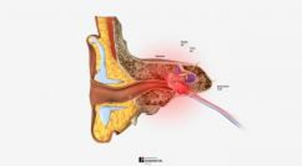

# 耳痛

> **来源**: msd_家庭版  
> **分类**: 耳鼻喉疾病

---

# 耳痛

$!
/$
$!
/$

## （耳痛；耳痛）

作者：
[Eric J. Formeister](https://www.msdmanuals.cn/home/authors/formeister-eric)
,
MD, MS
,
Dept. of Head and Neck Surgery and Communication Sciences, Duke University
School of Medicine
Reviewed By
[Lawrence R. Lustig](https://www.msdmanuals.cn/home/authors/lustig-lawrence)
,
MD
,
Columbia University Medical Center and New York Presbyterian Hospital
已审核/已修订
修改的
1月 2025
v1525462_zh
**
浏览专业版
- 病因 |
- 评估 |
- 治疗 |
- 关键点 |
- 多媒体 |

耳痛通常只发生在一侧耳。有些人还会出现 耳分泌物 或者罕见情况下的 听力损失 。

耳部内视图

|  |
| --- |

## 耳痛的病因

耳痛可能是由于耳朵本身的疾病、或附近与耳朵共用脑部神经的某个部位的疾病造成。此类身体部位包括鼻子、鼻窦、喉咙和颞下颌关节(TMJ)。

**急性疼痛** （疼痛持续不到两周）的最常见原因是

- 中耳感染（ 中耳炎 ）
- 外耳感染（ 外耳炎 ）
- 突然的压力变化（ 气压伤 ）

中耳和外耳感染引起疼痛发炎。中耳感染也会导致耳膜（鼓膜[TM]）后面的压力升高。压力升高不但疼痛，而且会导致鼓膜凸出。鼓膜后面的液体也会导致听力损失，因为鼓膜不能正常振动。耳膜凸起之后，会偶尔破裂，并从耳朵排出少量脓液和/或血液。罕见情况下，中耳感染会扩散到耳后乳突骨（导致 乳突炎 ）。

糖尿病 患者和免疫系统受损（由于 HIV 感染或 癌症化疗 ）的人或 慢性肾病 患者可能发生特别严重的外耳炎，称为 坏死性外耳炎 （以前称为恶性外耳炎）。

飞机飞行和潜水期间的压力变化会引起耳朵疼痛（另见 耳部气压伤 ）。当连接中耳和鼻后部的管（咽鼓管）被阻塞或无法正常发挥功能时，会发生此类耳痛。这种堵塞或功能障碍会导致中耳压力与外界压力失衡。压力差会推动或拉动耳膜，引起疼痛。在极端情况下，压力变化也可能导致鼓膜破裂。

**慢性疼痛** （疼痛持续超过 2 至 3 周）的最常见原因是

- 颞下颌关节(TMJ)疾病
- 慢性咽鼓管功能不全
- 慢性外耳感染
- 偏头疼

慢性疼痛的一个相对少见原因是影响喉（喉头）或喉（声道）疾病所致的疼痛，如癌症（称为牵涉痛）。

耳痛

3D 模型

## 耳痛评估

下面的信息可以帮助耳痛患者确定何时需要就诊，并帮助他们了解在就诊过程中会发生什么。

### 警示体征

耳痛的人群在产生以下症状和体征时应当引起关注：

- 糖尿病、免疫系统受损或慢性肾病
- 耳朵后面红肿
- 耳道开口处严重肿胀
- 从耳朵排出液体
- 发热
- 慢性疼痛，尤其是还有其它头部/颈部症状的人（如声音嘶哑、吞咽困难或鼻塞）
- 患者在睡眠中被痛醒

### 何时就医

出现警示体征或 耳溢液 的人应尽快去看医生，除非唯一的警示体征是慢性疼痛。而一个星期左右的延迟不会对人体有害。出现急性疼痛的人应该在几天之内去看医生（或如果疼痛严重应更早）。

### 医生会怎么做

医生首先询问有关患者症状和病史的问题。然后医生重点进行耳、鼻、喉的体检。他们在病史和体格检查时的发现通常会提示耳痛的原因和可能需要进行的检查（见表格 一些耳痛的原因和特征 ）。医生还可能会进行 音叉测试 以评估听力。

除了存在警示体征外，一个重要特征是耳朵检查是否正常。中耳和外耳疾病会引起异常，可以通过耳镜或显微镜观察到，当把这些异常与患者的症状和其他病史相结合时，通常会提示某个病因。

耳朵检查结果正常的人可能因其它原因发生耳朵疼痛，如 扁桃体炎 。如果耳朵检查过程中未发现异常，但患者存在慢性疼痛，医生会怀疑可能是 颞下颌关节 (TMJ) 疾病 或偏头痛导致了耳痛。然而，慢性耳痛患者应进行全面的头颈部检查（包括光纤内窥镜检查），以排除鼻道和咽喉上部（鼻咽部）的癌症或肿瘤。

表格
一些耳痛的原因和特征
表格

一些耳痛的原因和特征

| 病因 | 一般特征*† | 诊断方法 |
| --- | --- | --- |
| 中耳 |
| 急性咽鼓管阻塞（例如，由于 感冒 或 过敏 ） | 轻度到中度不适或胀满感 潺潺、噼里啪啦或爆裂的声音，有或无鼻塞，尤其是在打哈欠或吞咽时 受影响的耳朵听力下降 | 有时仅需医生进行体格检查 有时进行听力图检查 |
| 气压变化（ 气压伤 ） | 严重疼痛 最近有气压迅速变化的病史（如空中旅行或潜水） 通常鼓膜上面或后面可见出血 | 有时，仅进行医生检查 听力下降时进行听力图测试 |
| 乳突炎 | 最近中耳感染 耳后发红、肿胀和压痛 常有发热和/或耳溢液 | 通常仅进行医生检查 有时进行 CT 扫描 |
| 中耳炎（ 急性 或 慢性 ） | 剧烈疼痛，常有感冒症状 凸起的耳膜 受影响的耳朵听力下降 儿童中更常见 有时耳溢液 | 有时仅需医生进行体格检查 有时进行听力图检查 |
| 感染性鼓膜炎（耳膜感染） | 严重疼痛 耳膜发炎 耳膜表面有小水泡 | 仅进行医生检查 |
| 耳带状疱疹 | 严重疼痛 外耳水疱或脓疱 可能伴有听力损失或面肌无力 | 仅进行医生检查 |
| 外耳 |
| 受影响的耳垢或异物 | 在医生检查时可见 异物进入的情况几乎总是发生在儿童中 | 仅进行医生检查 |
| 创伤 | 通常发生在试图清理耳朵的人中 在医生检查时可见 | 仅进行医生检查 |
| 外耳炎（ 急性 或 慢性 ） | 瘙痒和疼痛（慢性外耳道炎更多的是痒，只有轻度不适） 经常有游泳史或反复的水接触史 有时会流出恶臭的脓液 外耳道红肿，充满脓液状物质 | 有时，仅进行医生检查 如果怀疑是坏死性外耳炎（感染扩散到颅骨），则进行 CT 扫描 |
| 头颈部结构引起的病因 ‡ |
| 咽喉、扁桃体、舌根、喉头（喉）和鼻道和咽喉上部（鼻咽部）的 癌症 | 慢性不适 通常具有很长的吸烟史和/或饮酒史 有时伴有颈部淋巴结肿大但无压痛 常见于中老年人 | 钆增强型MRI 纤维内镜并去除可见病变（活检） |
| 感染 （扁桃体、扁桃体周围脓肿） | 吞咽时疼痛加剧 喉咙和/或扁桃体可见红肿 因上呼吸道肿胀（“吃烫土豆的声音”）或呼吸困难引起的声音改变 | 有时，仅进行医生检查 有时进行培养 |
| 偏头痛 | 反复头痛，进行一般耳镜检查和体格检查 典型偏头痛诱因（如压力、睡眠不足、已知的饮食性偏头痛诱因）可加重症状 | 通常仅需医生仔细询问病史和进行检查 有时 MRI |
| 神经痛（神经发炎, 例如 舌咽神经发炎 ) | 非常严重、频繁、剧烈的疼痛，持续时间少于1秒 | 仅进行医生检查 钆增强型 MRI，用于评估血管或其他肿块对神经的压迫 |
| 颞下颌关节 (TMJ) 疾病 | 下颌运动时疼痛加剧 缺乏流畅的颞下颌关节运动 夜间磨牙史或咬牙习惯 | 仅进行医生检查 偶尔进行 CT 或 MRI 检查，以评估慢性关节变化 |
| * 特征包括症状和医生的检查结果。提到的特点是典型的，但并不总会出现。 |
| † 许多中耳和外耳疾病患者的 听力会有些减退 。 |
| ‡ 共同特征是耳朵检查正常。 |
| CT=计算机断层扫描；MRI=磁共振成像。 |

* 特征包括症状和医生的检查结果。提到的特点是典型的，但并不总会出现。

† 许多中耳和外耳疾病患者的 听力会有些减退 。

‡ 共同特征是耳朵检查正常。

CT=计算机断层扫描；MRI=磁共振成像。

### 检查

大多数情况下，医生的检查便可提供诊断，不需要测试。然而，耳朵检查正常，特别是患有慢性或复发性疼痛的患者，可能需要测试，以查找癌症。此类检查通常包括使用可弯曲的观察镜（内窥镜）、计算机断层 (CT) 扫描或颅底磁共振成像（MRI），来检查鼻子、喉和声匣（喉）。

## 耳痛的治疗

治疗耳痛的最好办法是治疗基础疾病。

患者可以口服止痛药。通常，非甾体类消炎药（NSAID）或对乙酰氨基酚便足够。然而，有些人，尤其是外耳感染严重的患者，需服用几天阿片类药物，如羟考酮或氢可酮。

对于严重的外耳感染，医生也经常会从耳道吸脓或其它液体，并插入一个小的泡沫芯。泡沫芯可以使用抗生素和/或皮质类固醇滴耳液浸泡。

含有止痛药的滴耳液一般不是很有效，但可使用几天。鼓膜可能穿孔的人不应使用这些滴耳液（以及任何其他滴耳液，例如可清除耳垢的滴耳液），所以在使用滴耳液之前应咨询医生。

您知道吗……

| 人们应该避免用任何物体掏耳朵，无论物体有多柔软。 |
| --- |

人们应该避免用任何物体掏耳朵（无论物体有多柔软，或自己有多小心）。应避免使用棉签，因为它们仅适用于清洁耳朵最外部的缝隙。此外，人们不应该尝试冲洗自己的耳朵，除非医生指示这样做，并且只能轻轻冲洗。不应在耳朵中使用口腔冲洗液（例如用于清洁牙齿的冲洗液）、自清洁套件或自视频内窥镜套件。

## 关键点

- 许多耳痛是由中耳或外耳感染引起的，但其他非常常见的诊断（如颞下颌关节疾病和偏头痛）也可导致相同类型的耳痛。
- 诊断时，通常都只需要医生进行检查。
- 如果耳部检查显示正常，医生会寻找耳朵附近结构的疾病。

Test your Knowledge
[Take a Quiz!](https://www.msdmanuals.cn/home/pages-with-widgets/quizzes)

版权所有 © 2026 Merck & Co., Inc., Rahway, NJ, USA 及其附属公司。保留所有权利。

- 关于
- 免责声明

版权所有 © 2026 Merck & Co., Inc., Rahway, NJ, USA 及其附属公司。保留所有权利。
