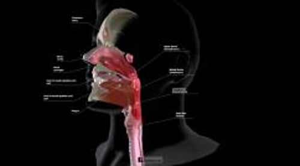

# 鼻旁窦癌

> **来源**: msd_家庭版  
> **分类**: 耳鼻喉疾病

---

# 鼻旁窦癌

$!
/$
$!
/$
作者：
[Bradley A. Schiff](https://www.msdmanuals.cn/home/authors/schiff-bradley)
,
MD
,
Montefiore Medical Center, The University Hospital of Albert Einstein College of
Medicine
Reviewed By
[Lawrence R. Lustig](https://www.msdmanuals.cn/home/authors/lustig-lawrence)
,
MD
,
Columbia University Medical Center and New York Presbyterian Hospital
已审核/已修订
9月 2024
|
修改的
4月 2025
v796850_zh
**
浏览专业版
[小知识](https://www.msdmanuals.cn/home/quick-facts-ear-nose-and-throat-disorders/mouth-nose-and-throat-cancers/sinus-cancer)

鼻窦癌是源自鼻窦的癌症，通常发生于上颌窦和筛窦。

- 症状 |
- 诊断 |
- 预后 |
- 治疗 |
- 了解更多信息 |
- 多媒体 |

尽管鼻窦癌在美国罕见，但在日本和南非班图人中更常见。医生不能确定这些癌症的病因，但它们在吸烟或定期吸入某种木屑或金属粉尘的人中更常见。 人乳头瘤病毒 (HPV ) 和 Epstein-Barr病毒 (EBV) 有时可能发挥一定致病作用。慢性鼻窦炎与之无关。

（另见 口、鼻、喉癌概述 。）

口、鼻和喉

3D 模型

鼻窦定位

|  |
| --- |

## 鼻窦癌的症状

鼻窦癌症状是由癌症对附近结构的压迫造成的，包括

- 疼痛
- 鼻塞感
- 复视
- 鼻衄
- 耳痛或胀满
- 面部麻木或刺痛
- 患病窦下面的上牙松动

由于鼻窦给早期肿瘤提供生长的空间，且不压迫临近结构，多数患者直到晚期才表现出症状。

## 鼻窦癌的诊断

- 影像学检查
- 活检

医生进行影像学研究（通常为 计算机断层扫描 和 磁共振成像 ）来定位肿瘤和描述范围。为了确认此癌症，医生会通过切除部分组织和在显微镜下检查来进行活检。医生使用一根柔性观察管（称为内镜）来进行观察和活检，有时候用于切除肿瘤。

## 鼻窦癌的预后

鼻窦癌治疗越早，预后越好。但存活率普遍较低。总体而言，约60％的鼻窦癌患者可存活超过5年。

## 鼻窦癌的治疗

- 手术
- 放疗
- 化疗

医生结合使用 手术 和 放疗 来治疗鼻窦癌。医生可以使用内窥镜经鼻彻底切除一些肿瘤。这种外科技术可以保留面部未受累及的部分（例如眼睛），从而使手术部位在手术后能有更好的外观和功能。如果肿瘤可能复发，在术后给予放疗。当手术无效或对于某些肿瘤难度过大时，医生可以使用放疗或 化疗 作为初始治疗。

## 了解更多信息

以下是可能对您有帮助的英文资料。请注意，本手册对该资料中的内容不承担任何责任。

- 美国癌症协会 ：鼻腔癌和鼻窦癌：鼻腔癌和鼻窦癌概述，包括诊断和治疗信息

Test your Knowledge
[Take a Quiz!](https://www.msdmanuals.cn/home/pages-with-widgets/quizzes)

版权所有 © 2026 Merck & Co., Inc., Rahway, NJ, USA 及其附属公司。保留所有权利。

- 关于
- 免责声明

版权所有 © 2026 Merck & Co., Inc., Rahway, NJ, USA 及其附属公司。保留所有权利。
