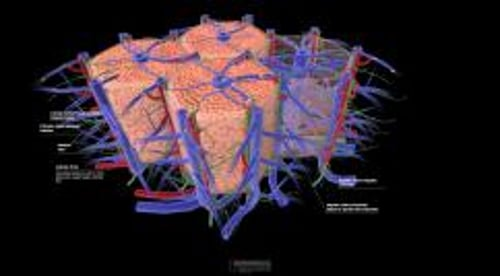

# 肝脏

> **来源**: msd_家庭版  
> **分类**: 肝胆疾病

---

# 肝脏

$!
/$
$!
/$
作者：
[Danielle Tholey](https://www.msdmanuals.cn/home/authors/tholey-danielle)
,
MD
,
Sidney Kimmel Medical College at Thomas Jefferson University
Reviewed By
[Minhhuyen Nguyen](https://www.msdmanuals.cn/home/authors/nguyen-minhhuyen)
,
MD
,
Fox Chase Cancer Center, Temple University
已审核/已修订
修改的
8月 2025
v758417_zh
**
浏览专业版
[小知识](https://www.msdmanuals.cn/home/quick-facts-liver-and-gallbladder-disorders/biology-of-the-liver-and-gallbladder/liver)
- 肝脏的功能 |
- 肝脏的供血 |
- 多媒体 |

肝脏呈楔形，是人体最大，从某种意义来说也是最复杂的内部器官。它作为人体的化工厂，要完成很多重要的功能，从调节体内化学物质的水平到产生出血时使血液凝固的物质（凝血因子）。（也请参见 肝脏和胆囊概述 。）

肝内原因

3D 模型

## 肝脏的功能

肝脏可产生约一半人体的胆固醇。剩余部分来自食物。大多数肝脏产生的胆固醇用于制造胆汁，胆汁是一种绿黄色浓厚粘稠的液体，可帮助消化。胆固醇也可以制造某些激素，包括 雌激素 、 睾酮 和肾上腺素，它们是各种细胞膜的重要成分。

肝脏也能制造其他物质，特别是蛋白质，机体利用蛋白质才能执行各种功能。例如凝血因子是止血所需要的蛋白质。白蛋白是一种维持血液渗透压需要的蛋白质。

糖以糖原形式储存在肝脏内，然后被分解，当需要时又以葡萄糖形式释放入血，例如，在一个人进入睡眠几个小时后，没有吃东西，血糖水平太低时，葡萄糖就会释放入血。

肝脏一个主要功能是分解由肠道吸收或体内其他部分产生的有害或有毒的物质，加工成无害的副产物排入胆汁或血液。分泌到胆汁中的副产物进入肠道，然后通过大便离开人体。排入血液的产物由肾脏过滤，以尿液的形式排出体外。此外肝脏也可以使一些药物发生化学（代谢）改变（参见 药物的代谢 ），通常使它们失活或者使它们更容易排出体外。

## 肝脏的供血

肝脏直接从肠道接收供血，也接受心脏和其他器官的供血。来自肠道供给肝脏的血液中几乎包含了肠道所吸收的一切物质包括营养，药物和一些有害物质。这部分血流经肠壁的毛细血管汇入肝的门静脉。当血液流经肝内呈网状的细小血管时，营养物质被吸收，有害物质得到处理。

肝动脉将血液从心脏送入肝脏，这种血液为肝组织输送氧气以及胆固醇和其他待处理的物质。随后来自肠道和心脏的血液在肝组织内混合，通过肝静脉回流到心脏。肝脏主要接受来自门静脉的血液和营养，但有些血液来自肝动脉。肝动脉是向肝脏胆管供血和供氧的主要系统。

门静脉循环|The Portal Circulation

3D 模型

Test your Knowledge
[Take a Quiz!](https://www.msdmanuals.cn/home/pages-with-widgets/quizzes)

版权所有 © 2026 Merck & Co., Inc., Rahway, NJ, USA 及其附属公司。保留所有权利。

- 关于
- 免责声明

版权所有 © 2026 Merck & Co., Inc., Rahway, NJ, USA 及其附属公司。保留所有权利。
