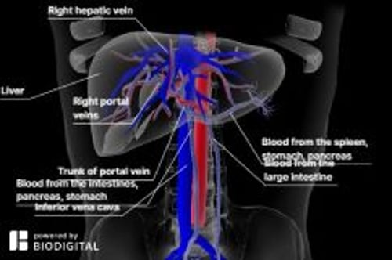

# 门静脉高压

> **来源**: msd_家庭版  
> **分类**: 肝胆疾病

---

# 门静脉高压

$!
/$
$!
/$
作者：
[Danielle Tholey](https://www.msdmanuals.cn/home/authors/tholey-danielle)
,
MD
,
Sidney Kimmel Medical College at Thomas Jefferson University
Reviewed By
[Minhhuyen Nguyen](https://www.msdmanuals.cn/home/authors/nguyen-minhhuyen)
,
MD
,
Fox Chase Cancer Center, Temple University
已审核/已修订
修改的
8月 2025
v758848_zh
**
浏览专业版
[小知识](https://www.msdmanuals.cn/home/quick-facts-liver-and-gallbladder-disorders/manifestations-of-liver-disease/portal-hypertension)

门静脉高压是门静脉（从肠道收集血液运送至肝脏的大静脉）及其分支的压力异常增高。

- 症状 |
- 诊断 |
- 治疗 |
- 多媒体 |
- 肝硬化 （造成肝脏结构变形并损害其功能的瘢痕形成）是门静脉高压最常见的病因。
- 门静脉高压可以引起腹部肿胀（ 腹水 ）、腹部不适、意识障碍及消化道出血。
- 医生需要根据症状、体检结果，有时需要借助超声、计算机断层扫描 (CT)、磁共振成像 (MRI) 或 肝活检 明确诊断。
- 药物可以减轻门静脉血压，但是如果发生消化道出血，则需要立即急诊治疗。
- 治疗有时包括 肝移植 或创建一个管道，血液通过这一管道可绕过肝脏（门体分流术）。

（也请参见 肝病概述 。）

门静脉循环|The Portal Circulation

3D 模型

门静脉收集整个肠道以及脾脏、胰腺和胆囊的血流，并将这些血液输送到肝脏。它确保消化过程中吸收的营养物质首先由肝脏处理。进入肝脏后，门静脉分成左右两条分支，进而再分成遍及肝脏的细小血管，血流离开肝脏时，通过肝静脉回流到全身血液循环。

肝脏和胆囊的视图

|  |
| --- |

有两种因素可使门静脉血管的压力增高：

- 流经门静脉血管的血流量增加
- 血流经过肝脏的阻力增加

引起门静脉高压的最常见原因是在 肝硬化 的肝脏中，广泛的瘢痕形成导致流经肝脏的血流阻力增加。门静脉高压也可由进出肝脏的血管中的血栓、称为血吸虫病的寄生虫感染以及其他原因引起。肝硬化最常见的病因是：

- 饮酒
- 代谢功能障碍相关性肝病 (MASLD)，以前称为非酒精性脂肪肝 (NAFLD)
- 慢性丙型肝炎 （肝炎已持续至少 6 个月）

门静脉高压可导致形成绕过肝脏的新静脉（称为侧支血管），它们与将血液从肝脏运输到体循环的门脉血管直接相连。由于这一旁路，本可正常地由肝脏处理或清除的物质（如毒素）可进入体循环。侧支血管出现在某些特定部位，最主要的部位是在食管下段及胃的上段，在这里，血管扩张并完全扭曲旋转——即出现食管（食管静脉曲张）或胃的静脉曲张（胃静脉曲张）。这些扩张的血管 很脆弱，容易出血 ，有时造成严重后果，偶尔甚至会致命。另一些血管可出现在脐周围和直肠。

门静脉高压常导致脾脏增大，因为门静脉高压干扰脾脏的血流进入门静脉。当脾增大时，白细胞的数目（计数）可降低（增加感染的危险），且血小板的数目（计数）可降低（增加出血的风险）。

门静脉高压会造成富含蛋白的液体（腹水）从肝脏和肠道表面漏出到腹腔里并在其中积聚。这称之为 腹水 。

## 门静脉高压的症状

虽然门静脉高压引起的实际压力增加本身并不会引起症状，但其一些后果会引起症状。

如果有大量腹水的集聚（称为腹腔积液），患者腹部增大（膨胀），有时表现为腹部明显胀大，到达一定程度时，会引起严重的腹部膨出及腹壁紧绷。这种腹胀是无痛的。肿大的脾脏，会引起左上腹部隐痛不适。

食管和胃的静脉曲张很容易出血，且有时会大量出血。患者可能呕血或吐咖啡渣样深色物质。大便可呈黑色和柏油样。直肠静脉曲张出血较为少见。此时，大便可带血。这些静脉出血可能导致死亡。

在腹部皮肤或直肠周围可见侧支血管。

当那些应该由肝脏代谢去除的物质进入体循环并到达大脑后，它们会引起精神错乱或者昏睡（ 肝性脑病 ）。由于大多数有门静脉高压的病人同时伴有严重的肝功能失常，他们可能会有 肝衰竭 症状，如出血倾向。

## 门静脉高压的诊断

- 医师的评估
- 进行血液检查和评估心理功能的其他测试
- 进行影像学检查，例如超声、磁共振成像 (MRI) 或计算机断层扫描 (CT)

医生通常可以根据症状和体检结果来确定门静脉高压。检查患者腹部时，医生可触诊到脾脏肿大。通过观察腹部有无肿胀及敲击腹部（叩诊）时有无沉闷音，医生可检查有无腹水。

根据症状（如意识错乱）医生可怀疑 肝性脑病 ，但可能需进行血液检查及精神功能评估测试。

也可使用超声检测门静脉及附近血管的血流，以及检测腹腔积液。超声、磁共振成像 (MRI) 或计算机断层扫描 (CT) 可用于寻找和检查侧支血管（参见 肝脏及胆囊影像学检查 ）。

在极少数情况下，我们也可以通过颈部的小切口插入导管，通过血管，进入肝脏或者脾脏，在门静脉内直接测量其压力（门静脉测压）。

## 门静脉高压的治疗

- 针对出血，可使用药物减缓出血、输血和/或做内镜检查
- 有时可通过外科手术改变血管流经路线（门体分流术）
- 有时需进行肝移植

### 控制出血

食管静脉曲张出血 是一种医疗急症。同时给予输血以补充失血量。医生通常使用一根可弯曲的可视导管（内镜下）经口腔插入食道，以确认出血源自静脉曲张。医生可在内镜下下用橡皮圈套扎静脉。

为减少食管静脉曲张出血的风险，医生通常会尝试降低门静脉压力。方法之一是让患者服用 β-受体阻滞剂，如噻吗洛尔、普萘洛尔、纳多洛尔或者卡维地洛。

医生将定期监测因静脉曲张出血的患者，因为出血可能复发。

### 难治性出血和分流术的作用

如果出血继续或反复出现，可以进行称为经颈静脉肝内门体分流 (TIPS) 的手术，以改变肝脏血流路线。这会使血液绕过出血的静脉，有助于减轻静脉内的压力并止血。因体循环压力较低，分流术能降低门静脉的压力。

门静脉分流术有多种类型。有一种称为经颈静脉肝内门静脉分流术(TIPS)，是在X光引导下用针插入颈静脉，进入肝静脉。导管被用来创建一个通路（分流），该通路可将门静脉（或它的一个分支）直接与肝静脉中的一支相连。不太常用的做法是通过手术进行“门体分流”。

分流术通常可成功止血，但也存在一定的风险，尤其对于 肝性脑病 患者。由于分流可能被堵塞，此操作可能需要反复进行。

### 肝移植

有些患者需要 肝移植 。

Test your Knowledge
[Take a Quiz!](https://www.msdmanuals.cn/home/pages-with-widgets/quizzes)

版权所有 © 2026 Merck & Co., Inc., Rahway, NJ, USA 及其附属公司。保留所有权利。

- 关于
- 免责声明

版权所有 © 2026 Merck & Co., Inc., Rahway, NJ, USA 及其附属公司。保留所有权利。
