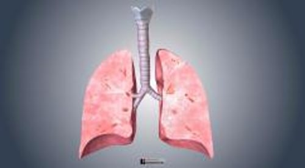

# 呼吸系统概述

> **来源**: msd_家庭版  
> **分类**: 肺与气道疾病

---

# 呼吸系统概述

$!
/$
$!
/$
作者：
[Rebecca Dezube](https://www.msdmanuals.cn/home/authors/dezube-rebecca)
,
MD, MHS
,
Johns Hopkins University
Reviewed By
[Richard K. Albert](https://www.msdmanuals.cn/home/authors/albert-richard)
,
MD
,
Department of Medicine, University of Colorado Denver - Anschutz Medical
已审核/已修订
5月 2025
|
修改的
7月 2025
v723291_zh
**
浏览专业版
[小知识](https://www.msdmanuals.cn/home/quick-facts-lung-and-airway-disorders/biology-of-the-lungs-and-airways/overview-of-the-lungs)
- 多媒体 |

呼吸系统的主要功能是通过肺部 吸入氧气和排出二氧化碳 。空气中的氧气被吸入肺部（吸入）。氧气是人体产生能量和维持生命所必需的。二氧化碳是能量生产过程中产生的废物，如果积聚起来会很危险，必须通过肺部将其排出体外，并回流到呼出的空气中（呼出）。呼吸系统与 循环系统 紧密配合，循环系统将氧气从肺部输送到身体器官，并从器官中清除二氧化碳和将其运送到肺部。

呼吸系统还有助于维持体温（通过调节吸入气体的温度）、排出体内水分（通过呼出气体中的水蒸气）、清除吸入气体中的灰尘和微生物、清除肺部的粘液或其他物质（通过咳嗽和称为纤毛的微小毛发状结构移动）、促进嗅觉（让气体经过鼻腔中的嗅觉器官）以及产生声音（在声带或喉部）。

呼吸系统始于鼻与口腔，经气道延伸至肺。空气需经过鼻腔、口腔、咽部和喉进入呼吸系统。喉的入口被一个小的组织瓣（即，会厌）所覆盖，它在吞咽时自动关闭，从而防止食物或饮料进入气道。

**气管** 是最大的气道。气管分出 2 支较小的气道：左、右主支气管。

每侧 **肺** 分成不同的区域（肺叶）：右肺 3 个肺叶，左肺 2 个肺叶。由于左肺与心脏共处于左侧胸腔中，故其体积较右肺小。

肺和气道内部结构图

|  |
| --- |

**支气管** 自身多次分成较小的气道，末梢最狭气道（细支气管）直径只有 0.5 毫米。气道整体像一棵倒置的树，这就是人们常称这部分呼吸系统为支气管树的原因。大气道以半柔软的纤维结缔组织即气管软骨作为支撑。小气道由周围接附在小气道上的肺组织支撑。小气道壁有一层薄且光滑的环形肌肉。气道肌肉可松弛或收缩，从而改变气道大小。

每个细支气管的末端有上千个 **肺泡** （小气囊）。虽然每个肺泡直径不到 0.5 毫米，但肺的数百万个肺泡共同形成一个超过 100 平方米的表面。肺泡壁内是由毛细血管形成的毛细血管网。空气和毛细血管间极薄的屏障使得氧气能够从肺泡进入血液，二氧化碳能够从毛细血管进入肺泡。

**胸膜** 是覆盖肺和胸壁内侧的一层光滑膜。它使得肺在呼吸和人体运动时能够平滑地移动。正常情况下，两层胸膜之间只有少量的润滑液。当肺的大小和形状发生变化时，两层胸膜之间可平滑移动。

肺内

3D 模型

Test your Knowledge
[Take a Quiz!](https://www.msdmanuals.cn/home/pages-with-widgets/quizzes)

版权所有 © 2026 Merck & Co., Inc., Rahway, NJ, USA 及其附属公司。保留所有权利。

- 关于
- 免责声明

版权所有 © 2026 Merck & Co., Inc., Rahway, NJ, USA 及其附属公司。保留所有权利。
