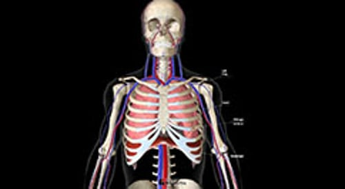

# 呼吸运动的调控

> **来源**: msd_家庭版  
> **分类**: 肺与气道疾病

---

# 呼吸运动的调控

$!
/$
$!
/$
作者：
[Rebecca Dezube](https://www.msdmanuals.cn/home/authors/dezube-rebecca)
,
MD, MHS
,
Johns Hopkins University
Reviewed By
[Richard K. Albert](https://www.msdmanuals.cn/home/authors/albert-richard)
,
MD
,
Department of Medicine, University of Colorado Denver - Anschutz Medical
已审核/已修订
5月 2025
|
修改的
7月 2025
v723380_zh
**
浏览专业版
- 多媒体 |

呼吸运动受脑干呼吸中枢潜意识调控。即使在睡眠中或者意识丧失的情况下呼吸运动都能持续进行。另一方面，人体也可根据意愿比如讲话、唱歌或屏气时主动控制呼吸运动。大脑、主动脉和颈动脉的微小感受器能够感受血液中氧气和二氧化碳水平。在健康人群中，二氧化碳浓度增高对呼吸具有强力的刺激作用，使之加深加快。相反，当血中二氧化碳浓度过低时，呼吸变慢，大脑降低呼吸频率和深度。静息呼吸时，成人平均呼吸频率为每分钟 12 至 20 次。

（另见 呼吸系统概述 。）

呼吸动力学

3D 模型

## 呼吸肌

肺脏本身并没有肌肉。呼吸运动由以下肌肉完成

- 隔膜
- 肋骨之间的肌肉（肋间肌）
- 颈部肌肉
- 腹部肌肉

**膈肌** （将胸腔和腹部分开的拱顶型肌肉层）是吸气（称为吸入或进气）时使用的最重要的肌肉。膈附着于胸骨底部、肋骨下部和脊柱。当横膈膜收缩时，它向下拉动，能使胸腔的长度和直径增加，从而使肺扩张。

**肋间肌** 和 **颈部肌肉** 能帮助移动肋廓，从而协助呼吸。

**腹部肌肉** 有时会参与呼气。安静状态下，呼气的过程（呼气）通常为被动过程。肺和胸壁的弹性（在吸入过程中积极拉伸）导致其在吸气肌肉放松时返回休息形态并将空气排出肺部。因此，当人休息时，无需费力便可呼气。但在剧烈运动时，部分呼吸肌会辅助呼气，其中最主要的是腹部肌群。腹部肌肉是其中最重要的。腹部肌肉收缩，腹内压增加，将松弛的膈肌推向肺部，促使气体呼出。

参与呼吸运动的肌肉只有当其与大脑之间的神经连接完整时才能产生收缩。在某些颈部和背部损伤中， 脊髓损伤 会导致患者需要呼吸机来呼吸（参见 人工通气 ）。

膈肌在呼吸过程中的作用

| 当膈肌收缩时，胸腔增大，胸内压力降低。为维持压力平衡，空气进入肺内。当膈肌松弛时，肺和胸壁的弹性将气体排出肺。 |
| --- |

Test your Knowledge
[Take a Quiz!](https://www.msdmanuals.cn/home/pages-with-widgets/quizzes)

版权所有 © 2026 Merck & Co., Inc., Rahway, NJ, USA 及其附属公司。保留所有权利。

- 关于
- 免责声明

版权所有 © 2026 Merck & Co., Inc., Rahway, NJ, USA 及其附属公司。保留所有权利。
