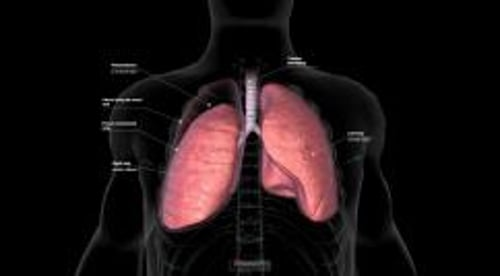

# 气胸

> **来源**: msd_家庭版  
> **分类**: 肺与气道疾病

---

# 气胸

$!
/$
$!
/$

## （肺塌陷）

作者：
[Najib M Rahman](https://www.msdmanuals.cn/home/authors/rahman-najib)
,
BMBCh MA (oxon) DPhil
,
University of Oxford
Reviewed By
[Richard K. Albert](https://www.msdmanuals.cn/home/authors/albert-richard)
,
MD
,
Department of Medicine, University of Colorado Denver - Anschutz Medical
已审核/已修订
修改的
7月 2025
v727645_zh
**
浏览专业版
[小知识](https://www.msdmanuals.cn/home/quick-facts-lung-and-airway-disorders/pleural-and-mediastinal-disorders/pneumothorax)

气胸是指胸膜腔（覆盖在肺表面和衬贴于胸壁内面的双层透明薄膜）之间充满空气而导致肺部部分或完全塌陷。

- 症状 |
- 诊断 |
- 治疗 |
- 多媒体 |
- 症状包括呼吸困难和胸痛。
- 通过胸部 X 线或超声检查诊断。
- 插入胸腔导管，有时用一根细的柔性管（导管）引流气体进行治疗。

（另见 胸膜和纵隔疾病概述 。）

正常情况下，胸膜腔内压力低于肺内或胸外。如果发生穿孔，使胸膜腔和肺内或胸外连通，空气进入胸膜腔，直至压力相等或连接关闭。当胸膜腔内存在空气，肺出现部分塌陷。有时，大部分或完全肺萎陷可导致严重的气短。

**原发性自发性气胸** 是指并未罹患已知肺病时发生的无确切原因的气胸。常发生于肺内小的薄弱区域（肺大疱）破裂时。原发性自发性气胸最常见于 40 岁以下的高个子男性，尤其是吸烟者（无论是吸食烟草还是大麻）。大多患者可以完全康复。绝大多数患者可痊愈，然而，多达 30% 的患者可复发。

有基础肺部疾病的患者会发生 **继发性自发性气胸** 。这类气胸最常见于 慢性阻塞性肺疾病 (COPD) 老年患者的大疱破裂时，但也见于有其他肺部疾病的患者，如 囊性纤维化 、 哮喘 、 肺朗格汉斯细胞组织细胞增生症 、 结节病 、 肺脓肿 、 结核病 和 肺孢子虫 肺炎。由于存在基础疾病，发生继发性自发性气胸时，其症状和预后普遍较差。复发率取决于病因。

**月经性气胸** 是一种罕见形式的继发性自发性气胸。绝经前女性来月经的 48 小时内会出现这种疾病，这种疾病有时还见于服用 雌激素 的绝经后妇女。病因是胸腔子宫内膜异位，可能由于子宫内壁（子宫内膜）组织通过膈肌开口或者静脉转移到肺部（ 子宫内膜异位 是医学术语，是指子宫内膜组织出现在子宫以外的任意地方）。

气胸还可能发生在受伤或将空气引入胸膜腔的医疗操作之后（称为 创伤性气胸 ）。胸腔穿刺术、支气管镜检查或胸腔镜检查等医疗操作可能会导致创伤性气胸。呼吸机会对肺造成压力性损伤，从而导致气胸——最常见于慢性阻塞性肺疾病或严重 急性呼吸窘迫综合征 患者。肺压力的变化（如发生在潜水员[ 气压伤 ]和飞行员中）可增加气胸风险。

气胸

3D 模型

## 气胸的症状

症状轻重主要取决于进入胸膜腔的气体量，肺不张的程度以及气胸发生前患者的肺功能。症状可为轻微气短或胸痛到严重呼吸困难、休克和危及生命的心跳停止。

最常出现为胸部锐痛和气短，偶尔为干咳。疼痛可出现在肩、颈或腹部。发生缓慢的气胸较迅速发生的气胸症状为轻。

除非气胸非常大或在压力下积聚导致胸部主要血管塌陷（称为 张力性气胸 ），症状一般在机体适应肺塌陷后消退，并且在重新从胸膜腔吸收空气时，肺慢慢开始再膨胀。

## 气胸的诊断

- 体格检查
- 胸部 X 线、CT 扫描或超声检查

如果气胸量大，体检常能确定诊断。医师用听诊器可以听到一侧胸壁正常呼吸音消失，敲击胸壁（叩诊）可听到空的鼓音。有时，空气聚集在胸部的皮肤下，当触摸胸部时，可以感觉到和听到噼啪声。

胸部 X 线显示气胸带和薄的脏层胸膜勾画出的肺边缘。胸部 X 线也可显示因肺不张所致的气管（通过前颈部的大气道）移到另一侧。计算机断层扫描 (CT) 或超声检查也可诊断气胸。

## 气胸的治疗

- 抽气治疗

少量原发性自发性气胸通常无需治疗。通常不会引起严重的呼吸道症状，且气体在几天内即可吸收。大面积气胸中的空气完全吸收可能需要数周时间。但插入胸腔引流管可更迅速排出气体。

如果原发性自发性气胸量大，影响呼吸，将连接有一根细的柔性管（导管）的大注射器插入胸壁抽气。导管可以被移除或是密闭的，然后留置一段时间以便可以移除重新积聚的气体。原发性自发性气胸患者应停止吸烟，并可能会从 戒烟 咨询中受益。

如果导管排气不成功，以及其他类型气胸（如继发性自发性气胸或创伤性气胸），则可能需要放置胸腔引流管。通过胸壁上的一个切口插入胸腔引流管，连接水封瓶系统或一个单向活瓣只容许气体排出而不能进入。如果在气道和胸膜腔之间气体存在异常连接（瘘管）导致持续气体漏入，就需将抽吸泵连接在胸腔引流管上。

有时候，手术是必要的。常将胸腔镜插入胸壁送入胸膜腔进行手术操作。

### 复发性气胸

复发性气胸可引起明显的残疾。手术可以预防气胸的复发。通常手术包括修补肺渗漏区域和把脏壁两层胸膜紧紧贴附在一起。通常用 电视胸腔镜 （一种让医生查看胸膜腔的显像管）进行这种手术。需要手术的患者包括：

- 对于从事高风险职业的人来说，例如，潜水员和飞机驾驶员，在第一次气胸发作后
- 继发性自发性气胸病人在第一次气胸发作后，如果患者足够健康，可以进行手术
- 气胸无法治愈的或同侧发生两次以上的气胸

如果复发性气胸者因健康因素不能耐受手术，通过排气管向胸膜腔注入滑石粉或多西环素进行封闭胸膜腔。然而，用这种封闭胸膜腔方法效果较手术差。

Test your Knowledge
[Take a Quiz!](https://www.msdmanuals.cn/home/pages-with-widgets/quizzes)

版权所有 © 2026 Merck & Co., Inc., Rahway, NJ, USA 及其附属公司。保留所有权利。

- 关于
- 免责声明

版权所有 © 2026 Merck & Co., Inc., Rahway, NJ, USA 及其附属公司。保留所有权利。
