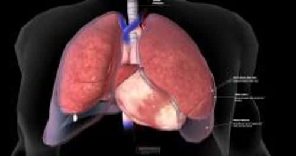

# 胸腔积液

> **来源**: msd_家庭版  
> **分类**: 肺与气道疾病

---

# 胸腔积液

$!
/$
$!
/$
作者：
[Najib M Rahman](https://www.msdmanuals.cn/home/authors/rahman-najib)
,
BMBCh MA (oxon) DPhil
,
University of Oxford
Reviewed By
[Richard K. Albert](https://www.msdmanuals.cn/home/authors/albert-richard)
,
MD
,
Department of Medicine, University of Colorado Denver - Anschutz Medical
已审核/已修订
修改的
7月 2025
v727491_zh
**
浏览专业版
[小知识](https://www.msdmanuals.cn/home/quick-facts-lung-and-airway-disorders/pleural-and-mediastinal-disorders/pleural-effusion)

胸腔积液是胸膜腔（覆盖在肺上的两层薄膜之间的腔隙）内液体异常积聚。

- 症状 |
- 诊断 |
- 治疗 |
- 多媒体 |
- 胸膜腔内积液可能由某些药物引起，也可能源于多种疾病，包括感染、肿瘤、损伤、心肾肝功能衰竭以及肺血管血栓（ 肺栓塞 ）。
- 胸腔积液症状可包括呼吸困难和胸痛，尤其在呼吸和咳嗽时明显。
- 胸腔积液的诊断手段包括胸部 X 线或超声检查，胸水实验室检查及通常行计算机断层扫描。
- 将导管插入胸腔引流大量液体。

（另见 胸膜和纵隔疾病概述 。）

正常情况下，仅有一层薄的液体分割两层胸膜。许多原因包括 心脏衰竭 、 肝硬化 、 肺炎 和癌症均可引起过量液体积聚。

许多疾病可引起胸腔积液。其中 **更常见** 的原因（大致以最常见到最不常见的顺序列出）包括：

- 心力衰竭
- 肿瘤
- 肺炎
- 肺栓塞
- 手术，如最近进行 冠状动脉搭桥术
- 胸部损伤
- 肝硬化
- 肾衰竭
- 系统性红斑狼疮 （狼疮）
- 胰腺炎
- 类风湿性关节炎
- 结核病
- 肾病综合征 （蛋白尿和高血压）
- 腹膜透析
- 药物，如肼屈嗪、普鲁卡因胺、异烟肼、苯妥英、氯丙嗪、美西麦角、白介素-2、呋喃妥因、溴隐亭、丹曲林、丙卡巴肼
胸膜腔积液

3D 模型

## 液体类型

视其病因，液体可能：

- 富含蛋白质（渗出液）
- 呈水样（漏出液）

医师利用这种差别以帮助确定病因。例如， 心脏衰竭 和 肝硬化 是胸膜腔有水样积液的常见病因。 肺炎 、 癌症 和 病毒感染 则是渗出性胸腔积液的常见病因。

**血液积聚在胸膜腔内** （血胸）常由胸部损伤所致。罕见情况下，无外伤时血管破入胸腔或主动脉膨出部位（ 主动脉瘤 ）漏血到胸膜腔。

肺炎或肺脓肿扩散到胸膜腔时， **脓液会积存在胸膜腔** （脓胸）。脓胸可并发于胸部外伤、胸部手术、食管破裂或腹部脓肿的感染。

**胸膜腔出现淋巴性（牛奶样）液体** （乳糜胸）是胸部大淋巴管（胸导管）损伤或肿瘤阻塞导管导致的。

## 胸腔积液的症状

很多胸腔积液病人无任何症状。无论胸腔中液体的类型或其病因如何，最常见的症状包括：

- 气短
- 胸痛

胸痛通常是一种称为胸膜炎样胸痛（“胸膜炎”一词已不再或鲜有使用）。胸膜痛仅在患者深呼吸或咳嗽时感受到，或能持续感受到但在深呼吸或咳嗽时加重。通常在引起积液的炎症或感染部位的正上方胸壁上会感觉到疼痛。但疼痛亦可出现或仅出现在上腹部或颈部和肩部，称为牵涉性痛（见图 何为牵涉性痛？ ）。胸膜痛可由胸腔积液以外的疾病引起，包括肺炎、肋骨骨折、肺部血栓、病毒感染、胰腺炎、类风湿性关节炎和狼疮。

随着液体积聚，胸腔积液引起的胸膜炎样胸痛可消失。大量胸腔积液可导致呼吸时一侧或双侧肺的扩张困难，引起呼吸困难。

## 胸腔积液的诊断

- 胸部 X 线、超声检查或两者兼有
- 对液体样本进行实验室检查
- 有时需要行计算机断层扫描 (CT)

**胸部 X 线检查** ，可显示胸腔内液体，是通常用来诊断的第一步。然而，少量的液体可能无法被胸部 X 线所发现。

还可以进行 **胸部超声** ，以帮助医生识别少量积液。

医生可进行 **胸腔穿刺术** 。在此操作中，医生使用针头抽取液体样本进行检查。胸水的外观有助于医师确定病因。某些实验室检查检测胸水的化学组成和确定细菌的存在包括结核杆菌。胸水标本也用来检查细胞数量和类型以及有无癌细胞。

如果这些检查不能确定胸腔积液的原因，则需要进行其他检查。

**CT 扫描** 可更为清晰地显示肺部和积液，并显示可能导致积液的肺炎、纵隔肿块、肺脓肿或肿瘤的证据。有时会在 CT（CT 血管造影术或静脉造影）过程中注入不透射线的染料，以寻找胸膜或血管问题，包括 肺栓塞 。

若看似为严重诊断，医师可将一根观察导管插入胸部（称为 **胸腔镜检查** ）。偶尔，医生需要取得胸膜和/或肺部样本（活检）。对于一些胸腔积液患者，经过初期检查不能发现病因，而某些患者即使进行全面检查也不能查出病因。

## 胸腔积液的治疗

- 治疗导致胸腔积液的疾病
- 大量引流胸腔积液

无症状的少量胸腔积液患者可能无需治疗，但必须治疗其基础疾病。有时会给予患者镇痛药直到积液被排出或自行吸收。

大量胸水病人，尤其引起气短症状者，需要引流胸液。引流常能显著缓解气短症状。常用胸腔穿刺术引流胸液。在下胸部两根肋骨间进行麻醉，然后插入一细针，轻轻向下推动针头直到抽出胸水。常用一根导管（细的柔性管）经针头引入胸膜腔抽液，以降低刺破肺部导致肺塌陷（ 气胸 ）或损伤其他器官及组织的风险。虽然胸腔穿刺术通常用于诊断目的，但医生可能会在该操作中一次性清除足量液体，以缓解患者的呼吸短促。

当需要抽取大量胸水时，可经胸壁插入导管（胸腔引流管）。医生在局部注射麻醉剂使该区域麻木后，将一根细长的柔性导管插入两根肋骨之间的胸腔。然后医师把管子连接到能阻止空气漏入胸腔的水封引流系统。行胸部 X 线检查以明确导管的位置。如胸腔引流管位置不正确或扭结，则可阻塞引流。如果胸水很粘稠或有凝块，引流会不畅。

### 肺炎引起的积液

因肺炎引起的积液需要使用抗生素。医生通常还会取液体样本进行检查和检测。如液体是脓液或有某些其他特征，液体通常需要用胸管引流。如果胸膜间隙内形成的疤痕将液体分隔成单独的间室，则引流会更加困难。有时会将纤溶药物（可溶解血栓）与一种能稀释浓稠积液的药物（α-核糖核酸酶）滴注至胸膜腔，以促进引流，从而可能避免手术治疗。（为有效引流，须结合使用纤溶药物和 阿法链道酶 。）

如需手术，可实施可视胸腔镜清创术或开胸术。在术中剥去肺表面一层厚的纤维样物质以使肺能正常扩张。

### 肿瘤引起的积液

肿瘤引起的胸水可能很难治疗，因为胸水易于迅速重新聚集。引流胸水和给予抗肿瘤药物有时能阻止进一步液体积聚。一个小管可留置胸腔以便周期性的将液体引流到真空瓶中。但如果胸水继续积聚，封闭胸膜腔（胸膜固定术）可能有用。用导管将胸水引流至导管内，再将其与胸膜刺激物如多西环素刺激物，博莱霉素，或滑石粉混合注入胸膜腔。这种刺激物把两层胸膜封闭在一起，就没有空间来容纳多余液体。胸膜封闭术也可使用胸腔镜来操作。

### 乳糜胸

乳糜胸的治疗关键在于消除胸导管的渗漏。治疗手段可包括手术，化疗或放疗治疗阻塞淋巴引流的肿瘤。

Test your Knowledge
[Take a Quiz!](https://www.msdmanuals.cn/home/pages-with-widgets/quizzes)

版权所有 © 2026 Merck & Co., Inc., Rahway, NJ, USA 及其附属公司。保留所有权利。

- 关于
- 免责声明

版权所有 © 2026 Merck & Co., Inc., Rahway, NJ, USA 及其附属公司。保留所有权利。
