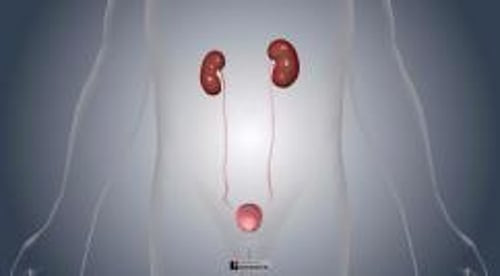

# 尿路系统概述

> **来源**: msd_家庭版  
> **分类**: 肾脏泌尿道疾病

---

# 尿路系统概述

$!
/$
$!
/$
作者：
[Glenn M. Preminger](https://www.msdmanuals.cn/home/authors/preminger-glenn)
,
MD
,
Duke Comprehensive Kidney Stone Center
Reviewed By
[Navin Jaipaul](https://www.msdmanuals.cn/home/authors/jaipaul-navin)
,
MD, MHS
,
Loma Linda University School of Medicine
已审核/已修订
修改的
1月 2025
v760731_zh
**
浏览专业版
[小知识](https://www.msdmanuals.cn/home/quick-facts-kidney-and-urinary-tract-disorders/biology-of-the-kidneys-and-urinary-tract/overview-of-the-kidneys-and-urinary-tract)
- 多媒体 |
肾脏和尿路概述

视频

正常情况下，一个人有两个 肾脏 。其余的尿路包括以下部分：

- 两条 输尿管 （将每个肾脏连接到膀胱的管道）
- 膀胱 （一个可膨胀的肌肉囊，可容纳尿液，直到它从体内排出）
- 尿道 （连接到膀胱并通向身体外部的管道）

每侧肾脏连续不断地产生尿液，尿液以较低的压力通过输尿管流入膀胱。然后从膀胱经由尿道，男性通过阴茎，女性通过外阴（女性外生殖器区域）排出体外。通常，尿液不含细菌及其他感染性微生物。

泌尿道器官

| 尿路包括肾脏、输尿管（将尿液从肾脏输送到膀胱的管道）、膀胱和尿道（将尿液排出体外的管道）。这些器官可能会因钝力（如在机动车交通事故或跌倒时）或穿刺力（如枪伤或刺伤所致）受损。手术期间也可能会意外发生损伤。 |
| --- |

泌尿系统

3D 模型

Test your Knowledge
[Take a Quiz!](https://www.msdmanuals.cn/home/pages-with-widgets/quizzes)

版权所有 © 2026 Merck & Co., Inc., Rahway, NJ, USA 及其附属公司。保留所有权利。

- 关于
- 免责声明

版权所有 © 2026 Merck & Co., Inc., Rahway, NJ, USA 及其附属公司。保留所有权利。
