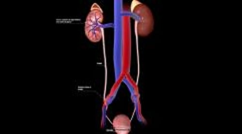

# 尿路结石

> **来源**: msd_家庭版  
> **分类**: 肾脏泌尿道疾病

---

# 尿路结石

$!
/$
$!
/$

## （肾结石；尿石；尿石病）

作者：
[Glenn M. Preminger](https://www.msdmanuals.cn/home/authors/preminger-glenn)
,
MD
,
Duke Comprehensive Kidney Stone Center
Reviewed By
[Leonard G. Gomella](https://www.msdmanuals.cn/home/authors/gomella-leonard)
,
MD
,
Sidney Kimmel Medical College at Thomas Jefferson University
已审核/已修订
1月 2025
|
修改的
10月 2025
v1156920_zh
**
浏览专业版
[小知识](https://www.msdmanuals.cn/home/quick-facts-kidney-and-urinary-tract-disorders/stones-in-the-urinary-tract/stones-in-the-urinary-tract-kidney-stones)

结石形成于尿路（肾脏、输尿管和膀胱），并可能导致疼痛、出血、感染或尿流阻塞。

- 病因 |
- 症状 |
- 诊断 |
- 治疗 |
- 预防 |
- 多媒体 |
- 微小的结石不会引起症状，但较大的结石可导致在肋骨与背部髋骨之间出现剧痛。
- 通常，会进行影像学检查（例如计算机断层 (CT) 扫描）和尿液分析来诊断结石。
- 有时，改变饮食可防止结石形成。
- 未自行排出的结石用 碎石术 （使用冲击波粉碎结石）或内镜技术（使用专用工具观察和操作内脏器官，无需开大的切口也无需手术）取出。

尿路结石形成于肾脏，并可进入尿管或膀胱。根据结石所在的部位，尿路结石可分为肾结石、输尿管结石或膀胱结石。结石形成的过程被称为尿石病或肾石病。

泌尿道

|  |
| --- |

每年，美国约有 1% 至 2% 的成年人诊断为尿路结石，并且 1,000 名确诊者中就有 1 人需要住院。结石更常见于中老年人。结石尺寸不一，小型结石肉眼难以看见，而较大的结石直径可达 1 英寸（2.5 厘米）或更长。较大的结石即所谓的鹿角形结石（因为它有许多类似鹿角的突起），可充满几乎整个肾盂（肾脏的中央集尿区域）和肾盏（将尿液引流到肾盂的管道）。

肾脏的内部结构

|  |
| --- |

鹿角形结石

图片

这张照片显示肾脏内的结石。在下部中心，鹿角形结石充满整个肾盂（肾脏的中央集合腔室）。右侧是较小的结石。

DR. E. WALKER/科学照片库

当细菌存在于梗阻部位以上的尿路中时，容易引发 尿路感染 。若结石长时间阻塞尿路，尿液就会返流到肾脏内的小管中，使局部压力升高，造成肾脏肿胀（ 肾盂积水 ），最终导致肾损伤。

输尿管中的肾结石

3D 模型

## 结石的类型

结石由尿液中形成晶体的矿物质组成。有时晶体会生长为结石。约85%的结石由钙组成，其余15%由尿酸、胱氨酸和磷酸镁铵结石等物质组成。鸟粪石（镁、铵和磷酸盐的混合物）也称为感染性结石，这是因为它们仅在感染的尿液中形成。

## 尿路结石的病因

结石可能是因为尿液中可形成结石的盐分过于饱和，或尿液缺乏防止结石形成的正常抑制剂而导致。枸橼酸盐可抑制结石形成，因为正常情况下，它可以与参与结石形成的钙相结合。

结石在患有某些疾病（如 甲状旁腺功能亢进 、 脱水 和 肾小管酸中毒 ）、 痛风 和 2 型糖尿病 的患者中更常见。饮食中含有大量动物源蛋白质或维生素 C 的人以及饮水或钙摄入不足的人也会出现尿路结石。有结石形成家族史的人更容易形成钙结石，而且通常患有尿路结石。接受过减肥手术（减重手术）的人，其结石形成的风险更高。

药物（包括茚地那韦）以及饮食中的物质（如三聚氰胺）也可引起结石，不过很少见。

## 尿路结石的症状

结石，尤其是微小结石，可无任何症状。膀胱结石可引起下腹疼痛。造成输尿管、肾盂或其他任何肾脏引流区域梗阻的结石都可引起背痛或肾绞痛。肾绞痛的特点为剧烈的、间歇性疼痛，通常位于一侧肋骨和髋骨之间部位，并遍及腹部以及常放射至会阴。疼痛像波浪一样阵阵袭来，逐渐增强达到顶峰，随后消退，周期为20-60min。疼痛可放散到腹股沟或睾丸或外阴。

其他症状包括恶心和呕吐、烦躁不安和出汗。尿液中可能有血液、结石或结石碎片。患者可以有尿频、尿急，特别是当结石向下进入输尿管时。有时可发生寒战、发烧、排尿有灼烧感或痛感、尿液混浊有异味以及腹部肿胀。

## 尿路结石的诊断

- 症状
- CT 扫描

肾绞痛常提示尿路结石。有时当患者有不明原因的腰背部和腹股沟压痛或会阴区疼痛时，医生也会怀疑尿路结石。发现尿液带血可支持诊断，不过并非所有结石都会导致尿液带血。有时症状和体检结果非常明显，无需再做检查，尤其是见于以前有过尿路结石的患者。但是，医生需要区分结石与其他可能引起严重腹痛的原因，包括

- 腹膜炎，这可能是由于 阑尾炎 、 宫外孕 或 盆腔炎 引起
- 急性胆囊疾病（急性 胆囊炎 ）
- 肠梗阻
- 胰腺炎
- 主动脉夹层动脉瘤

**CT** 扫描通常是最好的诊断方法。CT可明确结石的位置及其阻塞尿路的程度。CT还可以发现许多引起类似结石疼痛的其他疾病。CT的缺点是患者需暴露于射线。但如果 CT 确诊了包括另一种严重疾病等可能的病因，如 主动脉瘤 或 阑尾炎 ，则这种风险就可以接受了。新式 CT 设备和方法能够限制辐射暴露。

**超声** 可作为 CT 的替代，且不会令患者暴露于辐射中。但是与 CT 相比，超声更容易漏诊小结石（尤其是输尿管结石）、尿路梗阻的准确部位及可能引发症状的其他严重疾病。

您知道吗……

| 肾结石复发的患者应考虑限制接受 CT 扫描的次数，以防止辐射暴露过量。 |
| --- |

腹部 **X 光** 的辐射量比 CT 少，但在诊断结石方面准确度较低，且只能显示钙质结石。若医生怀疑患者有钙质结石，可采用 X 光来确定结石是否存在，或查看结石在输尿管中的位置。

**排泄性尿路造影** （以前称为静脉尿路造影或静脉肾盂造影）是在静脉注射一种在 X 射线上可见的染料（“造影剂”）后进行的一系列 X 线检查。该检查可检测结石并准确确定结石阻塞尿路的程度，但是其不仅耗时，还有接触造影剂的风险（如过敏反应或 肾衰竭 加重）。若可用 CT 或超声检查，则很少使用排泄性尿路造影诊断结石。

经常进行 **尿液分析** 。无论是否出现症状，尿液分析均可提示血尿或脓尿。

### 确定结石的类型

一旦诊断出结石，医生通常会进行测试以确定结石的类型。患者应回收自行排出的结石，这可以通过用纸或网状过滤器滤过全部尿液而实现。可以分析发现的任何结石。根据结石的类型，可能需要进行尿检和血检来测量可能令结石形成风险上升的钙、尿酸、激素以及其他物质的水平。

## 尿路结石的治疗

- 按需要给予非甾体类抗炎药 (NSAID) 或阿片类药物来缓解疼痛
- 有时需要摘除结石

不引起症状、 尿路梗阻 或感染的小结石通常无需治疗，且通常可自行排出体外。较大的结石（超过 5 毫米）以及靠近肾脏的结石不太可能自行排出。

### 疼痛缓解

可以使用 NSAID 缓解肾绞痛。如果疼痛严重，有时需要使用阿片类药物等更强效的止痛药。

### 排石策略

建议饮用大量液体或静脉注射大量液体来帮助结石排出，但尚不清楚该方法是否有用。α 肾上腺能阻滞剂（如坦索罗辛）可帮助排出结石。结石排出后，无需立即治疗。

### 结石旁路程序

有时若阻塞严重，医生可在输尿管中插入一根临时管（支架）来绕过阻塞的结石。医生向膀胱中插入一种可伸缩的观察仪器（膀胱镜，内镜的一种），并通过膀胱镜推动支架至输尿管开口。随后，支架被推动绕过阻塞的结石。支架保持原位，直至结石可被摘除（如通过手术）为止。

或者医生可从背部向肾脏的集尿区域插入排尿管（肾盂引流管），从而引流阻塞。

### 结石的摘除

医生通常使用 **冲击波碎石术** 来粉碎肾盂或输尿管最上端内直径为 ½ 英寸（1 厘米）或以下的结石。在该程序中，声波发生器向身体发射冲击波，以粉碎结石。结石碎片随后通过尿液排出。

输尿管下段需要摘除的小结石可用 **输尿管镜** （一种小型可视管，内镜的一种）插入尿道，通过膀胱，然后上行进入输尿管移除。有时，输尿管镜也可以和一个装置联合使用将结石打成小碎片，用输尿管镜将其移除或从尿液排出（体内碎石术）。最常用的装置是激光。该程序使用激光粉碎结石。

**经皮肾取石术** 可用于摘除某些较大的肾结石。在经皮肾取石术中，医生通过患者背部的小切口向肾脏插入一根可伸缩的可视管（肾镜，内镜的一种）。医生通过肾镜插入探头将结石破坏成碎片，然后清除碎片（肾镜取石术）。

**碱化尿液** （如口服枸橼酸钾 4-6 个月）有时可以逐渐溶解尿酸结石。其他类型的结石不能以这种方式溶解。

**手术摘除** 有时可用于导致阻塞的较大结石。

**内镜下手术** 通常可用于摘除磷酸镁铵结石。在引起感染的结石被完全清除之前，抗生素对治疗 尿路感染 是无效的。

**输尿管支架术** 是放置一根柔软的中空管，以帮助尿液从肾脏排出到膀胱。手术取出结石后 4 至 7 天内可能需要输尿管支架手术。如果因结石阻塞或结石脱落导致输尿管损伤，支架可以留置 1 至 2 周。结石或取出手术的刺激可能导致输尿管出现一些炎症。支架有助于炎症消退。

声波取石

| 肾结石有时可被碎石器产生的声波震碎，该程序被称为体外震波碎石术 (SWL)。 当通过超声或造影明确结石位置后，碎石器放置于背部，声波对准结石将其震碎。这时患者大量饮水以将结石碎片冲出肾脏，随尿液排出。 有时碎石术后可以出现血尿或腹部青紫，但是罕见严重并发症。 |
| --- |

## 尿路结石的预防

第一次排出钙质结石的患者，再形成结石的几率为：2 年内约 11% 以及 15 年内约 39%。根据已有结石的成分，应采取不同措施来预防形成新的结石。

大量饮水——8-10杯（300mL/杯）/天——推荐用于预防所有类型的结石，尽管疗效并不确切。患者应饮用足够的液体，每天产生超过约 2 夸脱的尿液。其他预防性措施部分取决于结石的类型。

### 钙质结石

钙质结石患者可能发生称作高钙尿症（尿液中排出过量的钙）的病症。对于此类患者，降低尿液中钙含量的措施有助于防止新结石的形成。对他们而言，低钠高钾饮食可能有益。 钙 摄入量应保持正常，约为每日 1,000 到 1,500 毫克（约每日 2 至 3 份乳制品）。若饮食中的钙含量太少，形成新结石的风险实际上反而更高，因此患者不应在饮食中回避钙质。但是，可能需要避免摄入含钙过多的物质（如含钙抗酸药）。

噻嗪类利尿剂，如氯噻酮或吲达帕胺，可降低尿液中钙浓度，有助于减少患者的新发结石。枸橼酸钾可以升高尿液中的枸橼酸浓度，从而抑制钙结石的形成。对于许多患有钙质结石的人士，限制饮食中的动物蛋白有助于降低尿钙和形成结石的风险。

摄入富含草酸的食物（如大黄、菠菜、可可、坚果、胡椒和茶）或某些小肠疾病（包括某些类型的减肥手术）可引起尿液中草酸浓度过高，进而促进钙结石形成。枸橼酸钙、消胆胺和低草酸、低脂饮食可以降低一些患者尿液中的草酸浓度。吡哆醇（维生素 B6）可降低机体生成草酸的量。

在极少数病例中，钙结石由 甲状旁腺功能亢进 、 结节病 、 维生素 D 毒性 、 肾小管性酸中毒 或癌症引起，必须治疗这些基础疾病。

您知道吗……

| 患有钙结石的人如果饮食中钙含量太少或太多，就更有可能患上其他结石。 |
| --- |

### 尿酸结石

尿酸结石几乎总是由尿中酸水平过高引起。所有尿酸结石患者均应服用枸橼酸钾以碱化尿液并中和高尿酸水平，因为尿液酸度增加时易形成尿酸结石。偶尔，低动物蛋白饮食或别嘌呤醇可用于降低尿中的尿酸水平。大量饮水仍然至关重要。

### 胱氨酸结石

胱氨酸结石患者，需要大量饮水并服用α-硫普罗宁或青霉胺。

### 磷酸镁铵结石

反复出现磷酸镁铵结石的患者可能需要持续使用抗生素以预防 尿路感染 。醋羟胺酸治疗可能有效。

Test your Knowledge
[Take a Quiz!](https://www.msdmanuals.cn/home/pages-with-widgets/quizzes)

