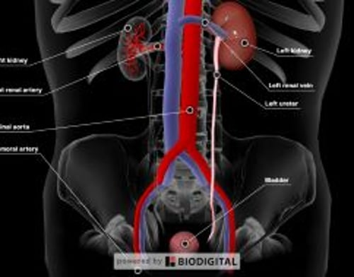
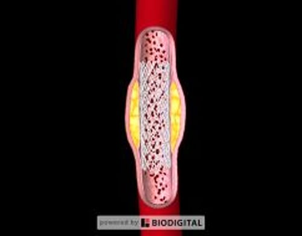

# 肾动脉阻塞

> **来源**: msd_家庭版  
> **分类**: 肾脏泌尿道疾病

---

# 肾动脉阻塞

$!
/$
$!
/$
作者：
[Zhiwei Zhang](https://www.msdmanuals.cn/home/authors/zhang-zhiwei)
,
MD
,
Loma Linda University School of Medicine
Reviewed By
[Navin Jaipaul](https://www.msdmanuals.cn/home/authors/jaipaul-navin)
,
MD, MHS
,
Loma Linda University School of Medicine
已审核/已修订
2月 2025
|
修改的
4月 2025
v762120_zh
**
浏览专业版
[小知识](https://www.msdmanuals.cn/home/quick-facts-kidney-and-urinary-tract-disorders/blood-vessel-disorders-of-the-kidneys/blockage-of-the-renal-arteries)

逐渐变窄（狭窄）或突然完全的阻塞（闭塞）可能影响为右侧或左侧肾、分支或它们整体供血的动脉。

- 病因 |
- 症状 |
- 诊断 |
- 治疗 |
- 了解更多信息 |
- 多媒体 |
- 肾动脉阻塞可引起肾衰竭或高血压。
- 影像学检查可显示狭窄或阻塞的动脉。
- 可以清除阻塞物或扩张狭窄的动脉，改善病情。

（也请参阅 肾血管疾病概述 。）

肾动脉有两条，一条为右肾供血，另一条为左肾供血。这些动脉进一步分为很多小动脉。

## 肾动脉阻塞的病因

肾动脉及其较大或中等分支的阻塞并不常见。原因包括

- 血栓从身体其他部位进入肾动脉
- 肾动脉内形成血栓
- 主动脉或肾动脉内膜撕裂
- 肾动脉壁变厚

多数情况下，阻塞由来源于身体其他部位的栓子流入肾动脉所致。在典型病例中，血栓常来源于心脏内的大块血栓或主动脉内脂肪沉积（粥样斑块）的碎块（请参阅 动脉粥样栓塞性肾脏疾病 ）。

另外，肾动脉内原位的血栓形成也可以造成肾动脉阻塞，肾动脉受损的部位常易形成血栓。突发损伤可以由医疗操作引起，如外科手术、血管造影或血管成形术。肾动脉的 动脉粥样硬化 、 动脉炎 （动脉的炎症）或动脉瘤（动脉壁缓慢形成的凸出部分）的逐渐损伤或破坏也会促发局部血栓形成。

主动脉或肾动脉内膜撕裂可引起肾动脉血流的突然中断。撕裂还可以导致动脉破裂。由于脂质沉积（动脉粥样硬化）或纤维物质形成（ 纤维肌性发育不良 ）而引起动脉管壁增厚、弹性降低的疾病，使得受累动脉易于撕裂。即便没有血栓，这些疾病也可以导致肾动脉的显著狭窄和部分阻塞。这种不伴有血栓的狭窄或阻塞称为肾动脉狭窄。

### 纤维肌性发育不良

纤维肌性发育不良是肾动脉阻塞的原因。纤维肌性发育不良好发于 20 至 50 岁的女性。病因不明。发病后，纤维物质使肾动脉变窄（肾动脉狭窄），通常为多个部位。

成人的肾动脉狭窄约10%是由于纤维肌性发育不良。因纤维肌性发育不良引起的肾动脉狭窄常导致 高血压 。

## 肾动脉阻塞的症状

肾动脉的部分阻塞通常不会引发任何症状。如果是突然的完全闭塞，患者可出现下腰部持续疼痛，偶尔也出现下腹痛。完全阻塞可引起发热、恶心、呕吐和背痛。阻塞引起的出血可以使尿色变红或呈暗褐色，但较少见。当双侧肾动脉完全阻塞，或仅有一侧肾脏的患者一侧肾动脉完全阻塞时，可出现突然无尿和肾脏停止工作（一种称作 急性肾损伤 的疾病）。

如果阻塞由肾动脉的栓子造成，患者还可能出现身体其他部位的栓塞，如小肠、大脑以及手指和足趾的皮肤。这些栓子可以造成相应部位的疼痛、小溃疡或坏疽或小卒中。

若阻塞发展缓慢，则症状也会发展得更缓慢。即便得到了最佳治疗，患者仍有可能发生难以控制的高血压。还可能出现各种 慢性肾病 的症状，初期是疲劳、恶心、食欲下降、瘙痒和注意力不集中。症状反映了肌肉、大脑、神经、心脏、消化道和皮肤中的异常。

一侧或双侧肾动脉逐渐阻塞可引起高血压或使原先得到控制的高血压变得难以控制。尽管服用多种降压药物，血压可能仍无法得到控制。有时，当给予肾动脉狭窄患者干扰肾脏代偿降低血流量正常能力的药物（如血管紧张素转换酶 [ACE] 抑制剂、 血管紧张素 II 受体阻滞剂 [ARB] 或肾素抑制剂）治疗高血压时，肾功能可能会迅速下降。如果及时停药，肾功能可以恢复。

## 肾动脉阻塞的诊断

- 常规实验室检查
- 影像学检查

医生可以根据患者的症状而疑诊肾动脉阻塞。常规实验室检查，如全血细胞计数、肾功能血检以及尿液分析（尿液显微镜检查），可为诊断提供进一步的线索。

由于这些症状或实验室检查均无法具体指示阻塞，所以医生需要进行肾脏 成像检查 。 计算机断层扫描 (CT) 血管造影 、 磁共振 (MR) 血管造影 、 多普勒超声 以及同位素灌注扫描可显示受累肾脏的血流减少或缺失。这些手段都各有其优缺点。如 CT 血管造影和 MR 血管造影都很准确，但 CT 血管造影需要使用静脉 不透 X 线的造影剂 ，这会增加肾功能减退患者肾损害的风险。MR血管造影也需要静脉注射造影剂钆，钆会增加肾功能减退患者发生肾源性系统性纤维化的风险。肾源性系统性纤维化可引起全身瘢痕组织形成，不易被逆转或治愈。

动脉造影 是明确诊断的一个最准确的手段。进行动脉造影时，需要将导管插入动脉，后者有时会损伤肾动脉。另外，与 CT 血管造影一样，动脉造影需要使用不透 X 线的造影剂，而后者增加肾损伤的风险。只有当医生考虑通过外科手术或血管成形术来解除阻塞时才建议进行动脉造影。医生可以通过经常定期反复进行血检来监测肾功能的恢复情况。

有时需要进行 超声心动图 等其他检查来确定血栓的原因。

## 肾动脉阻塞的治疗

- 预防或溶解血栓
- 有时手术或用导管打开堵塞物

治疗目的是防止血流进一步恶化并恢复被阻断的血流。在血栓致病者中，常规治疗是抗凝血药物（请参阅 药物和血栓 ）。这些药物首先是通过静脉给药，随后长期口服（有时要几个月或更长时间）。抗凝剂能够防止原始血栓增大，以及其他血栓的形成。溶解栓子的药物（纤溶剂或溶栓剂——请参阅 药物和血栓 ）可能比抗凝剂更有效。但是，只有当动脉没有完全阻塞或栓子能够被快速溶解时，纤溶剂才能改善肾功能。完全阻塞30～60分钟后，就会造成肾脏永久性损伤。即便如此，发病 3 小时内使用纤溶剂可能有益。

可以进行外科手术开通被栓子阻塞的动脉，但这种治疗出现并发症和致死的风险均较高，并且与单用抗凝剂或溶栓剂相比，不能更有效的改善肾功能。药物治疗通常总是优先于外科手术。然而，外伤引起的肾动脉阻塞必须外科手术修复。

为了缓解由动脉粥样硬化或肾动脉纤维肌性发育不良引起的阻塞，医生可能会进行血管成形术。在血管成形术中，医生使用一根末端带有球囊的导管穿过腹股沟的股动脉进入肾动脉。然后使球囊充气，强行打开阻塞血管。这一过程称为 经皮经腔血管成形术 。在进行该程序时，医生可以在动脉置入一个短的空心管（支架）来预防阻塞复发。如果血管成形术未成功，则需要外科手术解除阻塞或在阻塞部位进行旁路手术。

尽管治疗后肾功能可以得到改善，但通常不能完全恢复。如果动脉由于来自身体其他部位（如心脏）的栓子而堵塞，预后比较差。栓子也可能随着血流达到身体其他部位（如大脑或小肠），引起相应部位的栓塞。

长期治疗还侧重于 预防和治疗潜在的动脉粥样硬化 。

肾动脉

3D 模型
动脉支架

3D 模型

## 了解更多信息

以下是可能对您有帮助的英文资料。请注意，本手册对该资料中的内容不承担责任。

- 美国肾脏病患者协会 (AAKP) ：美国肾脏病患者协会通过在肾病患者中教育、倡导和促进社区意识来改善患者的生活。
- 美国肾脏病基金会 (AKF) ：美国肾脏病基金会提供有关肾脏疾病和肾脏移植、基于需求的财务援助的信息，以帮助管理医疗费用、为医疗专业人员举办网络研讨会和宣传机会。
- 美国国家肾脏基金会 (NKF) ：这个信息交流中心提供一切信息，包括有关肾功能基础知识的信息，以及为肾病患者提供治疗和支持、继续医学教育课程、研究机会以及为医疗专业人员提供资助的信息。
- 美国国家糖尿病、消化系统和肾脏疾病研究所 (NIDDK) ：肾脏疾病的一般信息，包括研究发现、统计和社区健康及外展计划。

Test your Knowledge
[Take a Quiz!](https://www.msdmanuals.cn/home/pages-with-widgets/quizzes)

版权所有 © 2026 Merck & Co., Inc., Rahway, NJ, USA 及其附属公司。保留所有权利。

- 关于
- 免责声明

版权所有 © 2026 Merck & Co., Inc., Rahway, NJ, USA 及其附属公司。保留所有权利。
