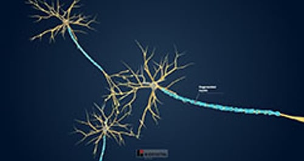

# 多发性硬化 (MS)

> **来源**: msd_家庭版  
> **分类**: 脑脊髓神经疾病

---

# 多发性硬化 (MS)

发生多发性硬化时，脑、视神经、以及脊髓的髓鞘（多数神经纤维表层的物质）和其内部的神经纤维出现斑片状损害或破坏。

- 病因不明，但可能涉及免疫系统攻击人体自身组织（自身免疫反应）。
- 在大多数多发性硬化患者中，相对健康的时期与症状恶化的时期交替出现，但是随着时间的推移，多发性硬化逐渐恶化。
- 患者常有视力障碍、感觉异常，动作乏力、笨拙。
- 通常，医生会根据症状和体检结果以及磁共振成像来诊断多发性硬化症。
- 治疗包括使用类固醇（也称为糖皮质激素或皮质类固醇），这类药物能帮助抑制免疫系统对视神经、大脑和脊髓中的髓鞘的攻击；接受康复专家的护理；以及使用缓解症状的药物。
- 除非病情特别严重，否则寿命不受影响。

术语“多发性硬化”是指包绕在视神经、脑和脊髓神经周围的组织（髓鞘）在遭受破坏后产生的许多疤痕（硬化）斑块。这种破坏称之为 脱髓鞘 。有时，传导信息的神经纤维（轴突）也可受损。随着病程进展，由于轴突被破坏，可出现脑萎缩。

全世界有约 280 万人患有多发性硬化症。在温带气候地区，多发性硬化症的患病率高于热带气候地区。

最常见的是，多发性硬化症始于20至40岁，但也可能始于15至60岁之间的任何时候。在女性中更多见。多发性硬化症在儿童中并不常见。

大多数多发性硬化症患者的健康状况相对较好(缓解)，但症状恶化(突发或复发)的时期交替出现。发作期的临床表现可轻可重。缓解期恢复良好，但通常不完全。因此，多发性硬化症会随着时间慢慢恶化。

多发性硬化症：髓磷脂退变的神经元

3D 模型

## 多发性硬化症的病因

多发性硬化的原因尚不清楚，但一个可能的解释是，人们在生命早期接触某种病毒（可能是疱疹病毒，如 爱泼斯坦-巴尔病毒 ，或逆转录病毒）或某种未知物质，这些病原体或物质以某种方式触发免疫系统攻击自身组织（即 自身免疫反应 ）。自身免疫反应导致炎症，从而损伤髓鞘和其内部的神经纤维。

基因似乎在多发性硬化中起作用。例如，如有父母或同辈（兄弟姐妹）患有多发性硬化，则患病风险增加数倍。此外，多发性硬化症更有可能发生在细胞表面带有某些基因标记的人身上。通常，这些标记（称为 人类白细胞抗原 ）帮助身体区分自我和非自我，从而知道攻击哪些物质。

环境因素在多发性硬化的发病中也起一定作用。人们最初15年的居住地直接影响着人们患多发性硬化的几率。它的发病率如下所示：

- 在温带气候下成长的约2000人中大约有1人
- 在热带气候下成长的约10000人中只有1人
- 在赤道附近成长的人通常不太常见

这些差异可能与 维生素 D 水平有关。当皮肤暴露在阳光下时，人体会合成 维生素 D 。因此，在温带气候地区长大且日照较少的人群，其 维生素 D 水平可能较低。 维生素 D 水平低的人更容易患上多发性硬化症。此外，在患有这种疾病和 维生素 D 水平低的人群中，症状出现得更频繁、更严重。但是，尚不清楚 维生素 D 如何预防多发性硬化。

不管气候如何，人们晚年生活的地方不会改变他们患多发性硬化症的几率。

之前感染 Epstein-Barr 病毒 （导致单核细胞增多症）似乎会增加多发性硬化症的风险。

吸烟似乎也增加了患多发性硬化症的机会。原因不明。

您知道吗……

| 生命中的最初 15 年生活在温带地区（而不是热带地区）将增加患多发性硬化的风险。 四分之三的多发性硬化患者从不需要轮椅。 |
| --- |

## 多发性硬化症的症状

多发性硬化的症状在人与人之间以及同一人的各个时间之间有很大的差异，具体取决于脱髓鞘的神经纤维：

- 如果传导感觉信息的神经纤维发生脱髓鞘，则导致感觉障碍（出现感觉症状）。
- 如果运动神经纤维发生脱髓鞘，则导致运动障碍（出现运动症状）。肌肉无力最常影响下肢。

## 多发性硬化的形式

多发性硬化可能意外进展和消退。但有几个典型症状形式：

- 复发-缓解型： 复发（症状恶化）与缓解（症状减轻或没有恶化）交替。缓解期可持续数月或数年。复发可以是自发的，也可由感染诱发，如流行性感冒。
- 继发进展型： 这种类型始于与缓解交替出现的复发(复发-缓解型)，随后疾病会逐渐进展。如果在此阶段出现复发、新发 MRI 病灶或病情快速恶化。这称为活动性继发进展型 MS，可能改变医生推荐的治疗药物。
- 原发进展型： 尽管疾病可能会进入短暂的稳定期，并且未出现进展，但病程最终会逐渐进展，并且无缓解或无明显反复发作。
- 进展复发型： 病程呈逐渐进展，期间出现突然反复发作，从而打断了原有的病程。此型罕见。

平均而言，若不治疗，患者大约每两年就会复发一次，但复发频率差别很大。

## 多发性硬化的早期症状

由脱髓鞘引起的模糊症状有时在诊断出本病之前就已经开始。最常见的早期症状如下：

- 手臂、腿部、躯干或脸部刺痛、麻木、疼痛、灼热和瘙痒，有时触觉减弱
- 一条腿或一只手丧失力气或灵巧，可能变僵硬
- 视力异常

可能有视物暗淡或视力模糊。最常见的情况是，人们在直视前方时会丧失视力（中央视力），而周边（侧向）视力则受影响较小。多发性硬化症患者也可能有以下视力问题：

- 核间眼肌麻痹 ：当眼睛水平移动(从一边看向另一边)时，协调眼睛的神经纤维受到损伤。一只眼睛不能向内转动，当看向受影响眼睛对面的一侧时会导致复视。未受影响的眼睛可能会不由自主地移动，快速重复地向一个方向移动，然后慢慢向后漂移(一种称为眼球震颤的症状)。
- 视神经炎 （视神经炎症）：一只眼睛可能部分失明，当眼睛移动时会疼痛。

行走和平衡可能会受到影响。 头晕和眩晕 很常见，疲劳也很常见。

过热，例如温暖的天气、热水澡或淋浴，或者发烧，可能会暂时使症状恶化（称为 Uhthoff 现象）。

当颈段脊髓背侧受累时，在患者向前屈曲颈部时，可出现电击感或刺痛感，并可向下放射到背部、双下肢、一侧上肢、或一侧躯体（称之为Lhermitte征）。通常，症状仅持续片刻，颈部伸直后症状即可消失。这种感觉往往在向前屈曲颈部时持续存在。

## 多发性硬化的晚期症状

随着多发性硬化的进展，可能出现震动样、不规则、无效运动。患者可能部分或完全瘫痪。无力的肌肉可出现不自主性收缩（称之为痉挛），有时可导致痛性痉挛。肌无力及肌痉挛可影响患者的行走，最终使患者丧失行走能力，即使使用助行器或其他辅助设施也无法行走。有些患者必须借助轮椅。无法行走的患者可能出现 骨质疏松症 （骨密度降低）。

患者还可出现语流变慢、口齿不清、言语含糊。

多发性硬化症患者可能无法控制情绪反应，可能会不恰当地笑或哭。患者常出现抑郁，可能出现轻度思维障碍。

多发性硬化经常影响控制排尿或排便的神经。因此，大多数多发性硬化症患者在 控制膀胱方面存在问题 ，例如：

- 频繁强烈的排尿欲望
- 尿液不自主排出(尿失禁)
- 排尿困难
- 无法完全排空膀胱（ 尿潴留 ）

尿液滞留可能导致细菌滋生，从而增加尿路感染的发生风险。

患者也可能 便秘 ，或者偶尔会不由自主地排便( 大便失禁 )。

罕见情况下，在晚期出现 痴呆 。

如果反复发作的频率增加，患者的病残程度可能日益加重。

表格
多发性硬化的常见症状
表格

多发性硬化的常见症状

| 身体某部位 | 举例 |
| --- | --- |
| 神经（感觉神经） | 麻木 刺痛 触觉减退 疼痛或烧灼感 瘙痒 |
| 眼睛 | 复视 一只眼睛部分或完全失明和疼痛 视物暗淡或 视力模糊 直视障碍 眼球运动不协调 |
| 生殖器官 | 难以有性高潮 生殖器官部位缺乏感觉 男性出现 勃起功能障碍 |
| 肌肉和协调运动 | 肌无力和动作笨拙 行走或维持平衡困难 震颤 运动不协调 肌肉僵直、不平稳、异常疲劳 |
| 肠和膀胱 | 大小便功能障碍 便秘 |
| 语言 | 言语迟缓、不清、犹豫 |
| 情绪 | 淡漠 情绪波动 不适当的兴奋或眩晕(欣快) 抑郁症 无法控制情绪（例如无故哭泣或大笑） |
| 心理功能 | 轻度或明显的精神功能损害 记忆力减退 判断力下降 注意力不集中 |
| 其他 | 头晕或眩晕 |

## 多发性硬化症的诊断

- 病史及体检
- 磁共振成像
- 有时需要额外的测试
隐性残疾：多发性硬化 (MS)

视频

多发性硬化的症状变化多端，早期很难识别。当一个年轻人突然出现 视力模糊 、 复视 ，或在身体的各个独立部位出现 运动问题 和异常感觉时，医生会怀疑多发性硬化症。症状波动以及复发-缓解的病程支持多发性硬化的诊断。患者应该向医生清楚描述所有症状，特别是当就诊时不存在症状的时候。

当医生怀疑多发性硬化症时，他们会在体检中彻底评估神经系统( 神经检查 )。使用 检眼镜 检查眼睛的后部(视网膜)。视盘(视神经连接视网膜的部位)可能异常苍白，表明视神经受损。

磁共振成像 (MRI) 是多发性硬化症最好的影像学检测手段。可显示脑和脊髓内脱髓鞘病灶的部位。但是，MRI 不能确定脱髓鞘作用是长期存在且是稳定的，还是最近出现且仍在进展。MRI也不能确定是否需要立即治疗。医生可能会将钆（一种顺磁性造影剂）注射到患者血流中，并再次进行MRI检查。钆有助于新发脱髓鞘病灶以及陈旧性脱髓鞘病灶的鉴别。这些信息有助于医生计划治疗。

有时，在多发性硬化引起任何症状之前，针对其他原因进行MRI时，可能会检测到脱髓鞘。

## 额外的测试

基于当前症状、复发和缓解史、体检和MRI结果，可以确诊多发性硬化。如果仍不能确定，应进行一些其他检查，以获取进一步证据：

- 诱发反应 ： 在这个测试中，感官刺激（例如闪光灯）被用来激活脑部的某些区域，脑部的电反应被记录下来。多发性硬化症患者的脑部对刺激的反应可能很慢，因为脱髓鞘的神经纤维不能正常传导神经信号。这种检测方法也可用于检测不导致症状的视神经的轻微损害。
- 脊椎穿刺 （腰椎穿刺）： 提取并分析脑脊液样本。脑脊液的蛋白质含量可能高于正常水平。抗体浓度增高，多数多发性硬化患者可检出特异性抗体（称作寡克隆区带）。

其他测试可以帮助医生区分多发性硬化症和引起类似症状的疾病，例如 晚期 HIV 感染 、 热带痉挛性麻痹 、 血管炎 、颈部关节炎、 格林巴利综合征 、 遗传性共济失调 、 狼疮 、 莱姆病 、 脊髓椎间盘破裂 、 梅毒 和脊髓囊肿( 脊髓空洞症 )。例如，血液测试可以排除莱姆病、梅毒、晚期 HIV 感染、热带痉挛性麻痹和狼疮，成像测试可以帮助排除颈部关节炎、椎间盘破裂和脊髓空洞症。

可以进行血液检查以测定 视神经脊髓炎 谱系障碍特异性抗体，从而区分该疾病与多发性硬化。

## 多发性硬化症的治疗

- 类固醇（有时称为皮质类固醇或糖皮质激素）用于治疗急性加重和复发
- 疾病修饰药物，用于帮助防止免疫系统攻击髓鞘
- 康复护理和控制症状的措施

对多发性硬化，目前尚无统一、有效的治疗方法。

### 类固醇

急性发作时最常用类固醇治疗。皮质类固醇可能通过抑制免疫系统而起治疗作用。皮质类固醇可短期使用，以缓解影响功能的急性症状（如视力丧失、无力或不协调）。例如，口服泼尼松或甲泼尼龙，或静脉用甲基泼尼松龙。尽管类固醇可缩短多发性硬化的发作期，暂时减缓其病程进展，但是并不能终止疾病的长期进展。

由于类固醇有许多副作用，例如增加患者对感染的易感性、糖尿病、体重增加、疲惫、骨质疏松症、以及溃疡病，因此极少长期应用。类固醇应在必要时才应用，且必须及时停药。

### 疾病修饰疗法

疾病修饰疗法（有时称为 DMT）是一类能阻止免疫系统攻击髓鞘的药物。它们主要用于减少未来复发、新发 MRI 病灶及残疾风险。这类药物包含中等疗效药物（如干扰素-β、醋酸格拉替雷及其他多种药物类别），以及高疗效药物，后者包括单克隆抗体和免疫抑制疗法。

**中度有效的药物：**

- β-干扰素注射剂 可降低复发频率，还有助于延缓残疾发展。它们可引发类似流感的综合征，表现为肌肉疼痛、白细胞计数降低及肝功能检查异常。
- 醋酸格拉默注射液 可能对早期轻度多发性硬化症患者有类似的益处。它可能引起注射部位反应和潮红。
- 特立氟胺、富马酸二甲酯、富马酸单甲酯、富马地罗昔美、芬戈莫德、西尼莫德、奥扎莫德 和 ponesimod 可用于治疗复发型多发性硬化。这些药物可口服。芬戈莫德、富马酸二甲酯、富马酸单甲酯和富马地罗昔美也增加了进行性多灶性白质脑病的风险，尽管这一风险远低于那他珠单抗。进行性多灶性白质脑病 (PML) 是一种罕见的致命性脑脊髓病毒感染，可导致言语、视力、平衡及思维清晰度障碍。

**高效药物：**

- 那他珠单抗、利妥昔单抗、奥瑞利珠单抗、奥法妥木单抗、乌妥昔单抗和阿仑珠单抗 均为单克隆抗体药物，可阻断部分免疫反应。它们往往比干扰素-β和醋酸格拉替雷更有效。这些药物通过静脉注射给药，可能引发输液反应，包括皮疹、瘙痒、呼吸困难、喉咙肿胀、头晕、低血压和心跳加速。克拉屈滨是一种化疗药物，也被归类为高效药物，用于口服治疗复发性 MS。

**其他药物：**

- 米托蒽醌 是一种疗效显著的化疗药物，可以减少复发的频率，减缓疾病的发展。由于该药最终可导致心脏损害，因此，通常用药时间不得超过 2 年，且只有在其他药物无效时，才可使用。

可增加进行性多灶性白质脑病风险的药物仅由受过专门训练的医生使用。此外，服用这些药物的患者必须定期检查进行性多灶性白质脑病的迹象。Jakob Creutzfeldt (JC) 病毒可导致进行性多灶性白质脑病，应针对该病毒定期进行血液化验。如果服用那他珠单抗的人出现进行性多灶性白质脑病，可以进行血浆置换以迅速清除药物。

### 其他治疗

对于类固醇无法控制的严重复发，一些专家建议进行 血浆置换 。然而，血浆置换治疗的益处并未得到证实。血浆置换时，先将血液抽出；去除血液中的异常抗体；然后将血液重新输入患者体内。

干细胞移植 在干细胞移植专业中心进行，对于严重的、难以治疗的疾病可能有作用。

### 康复护理和症状控制

可联系康复专家（如物理治疗师、职业治疗师和言语治疗师）处理特定残疾问题。其他药物可用于缓解或控制多发性硬化症的特定症状：

- 肌肉痉挛： 肌肉松弛剂（巴氯芬或替扎尼定）或向受累肌肉注射肉毒杆菌毒素
- 行走问题： 口服达伐吡啶，改善行走
- 由神经纤维受损引起的疼痛： 抗惊厥药物（如加巴喷丁、普瑞巴林或卡马西平），或有时也可用三环类抗抑郁药（如阿米替林或去甲替林）
- 震颤： 氯硝西泮或加巴喷丁，或在严重情况下，转诊给有注射肉毒杆菌毒素（一种用于麻痹肌肉或治疗皱纹的细菌毒素）经验的专家
- 疲惫： 金刚烷胺（用于治疗帕金森病），或用于治疗睡眠过多的药物（如莫达非尼、阿莫达非尼或苯丙胺），后者较少应用
- 抑郁： 抗抑郁剂（如舍曲林或阿米替林）、心理咨询、或联合应用
- 尿失禁： 奥昔布宁、坦索罗辛、米拉贝隆、 其他尿失禁药物 或肉毒毒素注射，具体取决于尿失禁类型
- 便秘： 定期服用粪便软化剂或泻药

尿潴留患者可以接受自我导尿训练，从而排空膀胱。

### 一般措施

尽管多发性硬化患者容易疲劳，而且不能按要求完成锻炼计划，但仍需保持一种积极的生活方式。鼓励和保证帮助。

有规律的锻炼，例如骑固定的自行车、散步、游泳、力量训练，可减轻痉挛，并有助于维持心血管、肌肉和心理健康。

物理治疗有助于维持平衡、行走能力、肢体活动范围，并有助于减轻痉挛状态和肌肉无力。患者应该尽可能独自行走，这样做可改善患者的生活质量，也有助于预防抑郁。

避免高温（例如，不洗热水澡或热水淋浴）会有所帮助，因为高温会使症状恶化。

吸烟者应戒烟。

由于低 维生素 D 水平患者往往有更严重的多发性硬化，而且服用维生素 D 可降低出现 骨质疏松症 的风险，医生通常推荐患者服用维生素 D 补充剂。维生素D补充剂是否能帮助减缓多发性硬化症的进展正在研究中。

身体虚弱且不能轻易移动的人可能会 产生压疮 ，因此他们及其护理人员必须格外小心以防止压疮。

如果患者是残疾人，职业、物理和语言治疗师可以帮助康复。尽管多发性硬化症导致残疾，但他们可以帮助患者学习各种功能。社会工作者可推荐和帮助安排需要的服务和器械。

## 多发性硬化症的预后

多发性硬化的影响以及其病程进展速度差异极大，且无法预期。缓解期可以持续数月至10年或更长时间。但某些患者可能迅速病残，如中年患病和发作频繁的男性患者。一些原发性进行性 MS 患者可能更快恶化。尽管如此，约75%的多发性硬化患者无需轮椅，约40%可维持正常的活动。

吸烟可能会加快疾病的发展。

除非多发性硬化症非常严重，否则寿命通常不受影响。

## 了解更多信息

以下是可能对您有帮助的英文资料。请注意，本手册对该资料中的内容不承担责任。

- 美国多发性硬化症协会(MSAA)
- 全国多发性硬化症协会（National Multiple Sclerosis Society）
