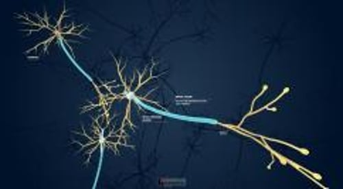

# 神经

> **来源**: msd_家庭版  
> **分类**: 脑脊髓神经疾病

---

# 神经

周围神经系统 由 1000 多亿个神经细胞（神经元）组成，这些神经细胞像细绳一样遍布全身，与脑、身体其他部位相连，并常相互连接。

周围神经由神经纤维束构成。这类纤维被许多层称作髓鞘的脂肪物质构成的组织包裹。这些组织层形成髓鞘，加快神经信号沿着神经纤维传导的速度。神经以不同速度传导信号，具体根据它们的直径及其周围的髓鞘数量而定。

外围神经系统可分成 2 个部分：

- 躯体神经系统
- 自主神经系统
神经冲动

3D 模型

## 躯体神经系统

躯体神经系统由神经组成，这些神经将 脑 和 脊髓 与受意识活动控制的肌肉（自主肌肉或骨骼肌）以及皮肤中的感觉受体连接起来。感觉受体是探测身体内部和周围信息的神经纤维的特殊末梢。

## 自主神经系统

自主神经系统将脑干和脊髓与内部器官连接起来，并调节不需意识控制的内部身体过程，因此人们通常感觉不到（参见 自主神经系统概述 ）。例如心脏收缩的速度和强度、血压、呼吸的速度以及食物通过消化道的速度。

自主神经系统又可分成 2 个部分：

- 交感支： 主要功能是使机体适应应激或为紧急情况做准备，如战斗或逃跑。
- 副交感支： 主要功能是在一般情况下维持正常的机体功能。

这两部分共同作用，通常是一个激活内脏器官，另一个起抑制作用。比如交感神经系统使脉搏加快、血压升高、呼吸加快，副交感系统则使它们降低。

神经细胞的典型结构

| 神经细胞（神经元）由大的胞体和神经纤维组成，神经纤维是传出神经冲动的延长部分（轴突）及接受冲动的多个分支（树突）。来自 1 个神经细胞轴突的冲动穿过突触（2 个神经细胞之间的连接处）到达另一个细胞的树突。 在脑和脊髓，轴突由少突胶质细胞环绕，在周围神经系统则由施旺细胞所包绕。这类细胞的膜由称作髓鞘的脂肪（脂蛋白）构成。细胞膜紧紧包裹在轴突周围，形成多层鞘。如同电线一样，髓鞘类似于神经的绝缘层。有髓鞘的神经纤维传递神经冲动的速度比无髓鞘的神经快得多。 |
| --- |

## 脑神经和脊神经

**脑神经** 将脑和脑干与眼睛、耳朵、鼻子和喉咙以及头部、颈部和躯干各部分直接相连。脑神经有 12 对，它们传递触觉、视觉、味觉、嗅觉和听觉等感觉信息。脑神经 II 或视神经实际上不被视为周围神经，因为它是大脑的外露部分，由少突胶质细胞而不是施旺细胞形成髓鞘（见 脑神经概述 ）。

**脊神经** 连接脊髓和身体其他部位。脊神经是脑与躯干交换信息的主要通路。有 31 对脊神经，沿脊髓间隔分布（见 脊髓疾病概述 ）。大多数脊神经和某些脑神经参与了周围神经系统的躯体神经部分和自主神经部分。

脊神经通过脊椎间的间隙从脊髓发出。每条脊神经由 2 个短分支（神经根）构成，一个在脊髓前面，一个在脊髓后面。

- 运动神经根（前神经根）： 运动根从脊髓前部发出。运动神经纤维将脑和脊髓的指令传递到躯体其他部位，特别是骨骼肌。
- 感觉神经根（后神经根）： 感觉根从脊髓的后方进入。感觉神经纤维将身体其他部位的感觉信息（身体姿势、光感、触觉、痛觉、温度觉）传递到脑部。每一条感觉神经根的感觉神经纤维都能传递身体某个特定部位（称为皮节）的信息。

运动及感觉神经根离开脊髓后，相应部位的运动及感觉神经根汇合形成一根脊神经。

某些脊神经形成相互交织的网状结构，称为神经丛。在神经丛中，来自不同脊神经的神经纤维经过分类再组合，以使通往或来自身体某一特定部位区域的所有纤维重新形成一条神经（见图 神经连接盒：神经丛 ）。

有如下 2 个主要神经丛：

- 臂丛神经： 对传到手臂和手的神经纤维进行分类和重组
- 腰骶丛： 对到达腿部和脚部的神经纤维进行分类和重组
