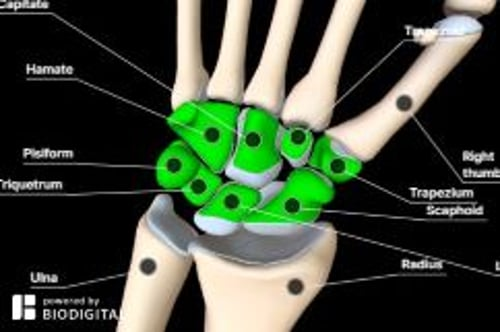

# Kienböck 病

> **来源**: msd_家庭版  
> **分类**: 骨骼关节肌肉疾病

---

# Kienböck 病

## （金伯克氏病）

Kienböck 病是指手腕月骨因血液供应受损而出现的坏死（ 骨坏死 ）。

（还可以参阅 手部疾病概述 。)

月骨是手腕上的腕骨之一。

腕部的骨骼

| 腕骨是手腕上的骨头。腕骨是位于前臂骨和掌骨之间的骨骼。 |
| --- |

腕部的骨骼

3D 模型

Kienböck 病比较罕见。手月骨的血液供应受损的病因不详。人们通常不记得受伤。最常发生于 20 至 45 岁的男性，以优势手多见。

## Kienböck 病的症状

Kienböck 病的症状最初常表现为腕关节疼痛，并进行性加重，局限于月骨区，即腕部基底部的中央。最终腕部的上部发生肿胀并可发生僵硬。10% 的病例双侧发病。

## Kienböck 病的诊断

- 影像学检查

Kienböck 病的早期诊断需借助 磁共振成像 (MRI) 或 计算机断层扫描 (CT)，必要时通过 X 光检查 可进一步明确诊断。

## Kienböck 病的治疗

- 手术

手术治疗是为了使月骨减压，例如通过延长或短缩与月骨连接的骨实现。尝试进行其他外科手术治疗，以恢复对月骨的血液供应（如 骨移植 或血管移植）。如果月骨已出现塌陷，需进行腕骨切除，或作为最后的手段实行腕关节融合，以缓解疼痛。

用手术以外的方法治疗此病尚未成功过，但夹板固定能够缓解轻度患者的疼痛。
