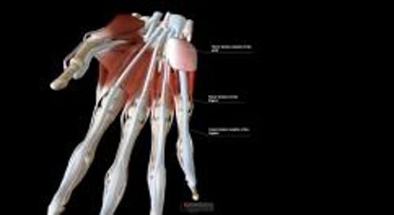

# 手指腱鞘感染

> **来源**: msd_家庭版  
> **分类**: 骨骼关节肌肉疾病

---

# 手指腱鞘感染

## （感染性屈肌腱鞘炎）

细菌感染可以在围绕手掌和手指内侧的肌腱的腱鞘中发展。

（还可以参阅 手部疾病概述 。)

在手和手指内走行的 肌腱 周围可发生脓包（脓肿）。这些肌腱位于称为肌腱鞘的组织套筒内。腱鞘有助于肌腱平滑滑动。

肌腱鞘脓肿是由手指掌侧横纹处的穿刺伤所引起。如果 脓性指头炎 的脓肿未及时治疗，脓液可自指尖进入腱鞘的末端。感染和脓液在肌腱周围形成并快速破坏周围组织。肌腱的滑动机制受到破坏，手指几乎不能活动。

腱鞘感染的症状包括手指的肿胀和疼痛，以及沿腱鞘的压痛。手指弯曲（屈曲）时会感觉好转。活动手指可引发极度疼痛。常常伴有发烧。

手指屈肌腱鞘

3D 模型

## 腱鞘感染的诊断

- 医生的检查
- X 射线检查
- 培养

医生对腱鞘感染的诊断基于检查结果。医生会做 X 光检查 ，以确认皮下是否隐藏任何异物（比如碎牙、针或其他物体）。

为了确定引起感染的细菌类型，医生从脓肿中取出脓液样本并在实验室让细菌生长（ 培养 ）。

医生会询问之前暴露于水族馆水或其他静水的情况，因为水中的细菌会感染患者的手。

## 腱鞘感染的治疗

- 引流脓液
- 抗生素

患者需要住院治疗。医生通过手术切口排出脓液。可静脉给予抗生素治疗。
