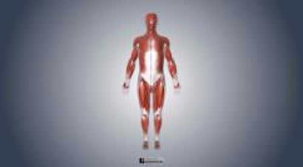

# 肌肉

> **来源**: msd_家庭版  
> **分类**: 骨骼关节肌肉疾病

---

# 肌肉

肌肉分为三种类型：

- 骨骼肌
- 平滑肌
- 心肌（心脏肌肉）

其中两种——骨骼肌及平滑肌——属于骨骼肌肉系统。

肌肉系统

3D 模型

**骨骼肌** 即是人们通常认为的肌肉，通过收缩完成各种动作。收缩纤维按一定方式规律排列形成束状形成骨骼肌，在显微镜下呈条纹状，称为横纹肌。骨骼肌在收缩时速度不同。

骨骼肌是维持肢体姿势和运动的组织，它附着于骨上。如在肘关节前方有屈肘的肱二头肌，在后方有伸肘的肱三头肌。这些反向运动是平衡的。平衡使得身体运动流畅，同时防止骨骼肌肉系统的损伤。

骨骼肌是受大脑支配的随意肌，受人的意识控制。它的大小和力量通过定期锻炼来维持或增长。另外， 睾酮 和生长激素有助于儿童肌肉的增长和成人肌肉形态的维持。

**平滑肌** 控制着一些不受人直接控制的身体功能。平滑肌包绕在许多血管周围，通过收缩来调节血流量。包绕在肠道周围的平滑肌通过收缩使食物残渣沿肠道向下运动。

平滑肌也受大脑支配，但不是随意肌。平滑肌的收缩和松弛乃根据身体的需求来触发，所以平滑肌属于非随意肌，不受人意识的控制。

**心肌** 是构成心脏的肌肉，不属于骨骼肌肉系统。和骨骼肌一样，心肌纤维按一定的规律排列，在显微镜下也呈条纹状，和骨骼肌一样同属于横纹肌。但心肌的节律性和舒缩活动不受人的意识支配。

肌肉骨骼系统(1)

|  |
| --- |

肌肉骨骼系统(2)

|  |
| --- |

肌肉骨骼系统的肌肉和其他组织

|  |
| --- |
