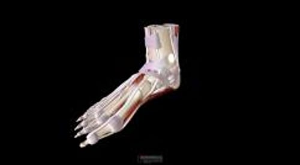

# 足部和踝关节问题概述

> **来源**: msd_家庭版  
> **分类**: 骨骼关节肌肉疾病

---

# 足部和踝关节问题概述

有些足部问题始于足本身，例如足损伤。足部的任何骨骼、关节、肌肉、肌腱或韧带均可出现问题。

脚骨

|  |
| --- |

足踝骨折 相当常见。

其他足部疾患则由累及全身多部位的疾病导致，如 糖尿病 、 痛风 或各类关节炎。

出现 趾甲变色 一定要就医检查，因为它可能是由某些疾病导致，包括真菌感染。

足

3D 模型

患有糖尿病或 外周动脉疾病 （上下肢或可能的内脏器官的供血动脉发生狭窄）的患者应每天观察足部是否出现感染或溃疡迹象，并应每年找医生或足病医生（足科医生）进行至少两次足部体检（见 足部护理 ）。

表格
足、踝部的一些常见疾病
表格

足、踝部的一些常见疾病

| 踝关节 跗管综合征 胫后肌腱炎和胫后腱鞘炎 踝关节扭伤/韧带损伤 跖球部 鸡眼与胼胝 足部神经受损 （趾间神经痛，莫顿神经瘤） 弗莱贝格病 跖关节痛 籽骨炎 足跟（足底侧） 跟骨前滑囊炎 内侧或外侧跖神经卡压症 足底筋膜炎 足跟（后侧） 跟腱止点炎 跟腱病 跟腱后滑囊炎 跟腱前滑囊炎 足底 跖腱膜纤维瘤病 足底筋膜炎 （足底筋膜炎、跟骨骨刺综合征） 脚趾 拇囊炎 拇僵症 锤状趾 嵌甲 甲真菌病 甲沟炎 |
| --- |

## 老年人须知：足部疾病

随着年龄的增大，足部可发生许多变化：

- 老年人通常脚部毛发少。
- 斑点或斑块可导致颜色褐变（色素沉着）。
- 皮肤可能变干，看起来变薄，尤其是脚后跟的皮肤。
- 脚趾甲常常变得更厚和弯曲。
- 趾甲常出现真菌感染。
- 脚的大小可能会改变。
- 脚掌下方的脂肪垫可能会变薄，缓冲作用也会减弱。

由于韧带和关节的变化，脚实际上可能变得更长和更宽。人们出现这些变化时，可能需要穿更大码的鞋子。所以，应定期测量脚的大小，或在购买新鞋时测量。

另外，终生穿不合脚的鞋子会损伤双脚。

## 足部疾病的治疗

- 矫形鞋和矫形器
- 注射麻醉剂和/或类固醇
- 有时需要进行手术

许多足部疾病的治疗通过改变穿在脚上的鞋来治疗，比如穿不同的鞋、使用内置物或其他的装置（矫形鞋或矫形器）来改变足的位置或活动范围，达到减轻关节面压力的目的。

向患处或疼痛部位注射麻醉剂通常可以缓解疼痛并减轻肌肉痉挛，从而使关节更容易活动。有时也可注射类固醇（有时称为糖皮质激素或皮质类固醇）以减轻疼痛和炎症。

如果这些治疗不成功，有时需要进行手术，以改善关节的对位和功能，并减轻疼痛。
