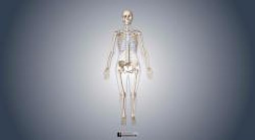

# 骨骼

> **来源**: msd_家庭版  
> **分类**: 骨骼关节肌肉疾病

---

# 骨骼

骨骼是一种强壮且处于不断动态变化中的组织，具有多种功能。骨骼是构成身体框架并保护脆弱内脏器官的坚硬结构。它含有骨髓，而血细胞在骨髓中形成。骨骼还维持身体的钙供应。

儿童时期，某些骨骼存在特殊区域称为 生长板 。在这些区域，一定时间内骨骼会不断生长直至其闭合。生长板闭合后，基于人体某些部位骨骼强度的需要，骨的横径增长大于纵径增长。

骨骼的形状分为两种：

- 扁平（如颅骨的骨板）
- 管状（如股骨和手臂骨骼，称作长骨）

某些骨具有这些结构的组合。所有骨具有相同的基本结构。

骨骼坚固的外层（称为皮质骨）包括大量的蛋白质（如胶原）和一种称为羟基磷灰石的物质，其主要由钙和其他矿物质组成。羟基磷灰石提供了骨的强度和密度。

骨的内层结构（骨小梁）较外层薄弱且密度低，但对维持骨骼的强度仍发挥显著作用。骨小梁在数量或质量上的降低可增加骨折风险。

骨髓充满于骨小梁中。骨髓中有能造血的特殊细胞（如干细胞）。血管为骨骼提供血运，神经分布于骨的周围。

您知道吗……

| 骨结构在人的一生中不断根据活动情况和机械应力（如负重运动）作出适应性改变。 |
| --- |

骨骼系统

3D 模型

骨骼持续处于重建过程中。在此过程中，陈旧的骨组织将被新生骨取代。大约每 10 年，身体的每块骨就会被彻底重塑。

为保持骨的强度和密度，身体需要充分的钙、其他矿物质及 维生素 D ，必须产生适当量的激素，如甲状旁腺素、生长激素、 降钙素 、 雌激素 和 睾酮 。活动（例如腿的负重练习）通过重塑增强骨骼。通过运动和最佳量的激素、维生素及矿物质，骨小梁发育成一种复杂的晶格结构，重量轻但是强壮。

骨的外面有一层薄膜，称为骨膜。骨骼损伤会导致疼痛，因为痛觉神经大多位于骨膜内。血管穿越骨膜为骨提供血供。
