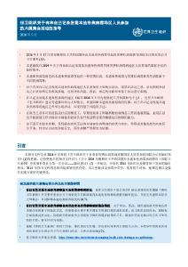

# 世卫组织关于有来自已记录发现本迪布焦病毒地区人员参加的大型集会活动的指导

> **来源**: who_china  
> **分类**: 新闻

---

[下载 (470.2 kB)](https://iris.who.int/server/api/core/bitstreams/ddbe9012-f63c-4848-bd93-6f0f35c81bf9/content)

### 概述

本指南为来自存在本迪布焦病毒病（Bundibugyo virus disease，BVD）传播地区的人员参与的大型集会活动的规划和管理提供了更新的建议。

该文件是在刚果民主共和国和乌干达于2026年暴发疫情的背景下发布的，取代了2014年针对埃博拉病毒病疫情制定的临时指南，并反映了病毒分类学、流行病学以及现有医疗对策方面的变化。文件概述了本迪布焦病毒病的具体特征，包括传播模式、潜伏期、临床表现，以及目前尚无已获许可的疫苗或获批治疗方法的情况。

本指南提出了供活动组织者和公共卫生主管部门在大型集会前、期间和之后采取的准备和应对措施。文件强调风险评估、事件监测、筛查措施、转诊路径、感染预防与控制，以及在《国际卫生条例（2005）》框架下的协调合作等方面的重要性。

指南特别关注早期发现、通过RT-PCR检测进行实验室确诊、疑似病例的隔离、风险沟通，以及跨境协作开展接触者追踪等内容。文件还涵盖了参会人员信息管理、公共卫生信息传播以及活动后评估等操作性考虑，以支持在本迪布焦病毒病暴发期间，对国际集会相关卫生风险管理。

世卫组织团队
突发卫生事件、准备和应对,
突发卫生事件准备
编辑
世界卫生组织
页数
8
参考编号
**书号:**
B09770
版权
