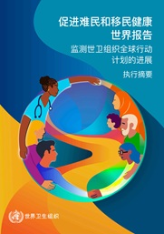

# 促进难民和移民健康世界报告: 监测世卫组织全球行动计划的进展。执行摘要

> **来源**: who_china  
> **分类**: 新闻

---

[下载 (3.5 MB)](https://iris.who.int/server/api/core/bitstreams/2de97590-02cb-46f1-a13f-aa85a86cb220/content)

### 概述

本执行摘要概述了世界卫生组织《促进难民和移民健康全球行动计划（2019–2030年）》实施进展的全球情况，并在既有评估基础上进一步分析。基于首轮全球健康与迁移调查数据及各国案例，报告评估了各会员国将难民和移民健康纳入国家政策、卫生体系和实践的情况。报告将迁移视为健康的重要决定因素和关键公共卫生议题，强调人口流动、社会决定因素与不同迁移阶段健康结果之间的复杂关系。

分析显示，一些积极进展已经取得，例如将难民和移民纳入国家卫生战略以及建立多部门协调机制。然而，报告也指出持续存在的差距，特别是在数据系统、卫生服务公平可及性以及相关人群参与决策方面。报告提出加强监测、促进包容性和针对性方法以及巩固政治和财政承诺的重点行动方向，为各国及合作伙伴推进公平、有韧性且对移民友好的卫生体系提供战略指导，并与全民健康覆盖和可持续发展目标保持一致。

世卫组织团队
Environment, Climate Change and Health (ECH),
Health and Migration Programme (PHM),
[环境、气候变化、同一健康和移民](https://www.who.int/zh/teams/environment-climate-change-and-health)
编辑
世界卫生组织
页数
34
参考编号
**书号:**
B09731
版权
