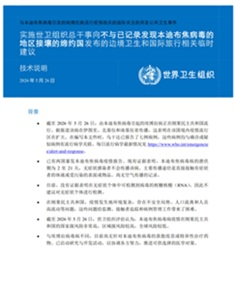

# 实施世卫组织总干事向不与已记录发现本迪布焦病毒的地区接壤的缔约国发布的边境卫生和国际旅行相关临时建议: 技术说明, 2026 年5月26日

> **来源**: who_china  
> **分类**: 新闻

---

[下载 (509.3 kB)](https://iris.who.int/server/api/core/bitstreams/ed4561c5-d44c-4186-b139-9277989edf4e/content)

### 概述

本技术说明概述了在世界卫生组织（WHO）总干事根据《国际卫生条例（2005）》宣布刚果民主共和国由本迪布焦病毒（Bundibugyo virus，BDBV）引起的埃博拉疫情构成“国际关注的突发公共卫生事件”（PHEIC）后，各国在实施与边境卫生和国际旅行相关的临时建议时应考虑的事项。

本文件主要面向 **与报告发现** **BDBV** **病例地区不接壤的《国际卫生条例》缔约国** ，为公共卫生主管部门、口岸（Points of Entry，PoE）、交通运输运营商以及其他相关利益攸关方提供操作性指导。文件介绍了本次疫情的流行病学背景、传播方式、当前风险评估情况，以及目前尚无针对BDBV获批上市的疫苗或特异性治疗药物这一现实情况。

文件提出了一系列支持口岸准备和应对工作的关键措施，包括：

- 向国际旅客提供旅行健康建议；
- 制定应急预案和标准操作程序（SOP）；
- 开展相关工作人员培训；
- 落实感染预防与控制（IPC）措施；
- 疑似病例的识别和管理；
- 与国际旅行相关接触者的识别、追踪和后续随访。

此外，文件还涵盖了卫生主管部门与交通运输部门之间的信息沟通与协调要求、环境清洁与消毒程序，以及在适当情况下使用旅客公共卫生信息表（Traveller Public Health Forms）等内容。

世卫组织团队
突发卫生事件、准备和应对,
突发卫生事件准备
编辑
世界卫生组织
页数
7
参考编号
**世卫组织参考编号:**
B09781
版权
