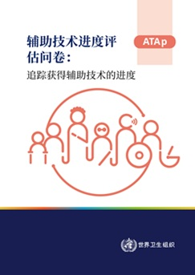

# 辅助技术进展评估问卷 : 跟踪获得辅助技术的进展

> **来源**: who_china  
> **分类**: 新闻

---

[下载 (1.6 MB)](https://iris.who.int/server/api/core/bitstreams/4c5b8bf4-9ac0-4b21-b22a-88db71f53ce6/content)

### 概述

本出版物介绍了世界卫生组织制定的《辅助技术进度评估问卷》，该工具旨在支持会员国监测和报告获取辅助技术方面的进展。该问卷用于收集具有可比性的国家层面数据，以支持落实世界卫生大会WHA71.8号决议及相关全球承诺，并为向世界卫生大会报告进展提供依据。

该问卷基于十项进度指标，涵盖立法、人口覆盖、资金保障、治理与协调、服务提供、人力资源、教育与培训、标准与规范以及国家举措等关键领域。文件为数据收集提供结构化指导，强调多部门协作和相关利益攸关方的参与。该工具有助于加强国家层面对辅助技术政策和项目的监测与评估，支持循证决策，并促进将相关数据纳入国家及全球报告框架，如可持续发展目标和《残疾人权利公约》，以推动实现公平获取辅助技术并改善个体功能、社会参与和福祉。
世卫组织团队
Access to Assistive Technology and Medical Devices (ATM),
Access to Medicines and Health Products (MHP),
Assistive Technology (ATA),
Health Product Policy and Standards (HPS),
卫生系统、获取和数据,
药物和卫生产品政策及标准
编辑
世界卫生组织
页数
33
参考编号
**书号:**
978-92-4-012198-0
版权
