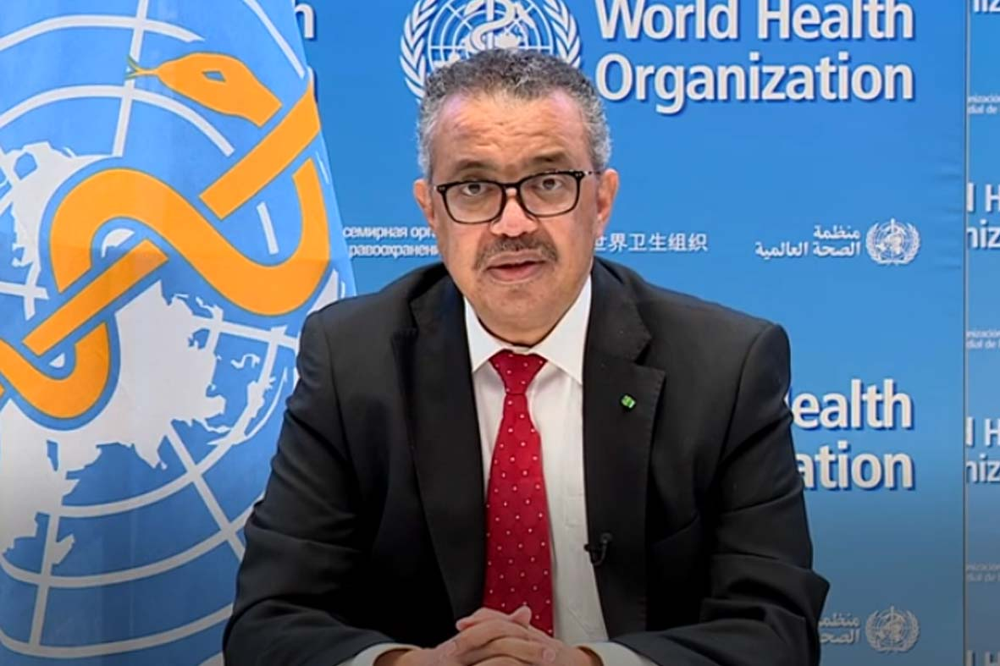

# 非洲埃博拉疫情

> **来源**: who_china  
> **分类**: 新闻

---

# 非洲埃博拉疫情

[阅读更多信息](https://www.who.int/zh/news/item/05-06-2026-africa-cdc-and-who-launch-joint-continental-ebola-response-plan)
© 世卫组织 / Josua Mulala Raymond
2026年6月，刚果民主共和国埃博拉疫情期间，医护人员接受个人防护装备使用培训。
©
来源
**

---

新闻

[更多 >](https://www.who.int/zh/news-room/releases)
[2026年6月24日 联合新闻发布 仍有6.55亿人生活在无电状态，凸显实现全民能源普及目标的紧迫性](https://www.who.int/zh/news/item/24-06-2026-655-million-people-still-living-without-electricity-underscore-urgent-need-to-deliver-on-universal-energy-access-target)
[2026年6月23日 新闻稿 世卫组织敦促扩大新生儿筛查规模，以改善出生缺陷的早期发现和治疗](https://www.who.int/zh/news/item/23-06-2026-who-urges-scale-up-of-newborn-screening-to-improve-early-detection-and-care-of-birth-defects)
[2026年6月17日 新闻稿 世卫组织发布关于丝状病毒病（包括埃博拉病和马尔堡病）的综合指南](https://www.who.int/zh/news/item/17-06-2026-who-issues-comprehensive-guidelines-on-filovirus-disease--including-ebola-and-marburg-disease)
[2026年6月15日 声明 就最终完成《世卫组织大流行协定》病原体获取和惠益分享附件致七国集团、二十国集团、金砖国家以及世界各国领导人的公开信](https://www.who.int/zh/news/item/15-06-2026-open-letter-to-leaders-of-g7-g20-brics-and-all-nations-on-finalizing-the-who-pandemic-agreement-s-pathogen-access-and-benefit-sharing-annex)

---

事实和数字

[更多 >](https://www.who.int/zh/news-room/fact-sheets)
[2026年4月16日 乳腺癌](https://www.who.int/zh/news-room/fact-sheets/detail/breast-cancer)
[2026年4月8日 世卫组织卫生产品预认证](https://www.who.int/zh/news-room/fact-sheets/detail/prequalification-of-medicines-by-who)
[2026年4月8日 恰加斯病（又称南美锥虫病）](https://www.who.int/zh/news-room/fact-sheets/detail/chagas-disease-(american-trypanosomiasis))
[2026年3月11日 全面性教育](https://www.who.int/zh/news-room/fact-sheets/detail/comprehensive-sexuality-education)

---

精选内容

[大流行预防、准备和应对协定](https://www.who.int/zh/news-room/questions-and-answers/item/pandemic-prevention--preparedness-and-response-accord)
[投资于世卫组织](https://www.who.int/zh/about/funding/invest-in-who)
[世卫组织出版物](https://www.who.int/zh/publications)

总干事

...

### 谭德塞博士

[为更健康的世界共同努力](https://www.who.int/zh/director-general)
...

讲话

[更多 >](https://www.who.int/zh/director-general/speeches)
[2026年6月3日 世卫组织总干事2026年6月3日在本迪布焦病毒引发的埃博拉疫情专题媒体通报会上的开场发言](https://www.who.int/zh/news-room/speeches/item/who-director-general-s-opening-remarks-at-the-media-briefing---3-june-2026)
[2026年5月30日 世卫组织总干事2026年5月30日在关于本迪布焦埃博拉疫情的新闻通报会上的讲话](https://www.who.int/zh/news-room/speeches/item/who-director-general-s-remarks-at-the-press-briefing-on-the-on-the-bundibugyo-ebola-outbreak---30-may-2026)
[2026年5月25日 世卫组织总干事在2026年5月25日执行委员会第159届会议上的开幕讲话](https://www.who.int/zh/news-room/speeches/item/who-director-general-s-opening-remarks-at-the-159th-session-of-the-executive-board-25-may-2026)

会议和活动

[更多 >](https://www.who.int/zh/news-room/events)
[2026 2026年9月17日 2026年9月17日世界患者安全日：“非传染性疾病的安全照护”](https://www.who.int/zh/campaigns/world-patient-safety-day/2026)
[世卫组织法定会议会期](http://apps.who.int/gb/gov/ch/dates-of-meetings-eb_ch.html)
